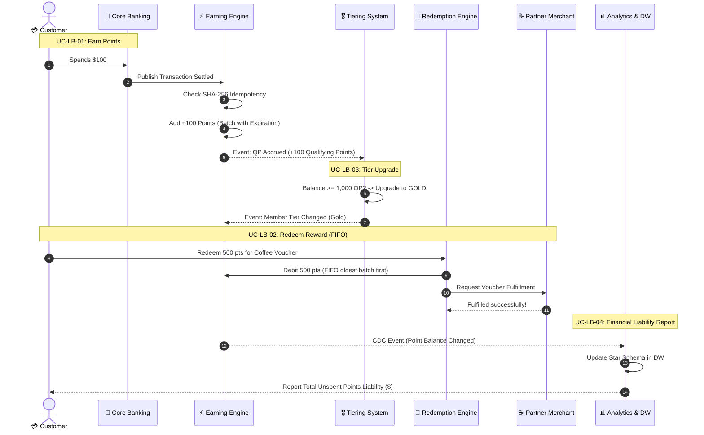

# 🎓 Beginner's Guide: Understanding the Loyalty Banking Platform

Welcome! If you are new to software architecture, microservices, or **Model-Driven Design (MDD)**, this guide is designed for you. It explains how this project works, how to navigate the documentation, and what you need to know about each component.

---

## 📌 Table of Contents
1. [What is this project?](#1-what-is-this-project)
2. [The Core Business Flow (The Mental Model)](#2-the-core-business-flow-the-mental-model)
3. [The 4 Golden Architectural Invariants (CON.1–CON.4)](#3-the-4-golden-architectural-invariants-con1con4)
4. [The 5 Core Components (Engines)](#4-the-5-core-components-engines)
5. [Database-Per-Service & Event-Driven Architecture](#5-database-per-service--event-driven-architecture)
6. [Step-by-Step Reading Roadmap](#6-step-by-step-reading-roadmap)
7. [Hands-On: Running and Tracing the Code](#7-hands-on-running-and-tracing-the-code)
8. [Glossary of Terms](#8-glossary-of-terms)

---

## 1. What is this project?

This repository contains the architecture, specifications, and reference implementation of an enterprise **Loyalty Banking Platform** (like credit card reward points, air miles, and VIP tier statuses).

It is structured as a **Model-Driven Design (MDD)** course project:
* **The Problem**: Banks need to reward customer spending with points, upgrade member tiers (Silver, Gold, Platinum), allow reward redemptions (coffee vouchers, flights), and report unspent points as financial liabilities.
* **The Challenge**: Point calculations must be 100% accurate, tamper-proof, idempotent (no double points on network retries), and follow strict database isolation.

---

## 2. The Core Business Flow (The Mental Model)

The platform revolves around 4 main use cases:



---

## 3. The 4 Golden Architectural Invariants (CON.1–CON.4)

Every document, microservice boundary, and test in this project enforces these 4 non-negotiable rules:

| Invariant | Name | What it means in plain English | Example |
|---|---|---|---|
| **CON.1** | **Zero Point Inflation** | Network retries or replayed messages must **never** create duplicate points. | If Core Banking sends the same transaction `TXN-101` three times, points are awarded only on the 1st attempt. 2nd and 3rd attempts return HTTP 409 Conflict. |
| **CON.2** | **FIFO Expiry-First Consumption** | When redeeming points, always spend the points that **expire the soonest** first. | You have 100 points expiring in Jan 2027 and 100 points expiring in Dec 2026. A 50-point redemption consumes from the Dec 2026 batch. |
| **CON.3** | **Redemption Reversal Guarantee** | If downstream partner fulfillment fails, reserved points **must be refunded immediately**. | You redeem a flight ticket, points are reserved, but airline API times out. Points are restored to your balance automatically. |
| **CON.4** | **Liability Staleness Guard** | Financial reports generated from the Data Warehouse must warn finance if replication lag exceeds threshold. | If reporting data is > 1 hour old, the report includes a `stale: true` warning flag. |

---

## 4. The 5 Core Components (Engines)

Each service has a single, well-defined responsibility and owns its private database:

### 1. ⚡ Earning Engine Service ([`EarningEngineService.java`](file:///D:/LEARN/loyalty_system_docs/capstone/src/com/loyalty/capstone/service/EarningEngineService.java))
* **Responsibility**: Ingests transactions, calculates points earned based on multipliers, and maintains the ledger of point batches.
* **Database**: [`EarningDb.java`](file:///D:/LEARN/loyalty_system_docs/capstone/src/com/loyalty/capstone/store/EarningDb.java) & [`IdempotencyStore.java`](file:///D:/LEARN/loyalty_system_docs/capstone/src/com/loyalty/capstone/store/IdempotencyStore.java).
* **Detailed Spec**: [`docs/detailed-design/DD-01-earning-engine.md`](file:///D:/LEARN/loyalty_system_docs/docs/detailed-design/DD-01-earning-engine.md).

### 2. 🎖️ Tiering System Service ([`TieringSystemService.java`](file:///D:/LEARN/loyalty_system_docs/capstone/src/com/loyalty/capstone/service/TieringSystemService.java))
* **Responsibility**: Listens to qualifying points (QP) accrued and evaluates member tier promotions (Silver $\rightarrow$ Gold $\rightarrow$ Platinum).
* **Database**: [`TieringDb.java`](file:///D:/LEARN/loyalty_system_docs/capstone/src/com/loyalty/capstone/store/TieringDb.java).
* **Detailed Spec**: [`docs/detailed-design/DD-02-tiering-system.md`](file:///D:/LEARN/loyalty_system_docs/docs/detailed-design/DD-02-tiering-system.md).

### 3. 🎁 Redemption Engine Service ([`RedemptionEngineService.java`](file:///D:/LEARN/loyalty_system_docs/capstone/src/com/loyalty/capstone/service/redemption/RedemptionEngineService.java))
* **Responsibility**: Orchestrates reward redemptions. Decomposed into 5 modular components:
  1. [`OrderIntakeModule`](file:///D:/LEARN/loyalty_system_docs/capstone/src/com/loyalty/capstone/service/redemption/OrderIntakeModule.java): Validates request schema and creates pending order.
  2. [`TierAndBalanceValidationModule`](file:///D:/LEARN/loyalty_system_docs/capstone/src/com/loyalty/capstone/service/redemption/TierAndBalanceValidationModule.java): Checks tier eligibility and balance lock.
  3. [`FifoDebitModule`](file:///D:/LEARN/loyalty_system_docs/capstone/src/com/loyalty/capstone/service/redemption/FifoDebitModule.java): Consumes points from oldest batch (**CON.2**).
  4. [`RedemptionOrderStateModule`](file:///D:/LEARN/loyalty_system_docs/capstone/src/com/loyalty/capstone/service/redemption/RedemptionOrderStateModule.java): Drives order state transitions (`PENDING` $\rightarrow$ `IN_PROGRESS` $\rightarrow$ `FULFILLED` / `FAILED` $\rightarrow$ `REVERSED`).
  5. [`FulfillmentCoordinationModule`](file:///D:/LEARN/loyalty_system_docs/capstone/src/com/loyalty/capstone/service/redemption/FulfillmentCoordinationModule.java): Dispatches to external partner and compensates points on failure (**CON.3**).
* **Database**: [`RedemptionDb.java`](file:///D:/LEARN/loyalty_system_docs/capstone/src/com/loyalty/capstone/store/RedemptionDb.java).
* **Detailed Spec**: [`docs/detailed-design/DD-03-redemption-engine.md`](file:///D:/LEARN/loyalty_system_docs/docs/detailed-design/DD-03-redemption-engine.md).

### 4. ⚙️ Program Management Service ([`ProgramManagementService.java`](file:///D:/LEARN/loyalty_system_docs/capstone/src/com/loyalty/capstone/service/ProgramManagementService.java))
* **Responsibility**: System master catalog. Manages loyalty programs, earn rule multipliers, promotional campaigns, and reward catalog items.
* **Database**: [`ProgramMgmtDb.java`](file:///D:/LEARN/loyalty_system_docs/capstone/src/com/loyalty/capstone/store/ProgramMgmtDb.java).
* **Detailed Spec**: [`docs/detailed-design/DD-04-program-management.md`](file:///D:/LEARN/loyalty_system_docs/docs/detailed-design/DD-04-program-management.md).

### 5. 📊 Analytics & Reporting Service ([`AnalyticsReportingService.java`](file:///D:/LEARN/loyalty_system_docs/capstone/src/com/loyalty/capstone/service/AnalyticsReportingService.java))
* **Responsibility**: Ingests platform Change Data Capture (CDC) events and calculates financial liability reports from a dimensional Star Schema Data Warehouse.
* **Database**: [`DataWarehouse.java`](file:///D:/LEARN/loyalty_system_docs/capstone/src/com/loyalty/capstone/store/DataWarehouse.java).
* **Detailed Spec**: [`docs/detailed-design/DD-05-analytics-reporting.md`](file:///D:/LEARN/loyalty_system_docs/docs/detailed-design/DD-05-analytics-reporting.md).

---

## 5. Database-Per-Service & Event-Driven Architecture

### 🛡️ Single-Owner Data Store Principle ([`ADR-001`](file:///D:/LEARN/loyalty_system_docs/docs/architecture/adrs/ADR-001-module-boundaries-and-data-isolation.md))
To prevent spaghetti dependencies:
* **No service is allowed to directly read or write another service's database.**
* In the Java code, this is enforced by [`OwnedStore.java`](file:///D:/LEARN/loyalty_system_docs/capstone/src/com/loyalty/capstone/store/OwnedStore.java). If `EarningEngineService` tries to write to `TieringDb`, the runtime throws an [`OwnershipViolation`](file:///D:/LEARN/loyalty_system_docs/capstone/src/com/loyalty/capstone/store/OwnershipViolation.java) error.

### 📨 Asynchronous Messaging ([`MessageBroker.java`](file:///D:/LEARN/loyalty_system_docs/capstone/src/com/loyalty/capstone/broker/MessageBroker.java))
Services communicate asynchronously via domain events on dedicated [`Topics`](file:///D:/LEARN/loyalty_system_docs/capstone/src/com/loyalty/capstone/broker/Topics.java):
* `banking.transaction_settled`: Triggered by Core Banking when money is spent.
* `earning.qp_accrued`: Triggered when points are awarded, notifying the Tiering System.
* `tiering.tier_changed`: Broadcasted when a member is upgraded.
* `cdc.platform_events`: Stream of database changes replicated to the Data Warehouse.

---

## 6. Step-by-Step Reading Roadmap

Follow this 3-day roadmap to systematically absorb the project:

```
Day 1: The Business & Scope ──► Day 2: Architecture & Models ──► Day 3: Code & Deep Design
```

### 🗓️ Day 1: The Business & Requirements
1. Start with [`labs/lab-01-scope/README.md`](file:///D:/LEARN/loyalty_system_docs/labs/lab-01-scope/README.md) to understand project scope (I-1 to I-11) and the 4 Invariants.
2. Read [`labs/lab-02-requirements/README.md`](file:///D:/LEARN/loyalty_system_docs/labs/lab-02-requirements/README.md) to see the 63 functional requirements and trace matrix.

### 🗓️ Day 2: Architecture & Visual Models
1. Open [`labs/lab-09-c4-models/README.md`](file:///D:/LEARN/loyalty_system_docs/labs/lab-09-c4-models/README.md) to inspect C4 Context, Container, and Component diagrams.
2. Read [`labs/lab-10-behavioral-models/README.md`](file:///D:/LEARN/loyalty_system_docs/labs/lab-10-behavioral-models/README.md) to walk through Sequence Diagrams for `UC-LB-01` through `UC-LB-04`.
3. Check [`docs/architecture/adrs/`](file:///D:/LEARN/loyalty_system_docs/docs/architecture/adrs/) to understand *why* key architectural decisions were made.

### 🗓️ Day 3: Code & Detailed Engine Specs
1. Run the test suite in [`capstone/`](file:///D:/LEARN/loyalty_system_docs/capstone/README.md).
2. Read the detailed design documents for the engines in [`docs/detailed-design/`](file:///D:/LEARN/loyalty_system_docs/docs/detailed-design/).
3. Review [`labs/lab-07-governance/README.md`](file:///D:/LEARN/loyalty_system_docs/labs/lab-07-governance/README.md) to understand how Quality Gates G1–G6 ensure architectural compliance.

---

## 7. Hands-On: Running and Tracing the Code

The best way to solidify your understanding is to run the capstone!

### 1. Run all 27 Automated Tests
```powershell
cd D:\LEARN\loyalty_system_docs\capstone
javac -d out (Get-ChildItem -Recurse src -Filter *.java | % FullName)
javac -d out -cp out (Get-ChildItem -Recurse test -Filter *.java | % FullName)
java -cp out com.loyalty.capstone.CapstoneTests
```

### 2. Start the Live Server
```powershell
java -cp out com.loyalty.capstone.Main 8080
```

### 3. Trace a Live Flow
Open another terminal and trigger an earn transaction:
```bash
curl -X POST http://localhost:8080/partner-earn \
  -H "Content-Type: application/json" \
  -d '{"sourceTransactionId":"TXN-1001","memberId":"M-1001","amount":200}'
```
Now look at [`EarningEngineService.java#L75`](file:///D:/LEARN/loyalty_system_docs/capstone/src/com/loyalty/capstone/service/EarningEngineService.java) to see how the code handles the idempotency check, writes the batch, and emits the qualifying points event.

---

## 8. Glossary of Terms

* **MDD (Model-Driven Design)**: Designing software by creating formal, connected models (ArchiMate, C4, UML) before writing code.
* **C4 Model**: A 4-tier hierarchical way to document architecture (Context, Containers, Components, Code).
* **ADR (Architecture Decision Record)**: A short document capturing an important architectural decision, its context, and consequences.
* **Qualifying Points (QP)**: Points used solely to determine member tier level (does not decrease when you redeem rewards).
* **FIFO (First In, First Out)**: Consuming the oldest points batch first to protect customer points from expiring.
* **Idempotency**: The property where calling an operation multiple times produces the exact same outcome as calling it once.
* **CDC (Change Data Capture)**: Streaming database mutations in real time to external systems (like the Data Warehouse).
* **Quality Gates (G1–G6)**: Formal checkpoints verifying that models match requirements and code matches models.
