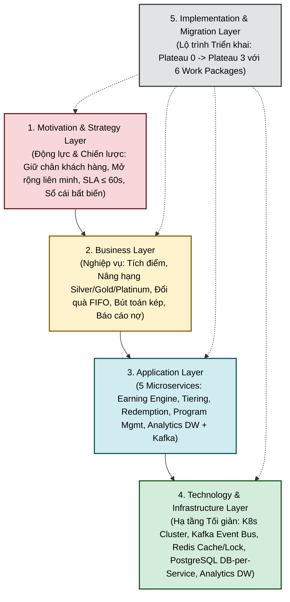
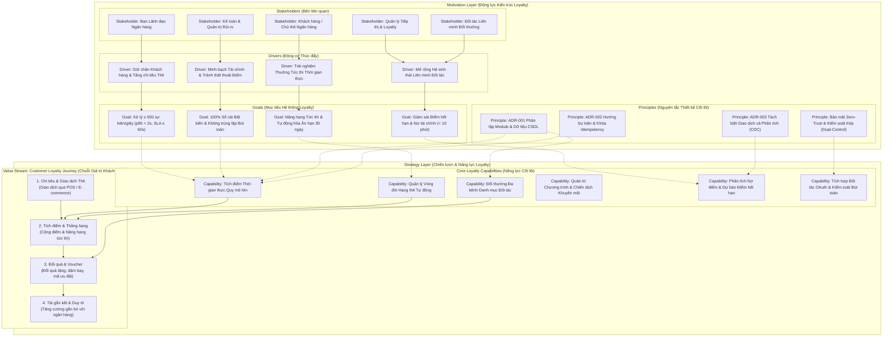
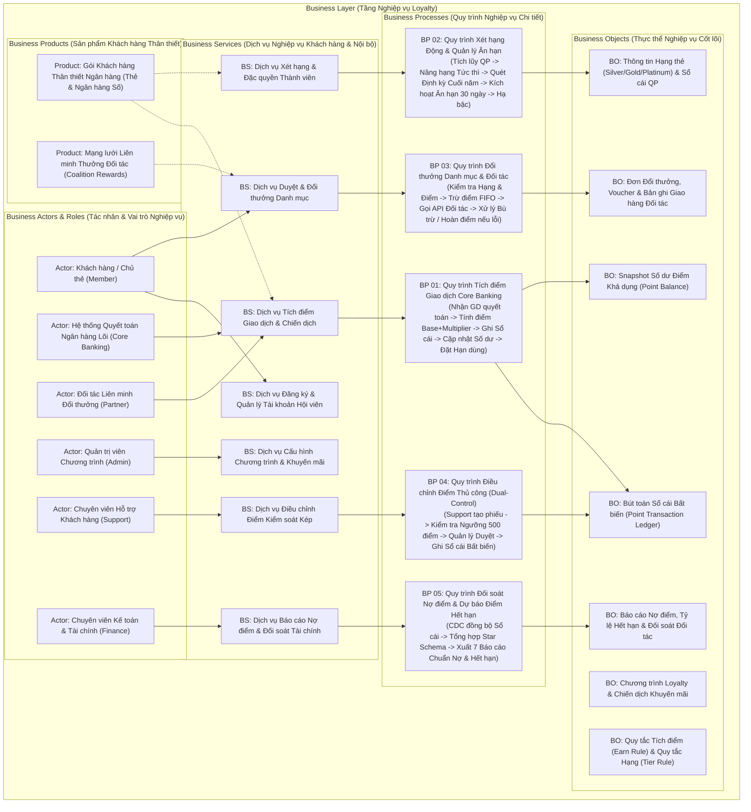
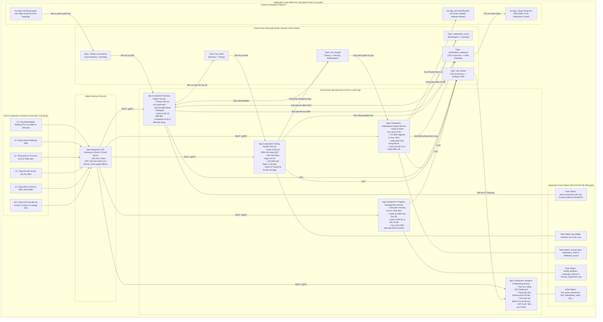
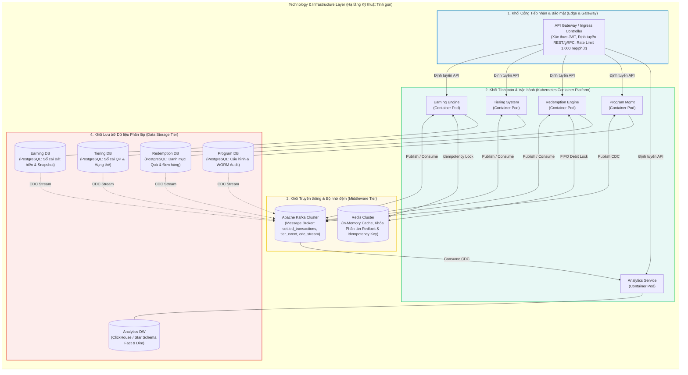
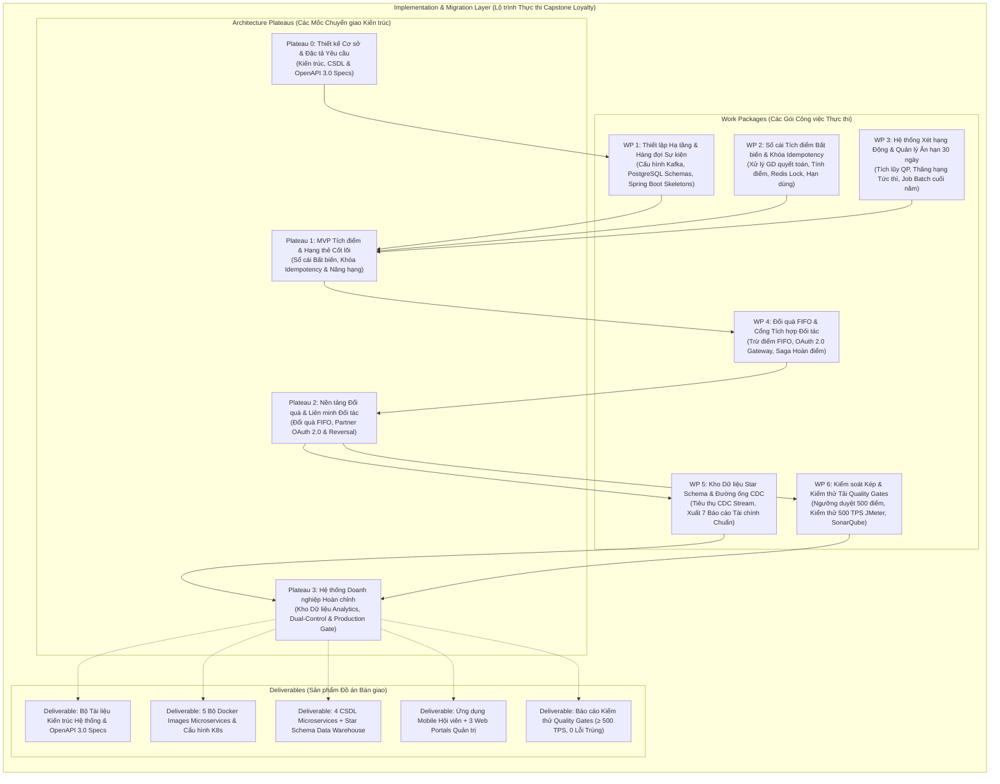
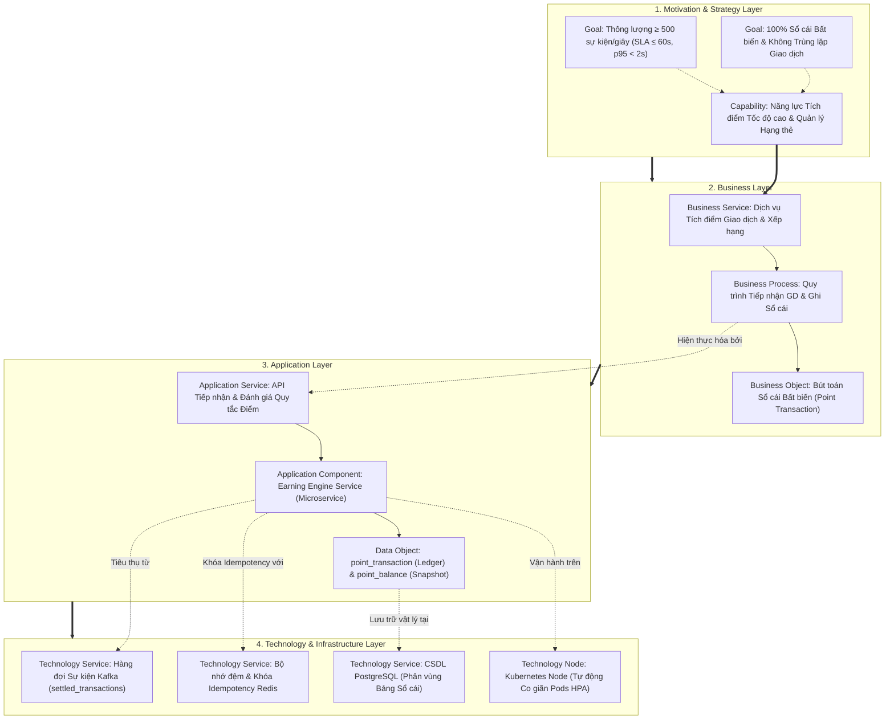

# Loyalty Banking — Kiến trúc Phân tầng ArchiMate 3.2 (ArchiMate Layer Diagrams)

**Domain**: Loyalty Banking Platform (Hệ thống Khách hàng Thân thiết Ngân hàng)  
**Tiêu chuẩn Kiến trúc**: The Open Group ArchiMate® 3.2 Specification  
**Phiên bản**: 3.0 (Chuẩn hóa Chính tả & Tối giản Hạ tầng)  
**Tài liệu tham chiếu**:
- [loyalty_domain.md](file:///d:/learn/loyalty/loyalty_domain.md) — Tổng quan nghiệp vụ Loyalty
- [Architecture-Overview.md](file:///d:/learn/loyalty/architecture/Architecture-Overview.md) — Kiến trúc tổng thể hệ thống
- [Data-Architecture-and-Schema.md](file:///d:/learn/loyalty/architecture/Data-Architecture-and-Schema.md) — Kiến trúc dữ liệu & Star Schema
- [Security-and-Integration-Architecture.md](file:///d:/learn/loyalty/architecture/Security-and-Integration-Architecture.md) — Bảo mật & Tích hợp Đối tác
- [domain-event-catalog.md](file:///d:/learn/loyalty/architecture/domain-event-catalog.md) — Danh mục sự kiện Kafka

---

## 1. Tổng quan Khung Kiến trúc ArchiMate trong Ngữ cảnh Loyalty Banking

Khung kiến trúc hệ thống **Loyalty Banking** được thiết kế nhằm giải quyết bài toán cốt lõi: **Xử lý tích điểm giao dịch ngân hàng thời gian thực (Real-time Accrual), duy trì sổ cái điểm bất biến (Immutable Ledger), tự động hóa vòng đời hạng thẻ (Tier Lifecycle), đổi thưởng tức thì (FIFO Redemption), và kiểm soát nợ điểm tài chính (Point Liability Reporting).**

---

## 2. Motivation & Strategy Layer (Tầng Động lực & Chiến lược Loyalty)

### 2.1. Phân tích Chi tiết Ngữ cảnh Loyalty
- **Động lực Kinh doanh (Drivers)**: Ngân hàng cần gia tăng tỷ lệ sử dụng thẻ (Card Spend), thúc đẩy giao dịch thanh toán số, mở rộng mạng lưới liên minh đối tác (Merchant Coalition), đồng thời bảo đảm an toàn tài chính (ngăn ngừa thất thoát và gian lận điểm thưởng).
- **Mục tiêu Đo lường (Goals)**:
  - Thông lượng xử lý $\ge 500$ sự kiện tích điểm/giây với độ trễ $p95 \le 2.000$ ms.
  - Hấp thụ giao dịch quyết toán từ Core Banking trong vòng $\le 60$ giây.
  - Sổ cái điểm bất biến (100% Immutable Append-Only Ledger), 0% trùng lặp giao dịch (Idempotency).
  - Tự động hóa đánh giá và thăng hạng tức thì khi đủ Điểm xét hạng (Qualifying Points - QP).
- **Nguyên tắc Kiến trúc (Principles / ADRs)**:
  - **ADR-001**: Phân lập dữ liệu hoàn toàn giữa các Module (Database-per-Service), nghiêm cấm gọi chéo CSDL.
  - **ADR-002**: Kiến trúc hướng sự kiện (EDA) với Kafka và khóa phân tán Redis Idempotency.
  - **ADR-003**: Tách biệt 100% CSDL giao dịch (OLTP) và CSDL phân tích (OLAP Star Schema) qua Debezium CDC.
  - **Bảo mật**: Cơ chế phê duyệt kép (Dual-Control) đối với các bút toán thủ công $> 500$ điểm.

### 2.2. Sơ đồ ArchiMate Motivation & Strategy

---

## 3. Business Layer (Tầng Nghiệp vụ Loyalty Banking)

### 3.1. Các Khái niệm & Quy trình Nghiệp vụ Cốt lõi
1. **Quy trình Tích điểm (Earning Process)**:
   - Tỷ lệ cơ bản (Base Rate): **1 USD = 1 điểm** (hoặc giá trị quy đổi VNĐ tương đương).
   - Hệ số nhân Hạng thẻ (Tier Multiplier): Silver (1.0×), Gold (1.5×), Platinum (2.0×).
   - Chiến dịch khuyến mãi (Campaign Multipliers): Ví dụ "Double Points August" (2.0×).
   - Ghi nhận bút toán vào **Sổ cái (Earning Ledger)** dưới dạng bất biến (append-only) và cập nhật số dư tức thời (`point_balance`). Thiết lập hạn sử dụng điểm (Rolling 12 tháng hoặc Fixed 31/12).
2. **Quy trình Quản lý Hạng thẻ (Tiering Lifecycle)**:
   - Tích lũy **Điểm xét hạng (Qualifying Points - QP)** tách biệt hoàn toàn với điểm thưởng đổi quà.
   - Ngưỡng thăng hạng chuẩn: Silver (0 QP), Gold (1.000 QP), Platinum (3.000 QP).
   - Thăng hạng (Upgrade): Có hiệu lực **ngay lập tức** khi điểm QP tích lũy vượt ngưỡng.
   - Hạ hạng (Downgrade): Đánh giá vào cuối chu kỳ năm (31/12), áp dụng **30 ngày ân hạn (Grace Period)**, mỗi chu kỳ chỉ hạ tối đa 1 bậc.
3. **Quy trình Đổi thưởng (Redemption Process)**:
   - Thành viên duyệt danh mục quà tặng (E-voucher, Dặm bay, Tiền mặt/Cashback).
   - Khóa điểm và trừ điểm theo nguyên tắc **FIFO (First-In, First-Out)** đối với các lô điểm cũ nhất.
   - Gửi yêu cầu phát hành thưởng tới API đối tác. Nếu đối tác xử lý thất bại $\rightarrow$ tự động kích hoạt quy trình bù trừ (Reversal/Compensation) để hoàn điểm cho khách hàng.
4. **Quy trình Điều chỉnh Bút toán Kép (Dual-Control Adjustment)**:
   - Chuyên viên CSKH/Support tạo phiếu yêu cầu điều chỉnh.
   - Bút toán $\le 500$ điểm: Hệ thống tự động phê duyệt.
   - Bút toán $> 500$ điểm: Chuyển Supervisor/Admin phê duyệt trước khi ghi vào Sổ cái.
5. **Quy trình Đối soát & Báo cáo Nợ điểm (Liability & Breakage)**:
   - CDC trích xuất biến động sổ cái sang Data Warehouse.
   - Tính toán nợ điểm chưa sử dụng (Outstanding Liability), dự báo điểm hết hạn (Breakage Forecast), và doanh thu đối tác.

### 3.2. Sơ đồ ArchiMate Business Layer

---

## 4. Application Layer (Tầng Ứng dụng & Microservices Loyalty)

### 4.1. Phân rã 5 Microservices Độc lập (Domain-Driven Design)
1. **Earning Engine Service**:
   - Ingestion Worker tiêu thụ sự kiện từ topic `settled_transactions`.
   - Rule Evaluator tính điểm Base + Multiplier theo Hạng và Chiến dịch.
   - Ghi bút toán `point_transaction` (Append-only) và cập nhật `point_balance`.
   - Redis Lock ngăn chặn xử lý trùng lặp giao dịch (Idempotency Key = `tx_settlement_id`).
   - Lên lịch gửi cảnh báo hết hạn điểm (30 ngày và 7 ngày trước khi hết hạn).
2. **Tiering System Service**:
   - Quản lý `qp_ledger` và thực thể `member_tier`.
   - Lắng nghe `tier_event` từ Earning Engine $\rightarrow$ Tự động thăng hạng Silver $\rightarrow$ Gold $\rightarrow$ Platinum.
   - Cron Job chạy đánh giá cuối năm (31/12) $\rightarrow$ Kích hoạt trạng thái `IN_GRACE_PERIOD` (30 ngày).
   - Phát sự kiện `tier_change` sang Kafka để Earning Engine và Redemption Engine cập nhật quyền lợi.
3. **Redemption Engine Service**:
   - Quản lý kho quà `reward_item` (Voucher điện tử, Dặm bay, Sản phẩm vật lý).
   - Thực thi trừ điểm nguyên tử theo thuật toán **FIFO** dựa trên các lô điểm còn hiệu lực.
   - Dispatcher gọi REST API sang Đối tác Fulfillment; quản lý Saga Compensation (Hoàn điểm tự động nếu giao voucher thất bại).
4. **Program Management Service**:
   - Quản trị cấu hình `loyalty_program`, `campaign`, và phiên bản quy tắc (`config_version_log`).
   - Quản lý danh mục đối tác, cấp phát OAuth 2.0 Client Credentials, thực thi Rate Limit 1.000 req/min.
   - Quản lý quy trình kiểm soát kép (Dual-Control) cho lệnh điều chỉnh điểm thủ công.
5. **Analytics & Reporting Service**:
   - CDC Consumer nhận luồng biến động từ `cdc_stream` (Debezium).
   - Nạp dữ liệu vào Star Schema CSDL Phân tích (Fact & Dimension Tables).
   - Tính toán nợ điểm, tỷ lệ hết hạn (Breakage Rate), và cung cấp 7 báo cáo tài chính tiêu chuẩn.

### 4.2. Sơ đồ ArchiMate Application Layer

---

## 5. Technology & Infrastructure Layer (Tầng Công nghệ & Hạ tầng Loyalty — Tối giản)

### 5.1. Khái quát Hạ tầng Kỹ thuật
Kiến trúc hạ tầng được thiết kế tinh gọn thành **4 khối chính**, dễ hiểu cho báo cáo Capstone nhưng vẫn đảm bảo toàn bộ yêu cầu phi chức năng ($\ge 500$ TPS, SLA $\le 60$s, 0% trùng lặp, CSDL cô lập):

1. **Khối Cổng & Mạng (Edge & Gateway)**: 
   - **API Gateway (Kong / Envoy)**: Tiếp nhận toàn bộ truy cập từ Mobile App, Web Portal và Partner API, giải mã Token JWT và giới hạn tần suất gọi (Rate Limiting).
2. **Khối Xử lý & Dịch vụ (Kubernetes Container Platform)**:
   - **Kubernetes Cluster**: Vận hành 5 Microservices đóng gói dưới dạng Docker Containers, hỗ trợ tự động co giãn Pods (HPA) khi lưu lượng giao dịch tăng cao.
3. **Khối Truyền thông & Đệm (Middleware & Event Streaming)**:
   - **Apache Kafka**: Hàng đợi tin nhắn phân tán lưu trữ các topic giao dịch (`settled_transactions`, `tier_event`, `cdc_stream`).
   - **Redis Cluster**: Bộ nhớ đệm tốc độ cao lưu trữ khóa Idempotency (ngăn xử lý trùng) và khóa phân tán `Redlock` (cho giao dịch trừ điểm FIFO).
4. **Khối Lưu trữ Dữ liệu (Polyglot Persistence)**:
   - **PostgreSQL Databases (Database-per-Service)**: Mỗi microservice sở hữu một CSDL riêng biệt (Earning DB, Tiering DB, Redemption DB, Program DB).
   - **Debezium CDC**: Tự động bắt biến động dữ liệu từ PostgreSQL đẩy sang Kafka.
   - **Data Warehouse (ClickHouse / PostgreSQL Star Schema)**: CSDL phân tích chuyên dụng lưu trữ Fact/Dim để xuất 7 báo cáo tài chính mà không ảnh hưởng CSDL giao dịch.

### 5.2. Sơ đồ ArchiMate Technology Layer (Tối giản & Trực quan)

---

## 6. Implementation & Migration Layer (Lộ trình Triển khai Capstone)

### 6.1. Phân kỳ Phát triển theo 4 Plateaus & 6 Work Packages
- **Plateau 0 (Khởi tạo)**: Thiết lập đặc tả yêu cầu, kiến trúc phân tầng ArchiMate, OpenAPI 3.0 Specs, và mô hình dữ liệu.
- **Plateau 1 (MVP Tích điểm & Hạng thẻ)**: Xây dựng Earning Engine với Sổ cái bất biến, cơ chế Idempotency qua Redis, Tiering System với QP Ledger và thăng hạng tự động.
- **Plateau 2 (Đổi quà & Tích hợp Đối tác)**: Phát triển Redemption Engine với thuật toán FIFO, Partner OAuth Gateway với Rate Limiter, và cơ chế Reversal hoàn điểm.
- **Plateau 3 (Hệ thống Hoàn chỉnh & Sẵn sàng Vận hành)**: Triển khai Debezium CDC + Star Schema Data Warehouse, cổng Dual-Control duyệt lệnh $> 500$ điểm, và vượt qua Quality Gates (Kiểm thử tải 500 TPS trên JMeter, 0 lỗi trùng lặp).

### 6.2. Sơ đồ ArchiMate Implementation Layer

---

## 7. Cross-Layer Traceability View (Sơ đồ Tích hợp Đa tầng Loyalty)

Sơ đồ thể hiện chuỗi liên kết xuyên suốt (**End-to-End Alignment**) từ Động lực Chiến lược $\rightarrow$ Quy trình Nghiệp vụ $\rightarrow$ Dịch vụ Phần mềm $\rightarrow$ Bảng CSDL và Hạ tầng Công nghệ:

---

## 8. Bảng Ma trận Ánh xạ Truy vết Phần tử ArchiMate (Traceability Matrix)

| STT | ArchiMate Layer | Loại Phần tử (Element Type) | Tên Phần tử trong Dự án Loyalty | Trách nhiệm & Ý nghĩa Nghiệp vụ / Kỹ thuật |
|:---:|---|---|---|---|
| 1 | **Motivation** | Stakeholder | Ban Lãnh đạo, Marketing, Kế toán, Chủ thẻ, Đối tác | Các bên tham gia trực tiếp vào chuỗi giá trị Loyalty |
| 2 | **Motivation** | Driver / Goal | Thông lượng $\ge 500$ TPS, SLA $\le 60$s, Sổ cái Bất biến | Chỉ số đo lường hiệu năng và cam kết dịch vụ tài chính |
| 3 | **Motivation** | Principle | ADR-001 (Cô lập DB), ADR-002 (Sự kiện/Idempotency), ADR-003 (CDC) | 3 quyết định kiến trúc cốt lõi định hình nền tảng |
| 4 | **Strategy** | Capability | Tích điểm tốc độ cao, Quản lý Hạng thẻ động, Đổi quà FIFO | Năng lực cốt lõi phục vụ hệ sinh thái Loyalty Ngân hàng |
| 5 | **Business** | Business Actor | Khách hàng (Member), Core Banking, Support Agent, Kế toán | Con người và hệ thống nguồn tham gia luồng nghiệp vụ |
| 6 | **Business** | Business Service | Tích điểm, Nâng hạng Silver/Gold/Platinum, Đổi thưởng, Báo cáo Nợ | Gói dịch vụ cung cấp ra người dùng và nội bộ ngân hàng |
| 7 | **Business** | Business Process | Tích điểm từ Core Banking, Chu kỳ Hạng 30d Grace, Lệnh Duyệt kép | Các quy trình kinh doanh và luồng nghiệp vụ chuẩn |
| 8 | **Business** | Business Object | Sổ cái Điểm (`point_transaction`), Số dư Điểm, QP, Đơn Đổi quà | Thực thể thông tin và dữ liệu kinh doanh tài chính |
| 9 | **Application** | App Component | Earning Engine, Tiering, Redemption, Program Mgmt, Analytics DW | 5 Microservices độc lập theo nguyên tắc Domain-Driven Design |
| 10 | **Application** | App Interface / Topic | `settled_transactions`, `tier_event`, `cdc_stream`, REST Gateway | Giao diện API và hàng đợi điều phối sự kiện phân tán Kafka |
| 11 | **Application** | Data Object | `point_transaction`, `point_balance`, `qp_ledger`, `fact_*` | Mô hình dữ liệu quan hệ và Star Schema Data Warehouse |
| 12 | **Technology** | Node / System Software | Kubernetes Cluster, Kafka, Redis Cluster, PostgreSQL, ClickHouse | Nền tảng hạ tầng tính toán, bộ nhớ đệm và CSDL phân tán |
| 13 | **Technology** | Artifact | `earning-engine.jar`, Docker Containers, `*.sql` Migration Scripts | Các tệp nhị phân đóng gói triển khai thực tế trên K8s |
| 14 | **Implementation** | Work Package | WP1 (Hạ tầng) $\rightarrow$ WP6 (Dual-Control & Quality Gates 500 TPS) | Các gói công việc triển khai thực tế cho đồ án Capstone |
| 15 | **Implementation** | Plateau | Plateau 0 (Baseline) $\rightarrow$ Plateau 3 (Target State Hoàn chỉnh) | Các giai đoạn bàn giao kiến trúc qua từng chặng đồ án |
