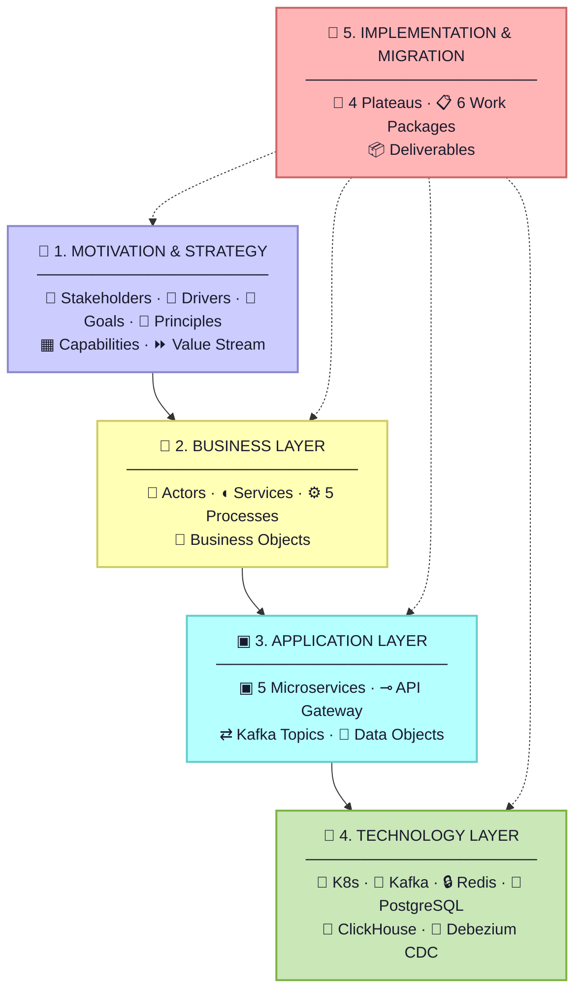
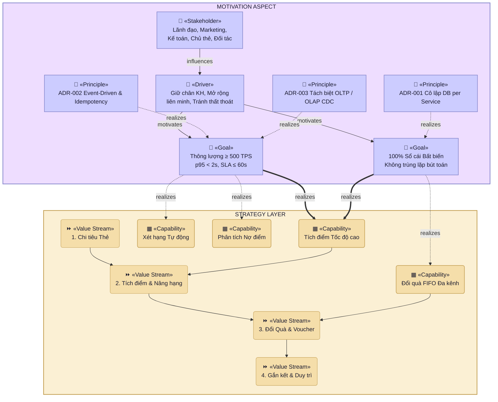
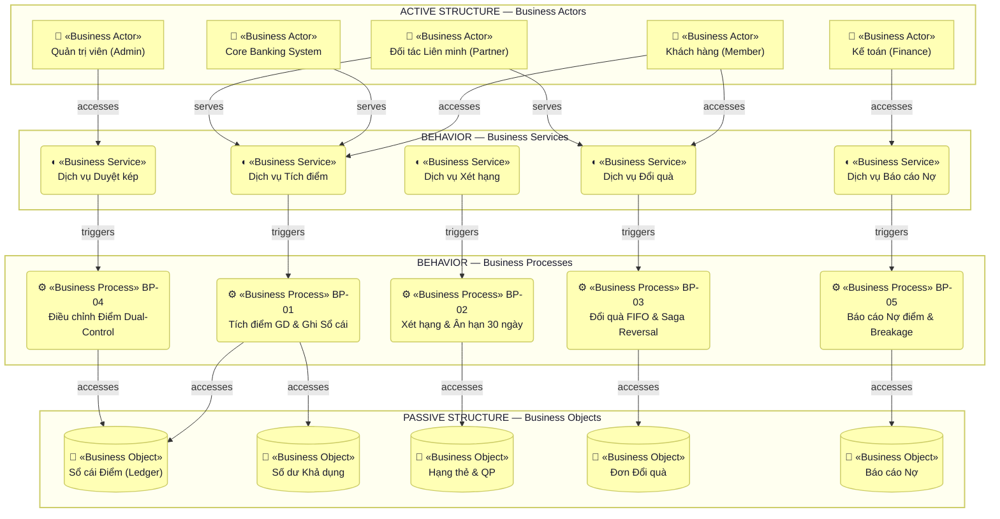
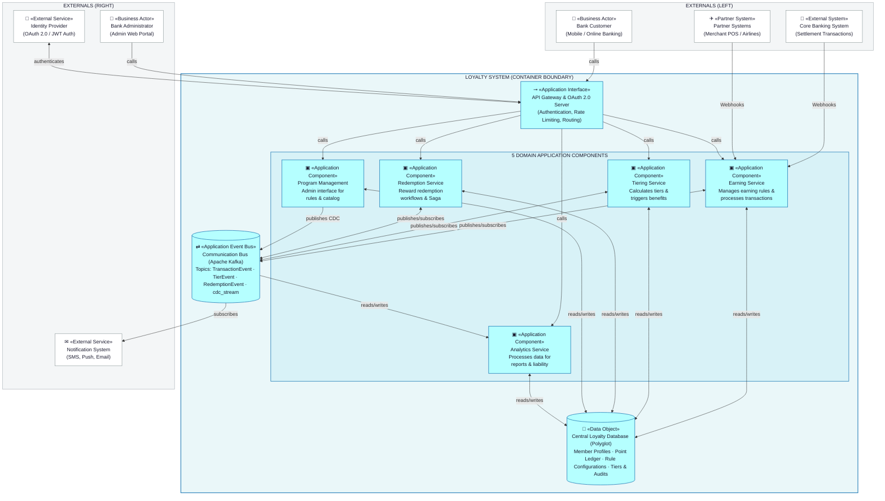
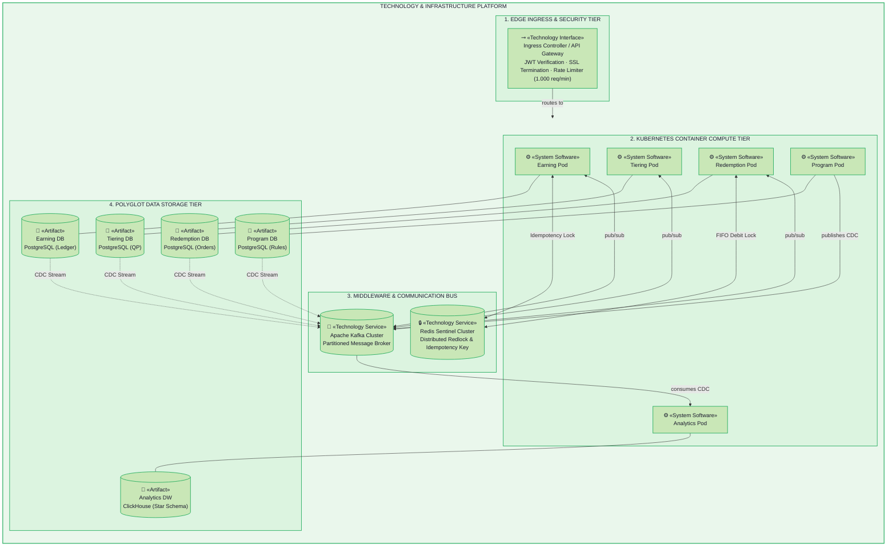
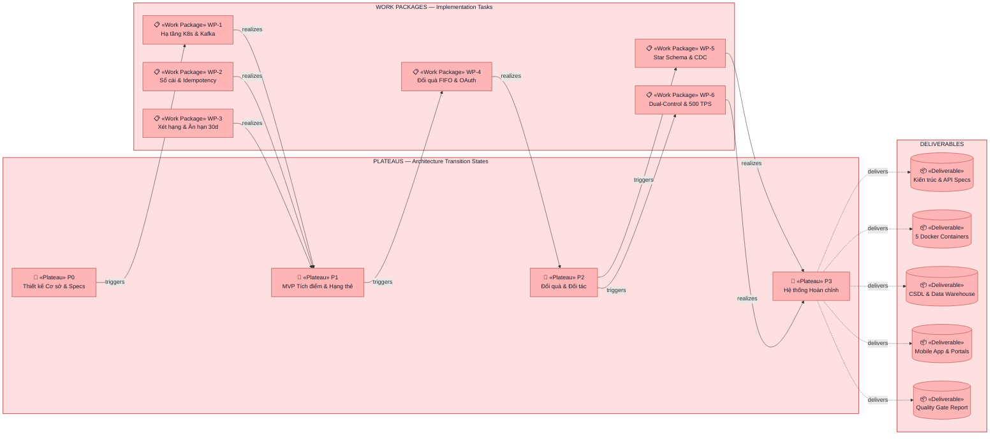
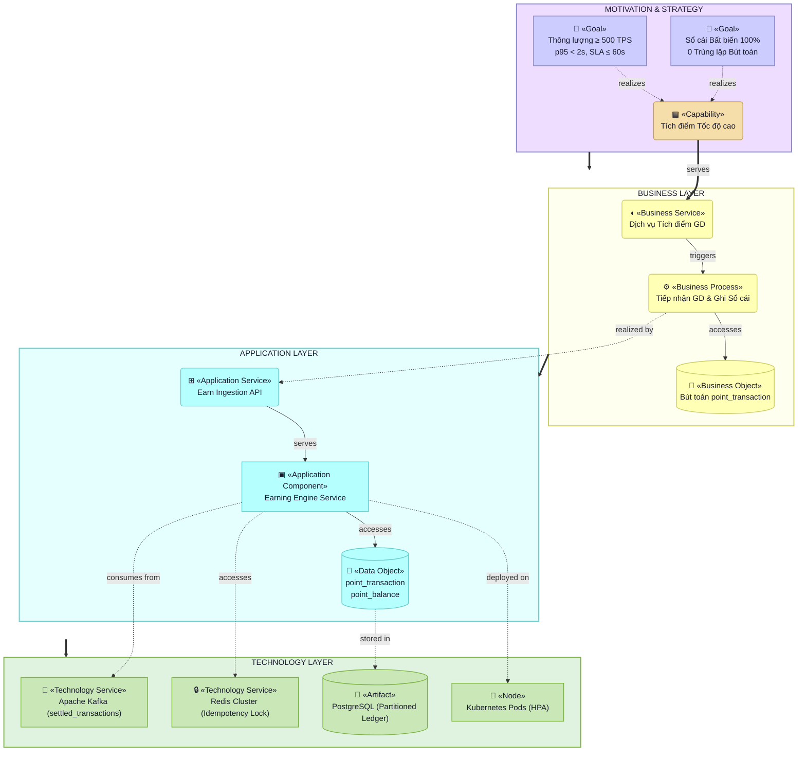

# Loyalty Banking — Kiến trúc Phân tầng ArchiMate 3.2 (ArchiMate Layer Diagrams)

**Domain**: Loyalty Banking Platform (Hệ thống Khách hàng Thân thiết Ngân hàng)  
**Tiêu chuẩn Kiến trúc**: The Open Group ArchiMate® 3.2 Specification & C4 Model Container Layout  
**Phiên bản**: 3.2  
**Tài liệu tham chiếu**:
- [loyalty_domain.md](file:///d:/learn/loyalty/loyalty_domain.md) — Tổng quan nghiệp vụ Loyalty
- [Architecture-Overview.md](file:///d:/learn/loyalty/architecture/Architecture-Overview.md) — Kiến trúc tổng thể hệ thống
- [Data-Architecture-and-Schema.md](file:///d:/learn/loyalty/architecture/Data-Architecture-and-Schema.md) — Kiến trúc dữ liệu & Star Schema
- [Security-and-Integration-Architecture.md](file:///d:/learn/loyalty/architecture/Security-and-Integration-Architecture.md) — Bảo mật & Tích hợp Đối tác
- [domain-event-catalog.md](file:///d:/learn/loyalty/architecture/domain-event-catalog.md) — Danh mục sự kiện Kafka

---

## 🎨 Quy chuẩn Bảng màu & Icon Chuẩn ArchiMate 3.2

### 1. Bảng màu Chuẩn (Archi Tool Standard)
| Tầng / Khía cạnh (Layer / Aspect) | Màu Nền (Fill) | Màu Viền (Stroke) | Hex Code | Ý nghĩa & Phân loại |
|---|:---:|:---:|:---:|---|
| **Motivation Aspect** | Lavender Purple | `#8888CC` | `#CCCCFF` | Stakeholders, Drivers, Goals, Principles, Requirements |
| **Strategy Layer** | Cream Tan | `#C4A055` | `#F5DEAA` | Capabilities, Resources, Courses of Action, Value Streams |
| **Business Layer** | Pale Yellow | `#CCCC66` | `#FFFFB5` | Business Actors, Roles, Services, Processes, Business Objects |
| **Application Layer** | Light Cyan | `#66CCCC` | `#B5FFFF` | Application Components, Services, Interfaces, Data Objects |
| **Technology Layer** | Mint Green | `#7CB342` | `#C9E7B7` | Nodes, System Software, Technology Services, Artifacts |
| **Implementation Layer** | Salmon Pink | `#CC6666` | `#FFB5B5` | Work Packages, Deliverables, Plateaus, Gaps |

### 2. Danh mục Icon & Stereotype Chuẩn ArchiMate 3.2
- **Motivation**: `👤 «Stakeholder»`, `🧭 «Driver»`, `🎯 «Goal»`, `📜 «Principle»`
- **Strategy**: `▦ «Capability»`, `⏩ «Value Stream»`
- **Business**: `👤 «Business Actor»`, `◖ «Business Service»`, `⚙ «Business Process»`, `📄 «Business Object»`
- **Application**: `▣ «Application Component»`, `⊸ «Application Interface»`, `⊞ «Application Service»`, `⇄ «Application Event Bus»`, `💾 «Data Object»`
- **Technology**: `🧊 «Node»`, `⚙ «System Software»`, `🔄 «Technology Service»`, `🔒 «Technology Service»`, `💾 «Artifact»`
- **Implementation & Migration**: `🏁 «Plateau»`, `📋 «Work Package»`, `📦 «Deliverable»`

---

## 1. Tổng quan Khung Phân tầng Kiến trúc (ArchiMate Core Stack)

---

## 2. Motivation & Strategy Layer (Tầng Động lực & Chiến lược)

---

## 3. Business Layer (Tầng Nghiệp vụ Loyalty)

---

## 4. Application Layer — C4 Container Architecture Layout

---

## 5. Technology & Infrastructure Layer (Tầng Công nghệ & Hạ tầng)

---

## 6. Implementation & Migration Layer (Lộ trình Triển khai Capstone)

---

## 7. Cross-Layer Traceability View (Sơ đồ Tích hợp Đa tầng)

---

## 8. Bảng Ma trận Ánh xạ Truy vết Phần tử ArchiMate (Traceability Matrix)

| STT | ArchiMate Layer | Loại Phần tử (Element Type) | Tên Phần tử trong Dự án Loyalty | Trách nhiệm & Ý nghĩa Nghiệp vụ / Kỹ thuật |
|:---:|---|---|---|---|
| 1 | **Motivation** | `👤 «Stakeholder»` | Ban Lãnh đạo, Marketing, Kế toán, Chủ thẻ, Đối tác | Các bên tham gia trực tiếp vào chuỗi giá trị Loyalty |
| 2 | **Motivation** | `🎯 «Goal»` | Thông lượng $\ge 500$ TPS, SLA $\le 60$s, Sổ cái Bất biến | Chỉ số đo lường hiệu năng và cam kết dịch vụ tài chính |
| 3 | **Motivation** | `📜 «Principle»` | ADR-001 (Cô lập DB), ADR-002 (Sự kiện/Idempotency), ADR-003 (CDC) | 3 quyết định kiến trúc cốt lõi định hình nền tảng |
| 4 | **Strategy** | `▦ «Capability»` | Tích điểm tốc độ cao, Quản lý Hạng thẻ động, Đổi quà FIFO | Năng lực cốt lõi phục vụ hệ sinh thái Loyalty Ngân hàng |
| 5 | **Business** | `👤 «Business Actor»` | Khách hàng (Member), Core Banking, Support Agent, Kế toán | Con người và hệ thống nguồn tham gia luồng nghiệp vụ |
| 6 | **Business** | `◖ «Business Service»` | Tích điểm, Nâng hạng Silver/Gold/Platinum, Đổi thưởng, Báo cáo Nợ | Gói dịch vụ cung cấp ra người dùng và nội bộ ngân hàng |
| 7 | **Business** | `⚙ «Business Process»` | Tích điểm từ Core Banking, Chu kỳ Hạng 30d Grace, Lệnh Duyệt kép | Các quy trình kinh doanh và luồng nghiệp vụ chuẩn |
| 8 | **Business** | `📄 «Business Object»` | Sổ cái Điểm (`point_transaction`), Số dư Điểm, QP, Đơn Đổi quà | Thực thể thông tin và dữ liệu kinh doanh tài chính |
| 9 | **Application** | `▣ «Application Component»` | Earning Engine, Tiering, Redemption, Program Mgmt, Analytics DW | 5 Microservices độc lập theo nguyên tắc Domain-Driven Design |
| 10 | **Application** | `⊸ «Application Interface»` | `settled_transactions`, `tier_event`, `cdc_stream`, REST Gateway | Giao diện API và hàng đợi điều phối sự kiện phân tán Kafka |
| 11 | **Application** | `💾 «Data Object»` | `point_transaction`, `point_balance`, `qp_ledger`, `fact_*` | Mô hình dữ liệu quan hệ và Star Schema Data Warehouse |
| 12 | **Technology** | `🧊 «Node»` / `⚙ «System SW»` | Kubernetes Cluster, Kafka, Redis Cluster, PostgreSQL, ClickHouse | Nền tảng hạ tầng tính toán, bộ nhớ đệm và CSDL phân tán |
| 13 | **Technology** | `💾 «Artifact»` | `earning-engine.jar`, Docker Containers, `*.sql` Migration Scripts | Các tệp nhị phân đóng gói triển khai thực tế trên K8s |
| 14 | **Implementation** | `📋 «Work Package»` | WP1 (Hạ tầng) $\rightarrow$ WP6 (Dual-Control & Quality Gates 500 TPS) | Các gói công việc triển khai thực tế cho đồ án Capstone |
| 15 | **Implementation** | `🏁 «Plateau»` | Plateau 0 (Baseline) $\rightarrow$ Plateau 3 (Target State Hoàn chỉnh) | Các giai đoạn bàn giao kiến trúc qua từng chặng đồ án |
