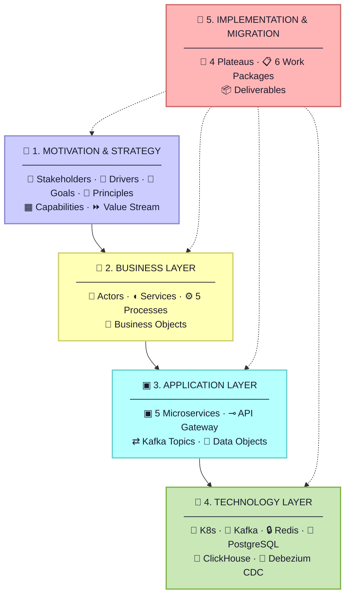
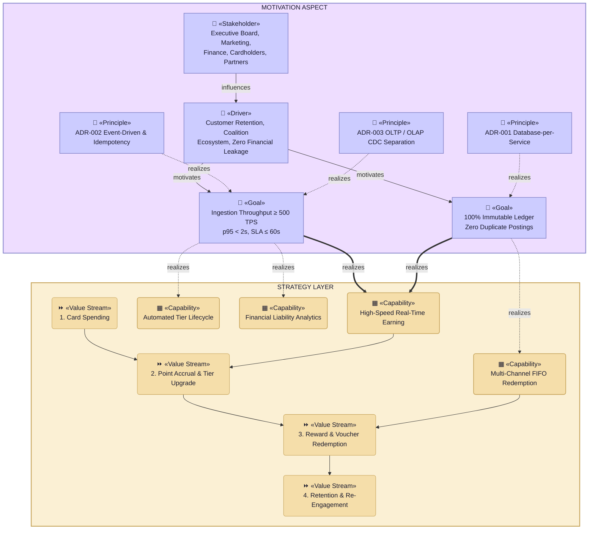
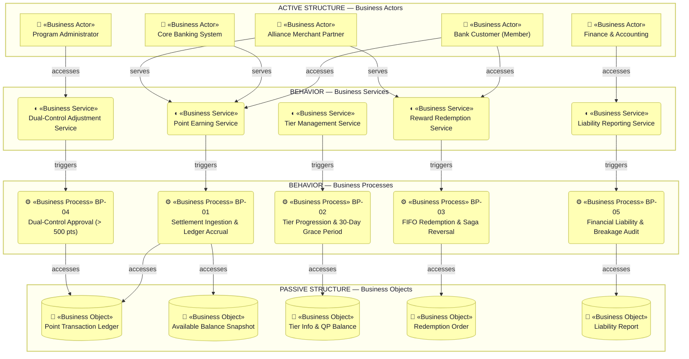
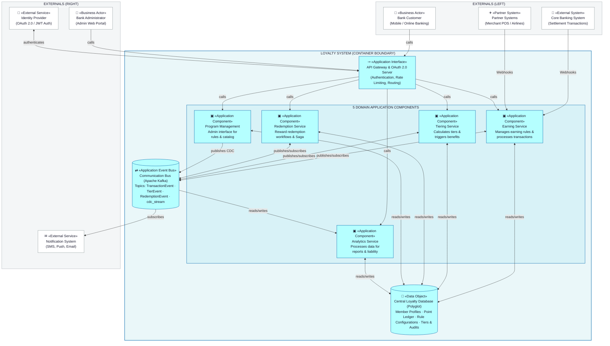
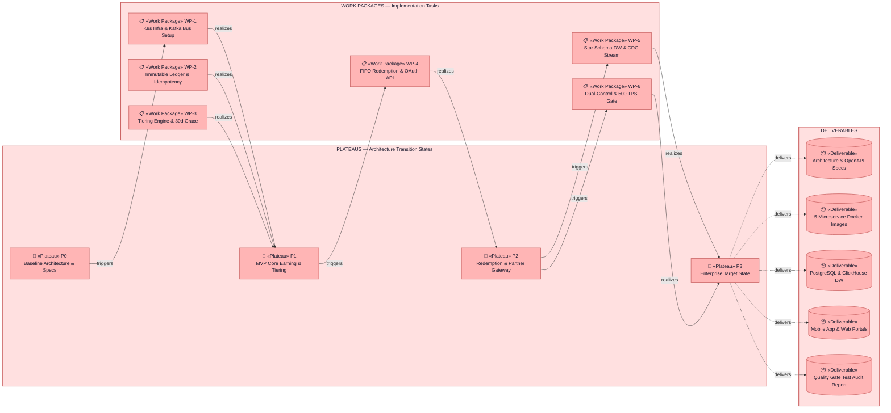
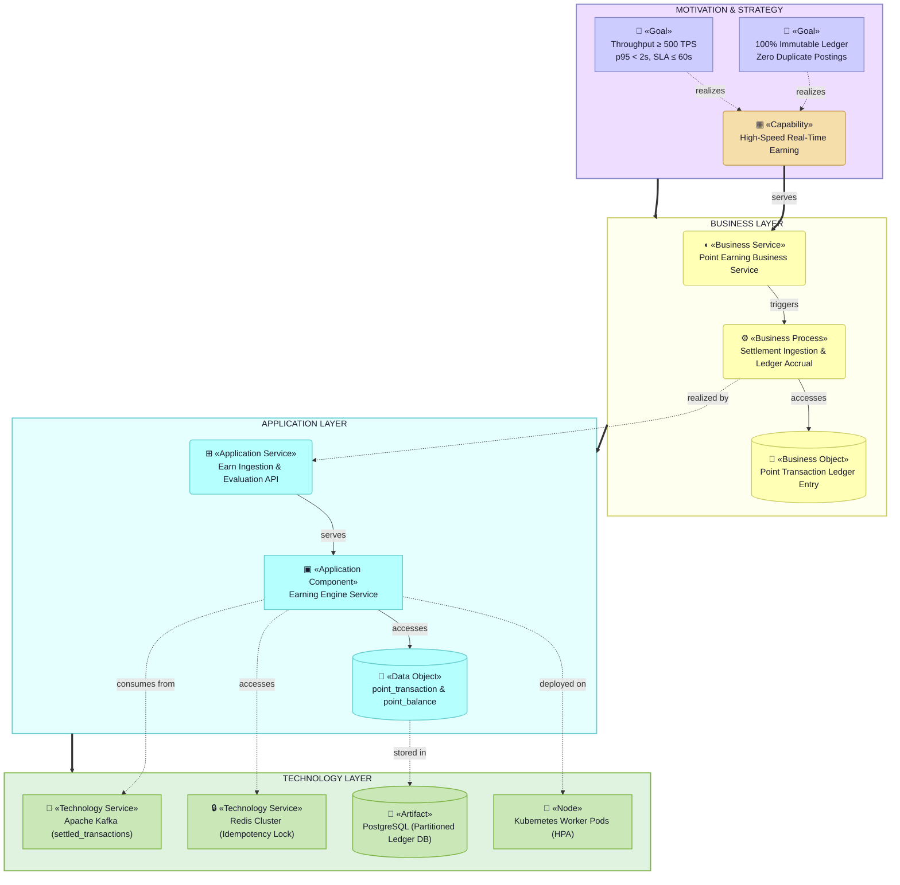

# Banking Loyalty System — ArchiMate 3.2 Enterprise Architecture Specification

> **Not a Lab 8 view — outside the modeling pack.**
> The four Lab 8 ArchiMate views are in [`../lab8-archimate-views.md`](../lab8-archimate-views.md).
> This file was drawn before the Guide was adopted. It has no header and no RACI, it uses the old container names, and it is kept only as before-pack material. It is not submitted and not reviewed.

**Domain**: Banking Loyalty Platform (Enterprise Financial Customer Engagement System)  
**Standard**: The Open Group ArchiMate® 3.2 Specification & C4 Model Container Layout  
**Version**: 3.2 (Production Release)  

---

## 📚 1. Architecture References & Documentation Catalog

| Document / Asset | Category | Key Contents & Architecture Scope | Repository Link |
|---|---|---|---|
| **C4 Level 1: System Context Diagram** | *C4 Model* | High-level system context diagram showing customer channels, core banking, partners, and external services. | [context.png](C4/context.png) |
| **C4 Level 2: Container Diagram** | *C4 Model* | Container architecture decomposition into API Gateway, 5 microservices, Kafka event bus, and polyglot DBs. | [container.png](C4/container.png) |
| **C4 Level 3: Component Diagram** | *C4 Model* | Internal component diagram showing Spring Boot controllers, domain rules, Kafka listeners, and Redlock managers. | [component.png](C4/component.png) |
| **Loyalty Domain Specification** | *Domain Rules* | Base earn rates, tier multipliers (Silver 1.0x, Gold 1.5x, Platinum 2.0x), 30-day grace period, FIFO debiting, and breakage liability rules. | [loyalty_domain.md](../lab2-requirements.md) |
| **Architecture Overview** | *C4 Model* | C4 System Context & Container diagrams, 5 domain microservices decomposition, synchronous vs asynchronous communication patterns. | [Architecture-Overview.md](Architecture-Overview.md) |
| **Data Architecture & Schema** | *Database & DW* | PostgreSQL Database-per-Service schemas, immutable point ledger, mutable snapshot tables, Redis Redlock configurations, and ClickHouse Star Schema. | [Data-Architecture-and-Schema.md](Data-Architecture-and-Schema.md) |
| **Security & Integration** | *Security & Ingress* | OAuth 2.0 Client Credentials flow for partners, API rate limiting policies (1,000 req/min/partner), and supervisor Dual-Control threshold approval (> 500 pts). | [Security-and-Integration-Architecture.md](Security-and-Integration-Architecture.md) |
| **Domain Event Catalog** | *Kafka Messaging* | Apache Kafka topic taxonomy, Avro/JSON event schemas, partition key strategy (`member_id`), consumer groups, and dead-letter queues (DLQ). | [domain-event-catalog.md](domain-event-catalog.md) |
| **The Open Group ArchiMate 3.2** | *Standard Spec* | Official Enterprise Architecture Modeling Language standard defining Motivation, Strategy, Business, Application, and Technology metamodels. | [ArchiMate Specification](https://www.opengroup.org/archimate-forum/archimate-overview) |

---

## 🎨 2. ArchiMate 3.2 Official Color Palette & Canonical Notation

### Color Palette (The Open Group & Archi Tool Standard)
| Layer / Aspect | Fill Color | Stroke Color | Hex Code | Visual Classification |
|---|:---:|:---:|:---:|---|
| **Motivation Aspect** | Lavender Purple | `#8888CC` | `#CCCCFF` | Stakeholders, Drivers, Goals, Principles, Requirements |
| **Strategy Layer** | Cream Tan | `#C4A055` | `#F5DEAA` | Capabilities, Resources, Courses of Action, Value Streams |
| **Business Layer** | Pale Yellow | `#CCCC66` | `#FFFFB5` | Business Actors, Roles, Services, Processes, Business Objects |
| **Application Layer** | Light Cyan | `#66CCCC` | `#B5FFFF` | Application Components, Services, Interfaces, Data Objects |
| **Technology Layer** | Mint Green | `#7CB342` | `#C9E7B7` | Nodes, System Software, Technology Services, Artifacts |
| **Implementation Layer** | Salmon Pink | `#CC6666` | `#FFB5B5` | Work Packages, Deliverables, Plateaus, Gaps |

### Canonical Stereotypes & Visual Cues
- **Motivation Elements**: `👤 «Stakeholder»`, `🧭 «Driver»`, `🎯 «Goal»`, `📜 «Principle»`
- **Strategy Elements**: `▦ «Capability»`, `⏩ «Value Stream»`
- **Business Elements**: `👤 «Business Actor»`, `◖ «Business Service»`, `⚙ «Business Process»`, `📄 «Business Object»`
- **Application Elements**: `▣ «Application Component»`, `⊸ «Application Interface»`, `⊞ «Application Service»`, `⇄ «Application Event Bus»`, `💾 «Data Object»`
- **Technology Elements**: `🧊 «Node»`, `⚙ «System Software»`, `🔄 «Technology Service»`, `🔒 «Technology Service»`, `💾 «Artifact»`
- **Implementation & Migration**: `🏁 «Plateau»`, `📋 «Work Package»`, `📦 «Deliverable»`

---

## 3. Architecture Overview (ArchiMate Core Stack)

---

## 4. Motivation & Strategy Layer

---

## 5. Business Layer

---

## 6. Application Layer — C4 Container Architecture Layout

---

## 7. Technology & Infrastructure Layer

---

## 8. Implementation & Migration Layer

---

## 9. Cross-Layer Traceability View

---

## 10. Traceability Matrix

| # | Layer | Element Type | Loyalty System Element Name | Business / Technical Responsibility |
|:---:|---|---|---|---|
| 1 | **Motivation** | `👤 «Stakeholder»` | Executive Board, Marketing, Finance/Accounting, Cardholder, Partners | Direct participants and beneficiaries in the Loyalty value chain |
| 2 | **Motivation** | `🎯 «Goal»` | Ingestion $\ge 500$ TPS, SLA $\le 60$s, 100% Immutable Ledger | Core performance SLA and financial non-repudiation targets |
| 3 | **Motivation** | `📜 «Principle»` | ADR-001 (DB Isolation), ADR-002 (Event/Idempotency), ADR-003 (CDC) | Foundational architectural invariant decisions |
| 4 | **Strategy** | `▦ «Capability»` | High-Speed Earning, Automated Tier Lifecycle, Multi-Channel FIFO Redemption | Core strategic enterprise capabilities |
| 5 | **Business** | `👤 «Business Actor»` | Cardholder (Member), Core Banking System, Program Admin, Finance, Partner | Human actors and external source banking systems |
| 6 | **Business** | `◖ «Business Service»` | Earning Service, Tier Evaluation Service, Reward Redemption, Liability Audit | Business services delivered to members and internal stakeholders |
| 7 | **Business** | `⚙ «Business Process»` | Core Banking Earning (BP01), Tiering Grace Period (BP02), FIFO Redemption (BP03), Dual-Control (BP04) | Standard enterprise business workflows and rules |
| 8 | **Business** | `📄 «Business Object»` | Point Transaction Ledger, Point Balance Snapshot, QP Ledger, Redemption Order | Passive informational and financial state business entities |
| 9 | **Application** | `▣ «Application Component»` | Earning Engine, Tiering System, Redemption Engine, Program Mgmt, Analytics Service | 5 autonomous Domain-Driven microservices |
| 10 | **Application** | `⊸ «Application Interface»` | `settled_transactions`, `tier_event`, `cdc_stream`, REST API Gateway | APIs and Kafka choreography event streams |
| 11 | **Application** | `💾 «Data Object»` | `point_transaction`, `point_balance`, `qp_ledger`, `fact_*` | Relational transactional data models and OLAP Star Schema |
| 12 | **Technology** | `🧊 «Node»` / `⚙ «System SW»` | Kubernetes Cluster, Kafka 3-Brokers, Redis Sentinel, PostgreSQL, ClickHouse | Distributed compute, caching, messaging, and storage nodes |
| 13 | **Technology** | `💾 «Artifact»` | `earning-engine.jar`, Docker Containers, `*.sql` Migration Scripts | Physical deployed binaries and database schema definitions |
| 14 | **Implementation** | `📋 «Work Package»` | WP1 (Infra Setup) $\rightarrow$ WP6 (Dual-Control & Quality Gates 500 TPS) | Capstone engineering implementation work packages |
| 15 | **Implementation** | `🏁 «Plateau»` | Plateau 0 (Baseline Specs) $\rightarrow$ Plateau 3 (Enterprise Target State) | Target architecture deliverables and handover states |

---

## 11. Lab 8 Four-View Review Register

This section binds the broader ArchiMate material above to the four named Lab 8 views required by `template/list.md`. Extra views and presentation material remain supporting evidence, but the trainee review set is the four rows below.

### 11.1 Input Coverage

| Lab 1 input | Evidence |
|---|---|
| I-1 goal/outcome | `loyalty.md` I-1; Motivation / Strategy view row below |
| I-4 containers | `loyalty.md` I-4; Application Cooperation view row below |
| I-5 process | `loyalty.md` I-5; Business Process view row below |
| I-9 deployment | `loyalty.md` I-9; Technology view row below |
| I-10 constraints | `loyalty.md` I-10; Motivation and Process view rows below |

### 11.2 Four Named Views

| # | View | After evidence | Must show | Must not show | Status |
|---:|---|---|---|---|---|
| 1 | Motivation or Strategy | `architecture/archimate/motivation-layer.md`; `architecture/archimate/strategy-layer.md`; sections 4 and 9 above | Goal, outcome, `CON.1` to `CON.3` as constraints or principles | Protocol, pods, JDBC, container internals | Pass with constraint mapping |
| 2 | Business Process | `architecture/archimate/business-layer.md`; section 5 above | I-5 happy path and `CON.*` on branches | C4 containers as process boxes; sync/async labels | Pass with process-to-constraint mapping |
| 3 | Application Cooperation | `architecture/archimate/application-layer.md`; section 6 above | Containers from I-4 using same strings as C4 Container | UML messages; mixed C4 notation | Pass with name-identity mapping |
| 4 | Technology / hybrid | `architecture/archimate/technology-layer.md`; section 7 above; deployment section in `Architecture-Overview.md` | Locations from I-9 and forbidden path | Channel writing core ledger DB | Pass with forbidden-path check |

### 11.3 After Header Register

| View | Header |
|---|---|
| Motivation / Strategy | Title: Loyalty Banking Motivation and Strategy; Viewpoint: ArchiMate; Layer(s): Strategy / Motivation; To-Be; Owner: Owner; RACI: R EA, A Owner, C SA BA/PO Sec, I DA Dev Test Ops; Version: v1.0, Date 2026-08-21, Status Review; Legend: Influence, Realization, Association, Triggering, Serving; Scope: Lab 1 I-1 |
| Business Process | Title: Loyalty Banking Business Process; Viewpoint: ArchiMate; Layer(s): Business; To-Be; Owner: Owner; RACI: R BA/PO, A Owner, C EA SA Sec Test, I DA Dev Ops; Version: v1.0, Date 2026-08-21, Status Review; Legend: Serving, Triggering, Assignment, Access, Realization; Scope: Lab 1 I-5 |
| Application Cooperation | Title: Loyalty Banking Application Cooperation; Viewpoint: ArchiMate; Layer(s): Application; To-Be; Owner: SA; RACI: R SA, A SA, C EA DA Sec Dev, I BA/PO Test Ops Owner; Version: v1.0, Date 2026-08-21, Status Review; Legend: Serving, Flow, Association, Access; Scope: Lab 1 I-4 and I-8 |
| Technology / hybrid | Title: Loyalty Banking Technology Deployment; Viewpoint: ArchiMate; Layer(s): Technology; To-Be; Owner: SA; RACI: R Ops, A SA, C Sec Dev, I EA BA/PO DA Test Owner; Version: v1.0, Date 2026-08-21, Status Review; Legend: Assignment, Serving, Access, Flow; Scope: Lab 1 I-9 |

### 11.4 G1 Motivation / Strategy Constraint Mapping

| G1 item | Lab 1 source | View representation |
|---|---|---|
| Goal | I-1 Goal | Real-time earning, ledger integrity, reporting isolation, and governed adjustments in Motivation/Strategy evidence |
| Outcome | I-1 Outcome | SLA and data-staleness goals in Motivation/Strategy evidence |
| CON.1 | No duplicate point posting | Principle / requirement for event-driven idempotency and ledger integrity |
| CON.2 | No direct database writes from channels, partners, or other services | Principle / requirement for database-per-service and source-of-truth ownership |
| CON.3 | Fulfillment failure must compensate by restoring points | Requirement/constraint attached to redemption and ledger integrity capability |

### 11.5 G2 Business Process and State Mapping

| I-5 step | ArchiMate Business Process representation | Constraint branch | Related state |
|---:|---|---|---|
| 1 | Settlement ingestion event enters loyalty process | CON.1 if duplicate source transaction | `PointTransaction` duplicate avoided |
| 2 | Point earning and ledger accrual | CON.1 if idempotency check fails | `PointTransaction` created/confirmed |
| 3 | QP accrual event published | CON.2 prevents direct tier DB write by Earning Engine | `MemberTier` updated by owner |
| 4 | Tier progression process evaluates threshold | CON.2 controls owner writes | `MemberTier` active/upgraded |
| 5 | Member submits redemption request | CON.2 enforces API route through gateway/service | `RedemptionOrder` PENDING |
| 6 | FIFO redemption and validation process | CON.2 blocks direct ledger DB mutation by Redemption Engine | `RedemptionOrder` IN_PROGRESS |
| 7 | Fulfillment process completes or fails | CON.3 on failure branch | `RedemptionOrder` FULFILLED or FAILED |
| 8 | Analytics reporting process consumes CDC | CON.2 blocks reporting reads from OLTP | Warehouse facts updated |

### 11.6 Application Cooperation Name Identity

| I-4 canonical name | Application view usage |
|---|---|
| API Gateway / OAuth 2.0 Auth Server | Edge application interface/component |
| Message Broker - Apache Kafka | Application event bus |
| Earning Engine Service | Application component |
| Tiering System Service | Application component |
| Redemption Engine Service | Application component |
| Program Management Service | Application component |
| Analytics & Reporting Service | Application component |
| Redis Cache & Distributed Lock | Application/technology support component label |
| Data Warehouse - Star Schema | Analytics data object/store |

### 11.7 Technology / Forbidden Path Check

| Location from I-9 | Technology view evidence | Forbidden-path status |
|---|---|---|
| Edge & Ingestion Zone | API gateway and event bus technology services | Does not write directly to Earning DB - PostgreSQL |
| Domain Services Zone | Service runtimes for earning, tiering, redemption, program management | Each service writes only its owned database |
| Analytics Zone | Analytics service and Data Warehouse - Star Schema | Analytics reads warehouse/CDC, not OLTP directly |
| Data Services Zone | PostgreSQL service databases and Redis | Owned by service boundaries and not exposed to external actors |

### 11.8 Negative Evidence

| Forbidden item | Status |
|---|---|
| Protocol, pods, JDBC, or container internals on Motivation / Strategy review view | Excluded from trainee Motivation / Strategy mapping |
| C4 containers as Business Process boxes | Business process mapping uses process names and business objects |
| UML messages inside Application Cooperation | Application Cooperation mapping uses ArchiMate application flows/interfaces |
| Channel writing core ledger DB | Explicitly forbidden by I-9 and CON.2 |
| More than four required Lab 8 views | Extra ArchiMate files/presentations are retained as supporting material, but the trainee review set is the four named views above |
