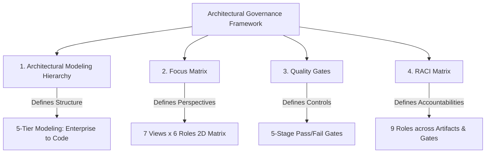
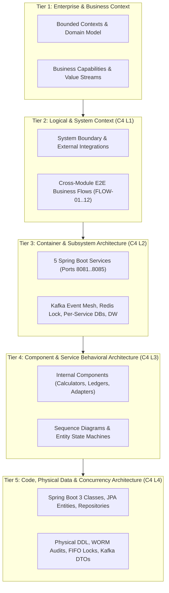
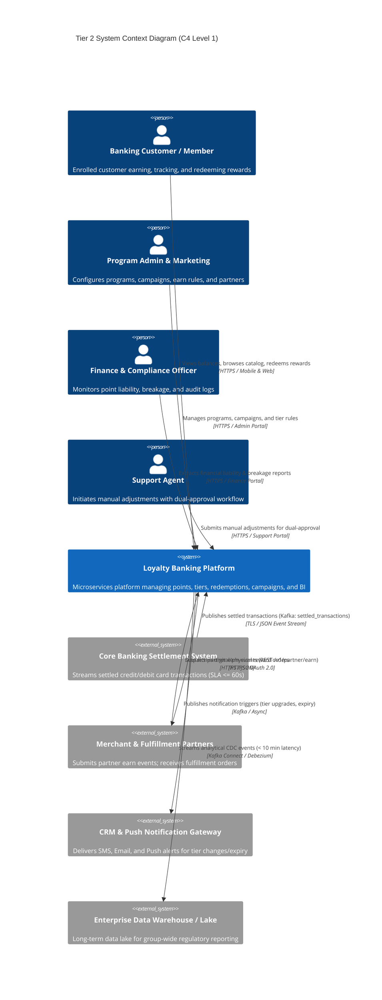
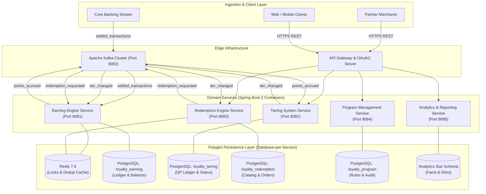
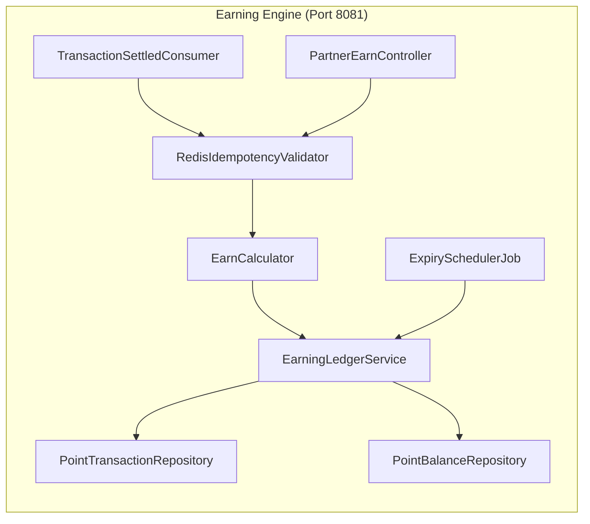
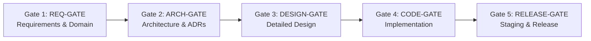
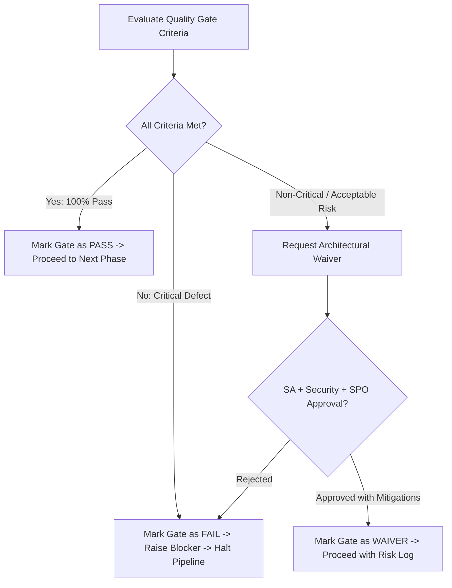

# Loyalty Banking — Architectural Governance Framework
## Architectural Modeling Hierarchy, Focus Matrix, Quality Gates & RACI Matrix

**Domain**: Loyalty Banking  
**Version**: 1.0  
**Date**: 2026-08-20  
**Author**: Enterprise Architecture & Engineering Governance Team  
**Scope**: All 5 Core Modules (`Earning Engine`, `Tiering System`, `Redemption Engine`, `Program Management`, `Analytics & Reporting`), Cross-Cutting Infrastructure, and Full Codebase Implementation (`loyalty-platform-impl`).

---

## Table of Contents

1. [Executive Overview](#1-executive-overview)
2. [Architectural Modeling Hierarchy (5-Tier Architecture Model)](#2-architectural-modeling-hierarchy)
   - [2.1 Tier 1: Enterprise & Business Context Architecture](#21-tier-1-enterprise--business-context-architecture)
   - [2.2 Tier 2: Logical & Macro System Context (C4 Level 1)](#22-tier-2-logical--macro-system-context-c4-level-1)
   - [2.3 Tier 3: Container & Subsystem Architecture (C4 Level 2)](#23-tier-3-container--subsystem-architecture-c4-level-2)
   - [2.4 Tier 4: Component & Service Behavioral Architecture (C4 Level 3)](#24-tier-4-component--service-behavioral-architecture-c4-level-3)
   - [2.5 Tier 5: Code, Physical Data & Concurrency Architecture (C4 Level 4)](#25-tier-5-code-physical-data--concurrency-architecture-c4-level-4)
   - [2.6 Traceability Across the 5 Modeling Tiers](#26-traceability-across-the-5-modeling-tiers)
3. [Architectural Focus Matrix](#3-architectural-focus-matrix)
   - [3.1 Matrix Structure & Dimensions](#31-matrix-structure--dimensions)
   - [3.2 2D Focus Matrix (7 Architectural Views × 6 Stakeholder Perspectives)](#32-2d-focus-matrix-7-architectural-views--6-stakeholder-perspectives)
   - [3.3 Deliverables, Decision Criteria & KPI Mapping](#33-deliverables-decision-criteria--kpi-mapping)
4. [Enterprise Quality Gates Framework](#4-enterprise-quality-gates-framework)
   - [4.1 Quality Gate Lifecycle & Phase Transitions](#41-quality-gate-lifecycle--phase-transitions)
   - [4.2 Gate 1: Requirements & Domain Quality Gate (REQ-GATE)](#42-gate-1-requirements--domain-quality-gate-req-gate)
   - [4.3 Gate 2: Architecture Quality Gate (ARCH-GATE)](#43-gate-2-architecture-quality-gate-arch-gate)
   - [4.4 Gate 3: Detailed Design Quality Gate (DESIGN-GATE)](#44-gate-3-detailed-design-quality-gate-design-gate)
   - [4.5 Gate 4: Implementation & Code Quality Gate (CODE-GATE)](#45-gate-4-implementation--code-quality-gate-code-gate)
   - [4.6 Gate 5: Verification, Staging & Release Quality Gate (RELEASE-GATE)](#46-gate-5-verification-staging--release-quality-gate-release-gate)
   - [4.7 Quality Gate Evaluation & Escalation Protocol](#47-quality-gate-evaluation--escalation-protocol)
5. [RACI Matrix for Architectural Governance](#5-raci-matrix-for-architectural-governance)
   - [5.1 Governance Roles Definition](#51-governance-roles-definition)
   - [5.2 RACI Matrix: Artifact Lifecycle & Modeling Tiers](#52-raci-matrix-artifact-lifecycle--modeling-tiers)
   - [5.3 RACI Matrix: Quality Gates Sign-off & Verification](#53-raci-matrix-quality-gates-sign-off--verification)
   - [5.4 RACI Matrix: Runtime Operations & Change Management](#54-raci-matrix-runtime-operations--change-management)
6. [Summary & Navigation Index](#6-summary--navigation-index)

---

## 1. Executive Overview

The **Loyalty Banking Platform** is an enterprise-grade financial loyalty solution providing real-time point earning, tier progression, catalog redemptions, campaign lifecycle management, and financial liability reporting. 

To ensure architectural integrity, regulatory compliance, zero financial discrepancies (e.g. duplicate point issuance, stale balance consumption), and seamless alignment between high-level business goals and Java Spring Boot code, this document establishes **four unified governance pillars**:



---

### 1.1 Lab 7 Guide Adoption for the Trainee Modeling Pack

This project adopts the Guide in `template/list.md` as written for the trainee modeling pack. The authoritative modeling gates for the pack are `G1` to `G6` only. The 5-stage enterprise gate lifecycle later in this document is retained as extended engineering governance and does not replace `G1` to `G6`.

| Guide role | Assigned name |
|---|---|
| Owner | Business Owner (simulated) |
| EA | Enterprise Architect (team role) |
| SA | Solution Architect (team role) |
| BA / PO | Business Analyst / Product Owner (team role) |
| DA | Domain / Data Architect (team role) |
| Sec | Security / Compliance / Risk (team role) |
| Dev | Software Engineer (team role) |
| Test | Quality Engineer (team role) |
| Ops | DevOps Engineer (team role) |

#### Adopted Modeling Hierarchy

| Level | Language | Loyalty Banking evidence |
|---|---|---|
| Top - enterprise | ArchiMate | Motivation/Strategy, Business Process, Application Cooperation, Technology views under `architecture/archimate/` |
| Middle - solution | C4 plus ArchiMate Application / Technology | `architecture/Architecture-Overview.md` C4 Context and Container views |
| Base - delivery | UML plus one C4 Component | `design/DD-01..05`, `design/entity-lifecycle-models.md`, selected C4 Component for `Redemption Engine Service` |

#### Adopted Modeling Gates: G1 to G6

| Gate | Blocks | Pass rule for Loyalty Banking |
|---|---|---|
| G1 | Solution design | Goal, measurable outcome, and `CON.1` to `CON.3` are listed in the Lab 1 index and Motivation/Strategy evidence |
| G2 | Dev + Test design | `RedemptionOrder` states match the state view and process branch evidence |
| G3 | Implementation | C4 Context and Container have no unnamed externals; sync/async edges and names match the Lab 1 index |
| G4 | Coding of integrations | Every C4 Container relationship has a contract row in the Lab 3 contract register |
| G5 | Production release | Critical fulfillment failure compensation is modeled from `CON.3` |
| G6 | UAT sign-off | State transitions and sequence alternatives are mapped to planned tests with C4 SUT names |

#### RACI Line Template for After Views

```text
Title:      <view title>
Viewpoint:  <ArchiMate / C4 / UML>
Layer(s):   <Strategy / Business / App / Tech / Delivery>
As-Is | To-Be | Transition:  To-Be
Owner:      Role <Owner role>  Name <simulated role name>
RACI:       R <role>  A <role>  C <role list>  I <role list>
Version:    v1.0  Date 2026-08-21  Status Review
Legend:     relationships listed in the diagram or view-specific legend
RACI legend: R = draws; A = approves; C = consulted; I = informed
Scope:      in-scope and out-of-scope as defined in Lab 1 I-1
```

#### RACI by Guide Artifact

| Artifact | R | A | C | I |
|---|---|---|---|---|
| Motivation / Strategy | EA | Owner | SA, BA / PO, Sec | DA, Dev, Test, Ops |
| Business Process | BA / PO | Owner | EA, SA, Sec, Test | DA, Dev, Ops |
| Application Cooperation | SA | SA | EA, DA, Sec, Dev | BA / PO, Test, Ops, Owner |
| Technology / Deployment | Ops | SA | Sec, Dev | EA, BA / PO, DA, Test, Owner |
| C4 Context | SA | Owner | EA, BA / PO, Sec | DA, Dev, Test, Ops |
| C4 Container | SA | SA | DA, Sec, Dev, Ops | EA, BA / PO, Test, Owner |
| C4 Component | Dev | SA | DA, Sec, Test | EA, BA / PO, Ops, Owner |
| UML Sequence | Dev | SA | BA / PO, Sec, Test | EA, DA, Ops, Owner |
| UML Activity / State | Test | BA / PO | SA, Sec, Dev | EA, DA, Ops, Owner |

---

## 2. Architectural Modeling Hierarchy

The Architectural Modeling Hierarchy organizes the system into **5 distinct abstraction tiers**, ensuring complete model-driven traceability from high-level business capabilities down to physical Spring Boot classes and PostgreSQL DDL.



---

### 2.1 Tier 1: Enterprise & Business Context Architecture

Tier 1 establishes the enterprise domain boundaries, business capabilities, and strategic policies governing the loyalty banking ecosystem.

#### 1. Bounded Context Map (DDD)
The domain is partitioned into 5 autonomous Bounded Contexts following [loyalty_domain.md](file:///Users/hoangdd/Desktop/personal/workspace/AI-study-2/loyalty_domain.md):
- **Earning Context**: Core earning mechanics, transactional base calculation, bonus multiplier evaluation, append-only point ledger, expiry scheduling.
- **Tiering Context**: Qualifying Point (QP) accrual, instant tier elevation, calendar-year evaluation cycles, 30-day grace rescue mechanics.
- **Redemption Context**: Reward catalog access, tier-restricted rewards, atomic FIFO point debiting, external partner fulfillment orchestration, automated failure compensation/reversal.
- **Program Management Context**: Multi-program lifecycle, campaign configuration with priority conflict resolution, temporal rule versioning, partner onboarding with OAuth 2.0, dual-control manual balance adjustments.
- **Analytics & Reporting Context**: Near-real-time Change Data Capture (CDC), star schema data warehousing, financial point liability calculation, breakage forecasting, operational health dashboards.

#### 2. Strategic Business Policies
- **Monetary Valuation**: Fixed default point valuation of $0.01/point (100 points = $1.00 USD) across redemptions and liability accounting.
- **Ledger Immutability**: All point transactions (`point_transaction`) and QP transactions (`qp_ledger`) are write-once, append-only records. Updates and deletes are prohibited.
- **Temporal Configuration**: Rule updates operate strictly prospectively using temporal versioning (`valid_from`, `valid_to`), preventing retroactive distortion of historical transactions.

---

### 2.2 Tier 2: Logical & Macro System Context (C4 Level 1)

Tier 2 models the macro interactions between the Loyalty Banking Platform and external enterprise systems, formalizing boundary contracts and asynchronous/synchronous channels.



#### Macro Integration Patterns & E2E Flows
- **Macro Flow Catalog**: 12 end-to-end business flows (`FLOW-01` through `FLOW-12`) connecting upstream banking settlements to downstream fulfillment and accounting ([traceability.md](file:///Users/hoangdd/Desktop/personal/workspace/AI-study-2/traceability.md) §3).
- **Core SLA Targets**: Ingestion SLA $\le 60\text{s}$ from settlement; Processing throughput $\ge 500\text{ TPS}$; Latency $p95 \le 2,000\text{ms}$; Analytics data staleness $\le 10\text{ minutes}$.

---

### 2.3 Tier 3: Container & Subsystem Architecture (C4 Level 2)

Tier 3 details the deployable service containers, polyglot persistence stores, and communication buses implementing the platform.



#### Container Specifications

| Container | Runtime | Port | Primary Responsibility | Data Store | Key Dependencies |
|---|---|---|---|---|---|
| `earning-engine` | Java 17 / Spring Boot 3 | 8081 | Settlement ingestion, rule calculation, FIFO ledger | PostgreSQL (`loyalty_earning`), Redis | Kafka, Redis |
| `tiering-system` | Java 17 / Spring Boot 3 | 8082 | QP accumulation, instant upgrade, 30d grace sweep | PostgreSQL (`loyalty_tiering`) | Kafka |
| `redemption-engine` | Java 17 / Spring Boot 3 | 8083 | Catalog validation, FIFO point debit, fulfillment reversal | PostgreSQL (`loyalty_redemption`), Redis | Kafka, Redis, Partner APIs |
| `program-management` | Java 17 / Spring Boot 3 | 8084 | Program/campaign lifecycle, rule versioning, WORM audit | PostgreSQL (`loyalty_program`) | Kafka |
| `analytics-reporting` | Java 17 / Spring Boot 3 | 8085 | Liability computation, breakage, star schema ETL | PostgreSQL (`loyalty_dw` / Star Schema) | Kafka, PostgreSQL |

---

### 2.4 Tier 4: Component & Service Behavioral Architecture (C4 Level 3)

Tier 4 defines the internal structural components within each microservice and their behavioral dynamics (state machines and sequence flows).

#### Internal Component Blueprint (Example: Earning Engine & Redemption Engine)



#### Behavioral Models & State Machines
- **Entity Lifecycles**: Strict state machine constraints modeled in [entity-lifecycle-models.md](file:///Users/hoangdd/Desktop/personal/workspace/AI-study-2/design/entity-lifecycle-models.md):
  - `PointTransaction`: `PENDING` $\to$ `CONFIRMED` $\to$ `EXPIRED` | `REDEEMED` | `CANCELLED`.
  - `MemberTier`: `ACTIVE` $\to$ `IN_GRACE_PERIOD` $\to$ `DOWNGRADED` (or rescued to `ACTIVE`).
  - `RedemptionOrder`: `PENDING` $\to$ `IN_PROGRESS` $\to$ `FULFILLED` | `FAILED` $\to$ `REVERSED`.
  - `Campaign`: `DRAFT` $\to$ `ACTIVE` $\to$ `PAUSED` $\to$ `COMPLETED` $\to$ `DEACTIVATED`.

---

### 2.5 Tier 5: Code, Physical Data & Concurrency Architecture (C4 Level 4)

Tier 5 maps directly to the physical codebase in `loyalty-platform-impl/`, defining package conventions, database constraints, concurrency locking mechanisms, and event serialization formats.

#### 1. Codebase Package Convention (Spring Boot 3)
```
com.loyalty.<module_name>/
├── api/             # REST Controllers, Request/Response DTOs, Exception Handlers
├── domain/          # JPA Entities (@Entity, @Table), Enums, Value Objects
├── kafka/           # Event Consumers (@KafkaListener), Event Publishers, Event DTOs
├── repository/      # Spring Data JPA Repositories (with Locking queries)
├── service/         # Core Domain Logic, Calculators, Transactional Orchestration
└── config/          # Security, Kafka, Redis, and Database Configurations
```

#### 2. Physical Data & Schema Controls
- **PostgreSQL Isolation**: 5 separate schemas enforcing [ADR-001](file:///Users/hoangdd/Desktop/personal/workspace/AI-study-2/architecture/adrs/ADR-001-module-boundaries-and-data-isolation.md).
- **FIFO Ledger Indexes**: `idx_pt_fifo_lookup` on `point_transaction (member_id, expiry_date, earn_date)` for $O(\log N)$ FIFO point debit queries.
- **Audit Immutability**: `config_version_log` and `manual_adjustment_log` configured with database-level triggers blocking `UPDATE` and `DELETE` operations.

#### 3. Concurrency & Locking Mechanics
- **Distributed Idempotency Lock**: Redis key `lock:idempotency:{source_system}:{transaction_id}` with a 60-second TTL prevents duplicate concurrent credit operations.
- **Atomic Balance Lock**: Redis `RLock` key `lock:member:balance:{member_id}` ensures FIFO point debits and concurrent earn events for the same member do not race.

---

### 2.6 Traceability Across the 5 Modeling Tiers

| Domain Concept | Tier 1 (Context) | Tier 2 (System C4 L1) | Tier 3 (Container C4 L2) | Tier 4 (Component C4 L3) | Tier 5 (Code & DDL C4 L4) |
|---|---|---|---|---|---|
| **Base Earn** | Earning Context | Core Banking Feed | `earning-engine:8081` | `EarnCalculator`, `EarningLedgerService` | `PointTransaction.java`, `point_transaction` DDL |
| **Instant Upgrade** | Tiering Context | Push Notification | `tiering-system:8082` | `QpAccruedConsumer`, `TierUpgradeService` | `MemberTier.java`, `QpLedgerRepository` |
| **FIFO Debit** | Redemption Context | Partner Gateway | `redemption-engine:8083` | `FifoDebitService`, `BalanceLockService` | `RedemptionService.java`, Redis `RLock` |
| **Rule Versioning**| Program Admin | Admin Portal | `program-management:8084`| `ProgramService`, `AuditLogService` | `ConfigVersionLog.java`, `valid_from` checks |
| **Point Liability**| Analytics Context | EDW / BI Dashboards | `analytics-reporting:8085`| `ReportingService`, Star Schema Loader | `FactPointTransaction.java`, Star Schema |

---

## 3. Architectural Focus Matrix

The Architectural Focus Matrix applies the principles of **ISO/IEC/IEEE 42010** and **TOGAF**, establishing a 2-dimensional governance mapping between **7 Architectural Perspectives (Views)** and **6 Stakeholder Roles**.

```mermaid
graph LR
    subgraph Views["7 Architectural Perspectives"]
        V1[1. Business & Domain Architecture]
        V2[2. Behavioral & Workflow Architecture]
        V3[3. Data & Storage Architecture]
        V4[4. Integration & Contract Architecture]
        V5[5. Security & Governance Architecture]
        V6[6. Non-Functional & Resilience Architecture]
        V7[7. Infrastructure & Observability Architecture]
    end

    subgraph Roles["6 Stakeholder Perspectives"]
        R1[1. Executive & Product Owner]
        R2[2. Solution Architect]
        R3[3. Software Engineer & Tech Lead]
        R4[4. Security & Compliance Officer]
        R5[5. Data Engineer & BI Specialist]
        R6[6. DevOps, SRE & QA Lead]
    end

    Views <-->|Governed by Focus Matrix| Roles
```



---

### 3.1 Matrix Structure & Dimensions

- **Horizontal Dimension (Architectural Views)**:
  1. *Business & Domain*: Capability mapping, domain glossary, business rules, monetary valuation.
  2. *Behavioral & Workflow*: End-to-end sequence flows, state machine lifecycles, compensation paths.
  3. *Data & Storage*: Polyglot DDL, append-only ledgers, star schema DW, retention tiers.
  4. *Integration & Contracts*: REST OpenAPI, Kafka AsyncAPI schemas, OAuth 2.0 client credentials.
  5. *Security & Governance*: RBAC matrix, PII data classification, dual-control approval, WORM audit.
  6. *Non-Functional & Resilience*: 500 TPS sustained load, p95 $\le$ 2s latency, multi-AZ RTO/RPO.
  7. *Infrastructure & Observability*: Docker Compose, Kubernetes, OpenTelemetry distributed tracing.

- **Vertical Dimension (Stakeholder Perspectives)**:
  1. *Executive / Business Owner (SPO / Business Lead)*
  2. *Enterprise & Solution Architecture (SA / EA)*
  3. *Software Engineering & Technical Leads (TL / DEV)*
  4. *Information Security & Compliance (SEC / FIN)*
  5. *Data Engineering & BI Specialists (DE / Analytics)*
  6. *DevOps, Site Reliability & QA (OPS / SRE / QA)*

---

### 3.2 2D Focus Matrix (7 Architectural Views × 6 Stakeholder Perspectives)

| Architectural View | 1. Executive / SPO | 2. Solution Architect | 3. Software Engineer / TL | 4. Security & Compliance | 5. Data Engineer / BI | 6. DevOps / SRE / QA |
|---|---|---|---|---|---|---|
| **1. Business & Domain** | **Accountable**: Business capabilities, ROI, partner program margins. | **Responsible**: Bounded context definitions, aggregate boundaries. | **Informed**: Implements entity business rules in Spring Boot services. | **Consulted**: Regulatory bounds on loyalty points as bank liabilities. | **Consulted**: Alignment of business KPIs with analytics facts. | **Informed**: Understanding test domain contexts and business flows. |
| **2. Behavioral & Workflow** | **Consulted**: Review customer experience in earn, redeem, and grace periods. | **Accountable**: Macro sequence diagrams and cross-module flows (FLOW-01..12). | **Responsible**: Internal component interactions, state machine coding. | **Consulted**: Approval workflow state transitions (dual-control). | **Informed**: Tracking event sequences for CDC ETL synchronization. | **Responsible**: Automated test scenarios validating E2E sequence flows. |
| **3. Data & Storage** | **Informed**: Data retention policy approval (Hot 2y, Warm 5y, Cold 10y). | **Accountable**: Polyglot persistence strategy, ADR-001 compliance. | **Responsible**: DDL schema creation, JPA entity mappings, FIFO indexes. | **Accountable**: PII data field identification, encryption at rest. | **Responsible**: Star schema design, ETL pipelines, Fact/Dim tables. | **Responsible**: Database backup automation, multi-AZ replication. |
| **4. Integration & Contracts** | **Informed**: SLA agreements with external merchant partners. | **Accountable**: API design standards, AsyncAPI event catalog schemas. | **Responsible**: Implementing REST controllers, Kafka consumers/producers. | **Accountable**: OAuth 2.0 mTLS verification, API gateway rate limiting. | **Responsible**: Consuming Kafka CDC streams (`cdc_events` topic). | **Responsible**: API Gateway deployment, contract testing in CI/CD. |
| **5. Security & Governance** | **Informed**: Audit reports, fraud alerts, compliance sign-offs. | **Consulted**: Security architecture patterns (dual-control, OAuth2). | **Responsible**: Implementing RBAC annotations (`@PreAuthorize`), WORM logs. | **Accountable**: Threat modeling, vulnerability scanning, WORM audit verification. | **Consulted**: Data masking in analytical data warehouse extracts. | **Responsible**: Secret management, TLS certificate rotation, SAST/DAST. |
| **6. Non-Functional & Resilience** | **Informed**: Uptime SLA ($99.95\%$), business continuity assurance. | **Accountable**: Defining throughput targets ($\ge 500\text{ TPS}$), RTO $\le 5\text{m}$. | **Responsible**: Thread pool sizing, Redis distributed lock optimizations. | **Consulted**: Resiliency compliance under DDoS and data breach scenarios. | **Responsible**: Batch query optimization, preventing OLTP performance degradation. | **Accountable**: Load testing (JMeter/k6), multi-AZ failover drills. |
| **7. Infrastructure & Observability** | **Informed**: Cloud/Infrastructure budget allocation. | **Consulted**: Deployment topology blueprints, container standards. | **Responsible**: Health check endpoints (`/actuator/health`), trace context propagation. | **Consulted**: Centralized security log ingestion, SIEM integration. | **Informed**: Monitoring DW ETL ingestion pipeline lag. | **Accountable**: Docker Compose orchestration, Prometheus/Grafana dashboards. |

---

### 3.3 Deliverables, Decision Criteria & KPI Mapping

| Architectural View | Primary Artifact Deliverables | Critical Decision Criteria | Target Success KPIs |
|---|---|---|---|
| **Business & Domain** | [loyalty_domain.md](file:///Users/hoangdd/Desktop/personal/workspace/AI-study-2/loyalty_domain.md), [requirements/FR-01..05](file:///Users/hoangdd/Desktop/personal/workspace/AI-study-2/requirements) | No ambiguity in earn/tier/redemption calculations | $100\%$ acceptance criteria coverage |
| **Behavioral & Workflow** | [DD-01..05](file:///Users/hoangdd/Desktop/personal/workspace/AI-study-2/design), [entity-lifecycle-models.md](file:///Users/hoangdd/Desktop/personal/workspace/AI-study-2/design/entity-lifecycle-models.md) | All state transitions have explicit trigger events | Zero deadlocked or unhandled entity states |
| **Data & Storage** | [Data-Architecture-and-Schema.md](file:///Users/hoangdd/Desktop/personal/workspace/AI-study-2/architecture/Data-Architecture-and-Schema.md) | Strict database-per-service; append-only ledger | $100\%$ schema constraint validation |
| **Integration & Contracts**| [domain-event-catalog.md](file:///Users/hoangdd/Desktop/personal/workspace/AI-study-2/architecture/domain-event-catalog.md), OpenAPI specs | All events have schema, partition key & idempotency | Zero breaking API/event schema changes |
| **Security & Governance** | [Security-and-Integration-Architecture.md](file:///Users/hoangdd/Desktop/personal/workspace/AI-study-2/architecture/Security-and-Integration-Architecture.md) | Dual-control for manual balance adjustments | Zero critical security vulnerabilities |
| **Non-Functional** | [ADR-001](file:///Users/hoangdd/Desktop/personal/workspace/AI-study-2/architecture/adrs/ADR-001-module-boundaries-and-data-isolation.md)..003, [Architecture-Overview.md](file:///Users/hoangdd/Desktop/personal/workspace/AI-study-2/architecture/Architecture-Overview.md) | Ingestion $\le 60\text{s}$; Throughput $\ge 500\text{ TPS}$ | $p95 \le 2,000\text{ms}$; RTO $\le 5\text{min}$; RPO $\le 10\text{min}$ |
| **Infrastructure & Ops** | [docker-compose.yml](file:///Users/hoangdd/Desktop/personal/workspace/AI-study-2/loyalty-platform-impl/docker-compose.yml), [e2e_test.sh](file:///Users/hoangdd/Desktop/personal/workspace/AI-study-2/loyalty-platform-impl/e2e_test.sh) | One-command local spin-up and verification | $100\%$ passing automated E2E test runs |

---

## 4. Extended Enterprise Quality Gates Framework

The Enterprise Quality Gates Framework enforces rigorous verification checkpoints across the software delivery lifecycle. Progressing from one phase to the next requires satisfying all mandatory criteria. These gates are extended engineering governance for implementation and release management; for the trainee modeling pack, the authoritative review gates remain `G1` to `G6` in section 1.1.



---

### 4.1 Quality Gate Lifecycle & Phase Transitions

| Gate ID | Stage | Triggers | Primary Evaluators | Blocking Outcome |
|---|---|---|---|---|
| **REQ-GATE** | Requirements Phase | Completion of FR-01..05 & AS-01..05 | SPO, Business Analyst, SA | Blocks Architecture Sign-off |
| **ARCH-GATE** | Architecture Phase | Completion of C4 Models, ADRs & Schemas | Solution Architect, Security Lead | Blocks Sprint Development |
| **DESIGN-GATE** | Detailed Design Phase | Completion of DD-01..05 & State Machines | Tech Lead, Module Architects, QA Lead | Blocks Code Merges to Feature Branches |
| **CODE-GATE** | Implementation Phase | PR creation / CI Pipeline Trigger | Tech Lead, Peer Reviewers, SonarQube | Blocks Merge to Main Branch |
| **RELEASE-GATE**| Verification / Staging | Deployment to Staging / Pre-Prod | QA Lead, SRE Lead, Security Officer, SPO | Blocks Production Deployment |

---

### 4.2 Gate 1: Requirements & Domain Quality Gate (REQ-GATE)

```
Target Stage: Requirements Phase
Primary Evaluators: System Product Owner (SPO), Solution Architect (SA), Lead Business Analyst
```

| ID | Quality Criterion | Verification Method | Target Artifact | Mandatory |
|---|---|---|---|---|
| `REQ-01` | **Domain Ubiquitous Language**: All business terms (QP, Redeemable Points, FIFO, Breakage, Grace Period) are formally defined without contradiction. | Semantic Review against [loyalty_domain.md](file:///Users/hoangdd/Desktop/personal/workspace/AI-study-2/loyalty_domain.md) | `loyalty_domain.md` | **YES** |
| `REQ-02` | **Functional Completeness**: All 5 core functional requirement specifications (FR-01 through FR-05) have unambiguous acceptance criteria. | Review against [requirements/](file:///Users/hoangdd/Desktop/personal/workspace/AI-study-2/requirements) | `FR-01..05` | **YES** |
| `REQ-03` | **Analytics & Financial Metrics**: Formal calculation formulas defined for Point Liability, Breakage Rate, Redemption Rate, and Active Members. | Mathematical review against [analytics/](file:///Users/hoangdd/Desktop/personal/workspace/AI-study-2/analytics) | `AS-01..05` | **YES** |
| `REQ-04` | **Edge Cases Specified**: Requirements define exact behavior for transaction reversals, concurrent earn/redeem, and leap-year expiry sweeps. | Review edge-case tables in FR docs | `FR-01..04` | **YES** |

---

### 4.3 Gate 2: Architecture Quality Gate (ARCH-GATE)

```
Target Stage: Architecture Phase
Primary Evaluators: Solution Architect (SA), Enterprise Architect (EA), Security Lead (SEC)
```

| ID | Quality Criterion | Verification Method | Target Artifact | Mandatory |
|---|---|---|---|---|
| `ARCH-01` | **Module Boundary Isolation**: Each service owns a private database schema; no cross-module direct SQL joins or table sharing permitted. | Verify [ADR-001](file:///Users/hoangdd/Desktop/personal/workspace/AI-study-2/architecture/adrs/ADR-001-module-boundaries-and-data-isolation.md) & [Architecture-Overview.md](file:///Users/hoangdd/Desktop/personal/workspace/AI-study-2/architecture/Architecture-Overview.md) §4 | Architecture Overview | **YES** |
| `ARCH-02` | **Event-Driven Idempotency Pattern**: Earn ingestion architecture specifies exactly-once processing with distributed Redis dedup locks. | Verify [ADR-002](file:///Users/hoangdd/Desktop/personal/workspace/AI-study-2/architecture/adrs/ADR-002-event-driven-earn-ingestion-and-idempotency.md) | ADR-002 | **YES** |
| `ARCH-03` | **Reporting Workload Isolation**: Analytics queries run strictly on dedicated Data Warehouse; transactional OLTP databases isolated via CDC. | Verify [ADR-003](file:///Users/hoangdd/Desktop/personal/workspace/AI-study-2/architecture/adrs/ADR-003-data-warehouse-and-analytics-isolation.md) | ADR-003 | **YES** |
| `ARCH-04` | **Domain Event Catalog Contract**: All 11 Kafka events (EVT-001..011) have explicit payload schemas, partition keys, and ordering rules. | Review [domain-event-catalog.md](file:///Users/hoangdd/Desktop/personal/workspace/AI-study-2/architecture/domain-event-catalog.md) | Event Catalog | **YES** |
| `ARCH-05` | **High-Availability & SLA Guarantees**: Multi-AZ topology designed to meet RTO $\le 5\text{m}$, RPO $\le 10\text{m}$, and $\ge 500\text{ TPS}$ throughput. | Infrastructure architecture review | Architecture Overview §7 | **YES** |

---

### 4.4 Gate 3: Detailed Design Quality Gate (DESIGN-GATE)

```
Target Stage: Detailed Design Phase
Primary Evaluators: Technical Lead (TL), Module Architects, QA Lead
```

| ID | Quality Criterion | Verification Method | Target Artifact | Mandatory |
|---|---|---|---|---|
| `DES-01` | **Component Decomposition**: Every service has a detailed component flowchart matching the C4 Level 3 standard. | Review [DD-01..05](file:///Users/hoangdd/Desktop/personal/workspace/AI-study-2/design) §2 | `DD-01..05` | **YES** |
| `DES-02` | **Behavioral Sequence Coverage**: All 12 business flows (`FLOW-01` to `FLOW-12`) have complete Mermaid sequence diagrams. | Cross-check [traceability.md](file:///Users/hoangdd/Desktop/personal/workspace/AI-study-2/traceability.md) §3 with DD docs | `DD-01..05`, `traceability.md` | **YES** |
| `DES-03` | **State Machine Enum Alignment**: All entity state transitions match database `status` column enum and check constraints. | Cross-check [entity-lifecycle-models.md](file:///Users/hoangdd/Desktop/personal/workspace/AI-study-2/design/entity-lifecycle-models.md) with DDL | Lifecycle Models, DDL | **YES** |
| `DES-04` | **FIFO Debit & Locking Algorithm**: Detailed design specifies atomic step-by-step point consumption with Redis lock and balance rollback on error. | Inspect [DD-03-redemption-engine.md](file:///Users/hoangdd/Desktop/personal/workspace/AI-study-2/design/DD-03-redemption-engine.md) §3 | `DD-03` | **YES** |
| `DES-05` | **Dual-Control Security Design**: Manual adjustment workflow specifies distinct Creator vs Approver roles with immutable audit logging. | Inspect [Security-and-Integration-Architecture.md](file:///Users/hoangdd/Desktop/personal/workspace/AI-study-2/architecture/Security-and-Integration-Architecture.md) §4 | Security Architecture | **YES** |

---

### 4.5 Gate 4: Implementation & Code Quality Gate (CODE-GATE)

```
Target Stage: Development & CI Phase
Primary Evaluators: Technical Lead (TL), Senior Developers, Automated CI Pipeline
```

| ID | Quality Criterion | Verification Method | Codebase Location | Mandatory |
|---|---|---|---|---|
| `CODE-01` | **Compilation & Clean Build**: All 5 Maven modules compile cleanly with Java 17 / Spring Boot 3 without errors or deprecated API usage. | `./mvnw clean compile` across all 5 services | `loyalty-platform-impl/` | **YES** |
| `CODE-02` | **Distributed Lock Release Safety**: All Redis locks (`RLock` / Redisson) are released inside mandatory `finally` blocks to prevent deadlocks. | Static analysis / code inspection | `earning-engine/`, `redemption-engine/` | **YES** |
| `CODE-03` | **Transaction Boundary & Isolation**: Service methods handling point debits and balance updates are annotated with `@Transactional(isolation = Isolation.READ_COMMITTED)`. | Code inspection of `@Transactional` usages | `EarningLedgerService.java`, `RedemptionService.java` | **YES** |
| `CODE-04` | **Static Code Analysis (SonarQube)**: Zero blocker/critical code smells; zero high/critical security vulnerabilities (OWASP Top 10). | Automated SonarQube scan in CI | CI Pipeline / SonarQube | **YES** |
| `CODE-05` | **Unit Test Coverage**: Minimum $\ge 85\%$ line coverage on core business logic (calculators, FIFO allocation, tier evaluators). | JaCoCo code coverage report | `target/site/jacoco/index.html` | **YES** |

---

### 4.6 Gate 5: Verification, Staging & Release Quality Gate (RELEASE-GATE)

```
Target Stage: Pre-Production / Release Staging
Primary Evaluators: QA Lead, SRE Lead, Security Officer, System Product Owner (SPO)
```

| ID | Quality Criterion | Verification Method | Execution Script / Artifact | Mandatory |
|---|---|---|---|---|
| `REL-01` | **Automated E2E Regression Pass**: Full execution of the end-to-end integration test suite passes $100\%$ across all 5 running containers. | Execute [e2e_test.sh](file:///Users/hoangdd/Desktop/personal/workspace/AI-study-2/loyalty-platform-impl/e2e_test.sh) | `e2e_test.sh` | **YES** |
| `REL-02` | **Performance & Latency Benchmark**: Sustained throughput of $\ge 500\text{ TPS}$ with $p95 \le 2,000\text{ms}$ under load test. | Execute k6 / JMeter load test scripts | Performance Test Report | **YES** |
| `REL-03` | **Failure Recovery & Chaos Resilience**: Kill/restart of Kafka broker or Redis instance results in automatic reconnection without data loss or stuck locks. | Chaos test script in staging environment | Resilience Drill Log | **YES** |
| `REL-04` | **Audit Trail & Financial Reconciliation**: Automated reconciliation between `point_transaction` ledger sum, `point_balance` snapshot, and `fact_point_transaction` liability matches $100\%$. | Reconciliation batch verification script | Daily Reconciliation Report | **YES** |
| `REL-05` | **Production Go-Live Sign-off**: Formal sign-off obtained from SPO, Solution Architect, Security Lead, and Operations Lead. | Formal sign-off record in JIRA / Confluence | Release Authorization Ticket | **YES** |

---

### 4.7 Quality Gate Evaluation & Escalation Protocol



1. **PASS**: All mandatory criteria satisfied with attached evidence. Pipeline automatically progresses.
2. **FAIL**: Any mandatory criterion failed. Progress is blocked immediately; an incident/defect ticket is raised.
3. **WAIVER**: Granted exclusively for non-critical criteria by unanimous consent of Solution Architect, Security Lead, and SPO, accompanied by a documented mitigation plan and expiry date.

---

## 5. RACI Matrix for Architectural Governance

The RACI Matrix establishes clear accountability across the **9 Key Governance Roles** throughout the system lifecycle.

### 5.1 Governance Roles Definition

| Role ID | Role Title | Primary Mandate |
|---|---|---|
| **SPO** | System Product Owner / Business Lead | Owns business strategy, program ROI, partner commercial terms, and final release sign-off. |
| **SA** | Solution Architect / Enterprise Architect | Owns system boundaries, C4 models, ADRs, data isolation rules, and architectural quality gates. |
| **TL** | Technical Lead / Module Architect | Owns detailed design, component specifications, code reviews, and technical consistency. |
| **DEV** | Senior / Backend Software Engineers | Implements Spring Boot microservices, JPA repositories, Kafka consumers, and unit tests. |
| **DE** | Data Engineer / Analytics Specialist | Implements Data Warehouse schemas, CDC pipelines, star schema transformations, and BI reports. |
| **QA** | Quality Assurance & Test Engineers | Owns automated testing, E2E test suites (`e2e_test.sh`), performance and regression testing. |
| **SEC** | Information Security & Compliance Officer | Enforces security policies, OAuth 2.0 / RBAC verification, PII protection, and audit logs. |
| **OPS** | DevOps & Site Reliability Engineer (SRE) | Manages CI/CD pipelines, Docker/Kubernetes infrastructure, multi-AZ deployment, and monitoring. |
| **FIN** | Finance & Operational Risk Officer | Verifies point liability accounting, breakage rates, manual balance adjustments, and audit reports. |

---

### 5.2 RACI Matrix: Artifact Lifecycle & Modeling Tiers

> **Legend**:  
> **R** = **Responsible** (Does the work to achieve the deliverable)  
> **A** = **Accountable** (Sole decision maker; approves the deliverable; only one 'A' per item)  
> **C** = **Consulted** (Provides two-way input and domain expertise)  
> **I** = **Informed** (Kept updated on progress and outcomes)

| Modeling Tier / Artifact | SPO | SA | TL | DEV | DE | QA | SEC | OPS | FIN |
|---|:---:|:---:|:---:|:---:|:---:|:---:|:---:|:---:|:---:|
| **Tier 1: Domain Model & Strategy** ([loyalty_domain.md](file:///Users/hoangdd/Desktop/personal/workspace/AI-study-2/loyalty_domain.md)) | **A** | **R** | C | I | C | I | C | I | C |
| **Tier 1: Functional Requirements** ([FR-01..05](file:///Users/hoangdd/Desktop/personal/workspace/AI-study-2/requirements)) | **A** | C | **R** | I | C | C | C | I | C |
| **Tier 1: Analytics Specifications** ([AS-01..05](file:///Users/hoangdd/Desktop/personal/workspace/AI-study-2/analytics)) | C | C | C | I | **R** | I | I | I | **A** |
| **Tier 2: System Context (C4 L1)** ([Architecture-Overview.md](file:///Users/hoangdd/Desktop/personal/workspace/AI-study-2/architecture/Architecture-Overview.md)) | I | **A** | **R** | I | I | I | C | C | I |
| **Tier 2: Cross-Module Flows** ([traceability.md](file:///Users/hoangdd/Desktop/personal/workspace/AI-study-2/traceability.md) §3) | I | **A** | **R** | C | C | C | I | I | I |
| **Tier 3: Container Architecture (C4 L2)** ([Architecture-Overview.md](file:///Users/hoangdd/Desktop/personal/workspace/AI-study-2/architecture/Architecture-Overview.md) §3) | I | **A** | **R** | C | C | I | C | C | I |
| **Tier 3: ADRs (ADR-001, ADR-002, ADR-003)** ([architecture/adrs/](file:///Users/hoangdd/Desktop/personal/workspace/AI-study-2/architecture/adrs)) | I | **A** | **R** | C | C | I | C | C | I |
| **Tier 3: Data Architecture & DDL** ([Data-Architecture-and-Schema.md](file:///Users/hoangdd/Desktop/personal/workspace/AI-study-2/architecture/Data-Architecture-and-Schema.md)) | I | **A** | C | **R** | C | I | C | C | I |
| **Tier 3: Event Catalog & AsyncAPI** ([domain-event-catalog.md](file:///Users/hoangdd/Desktop/personal/workspace/AI-study-2/architecture/domain-event-catalog.md)) | I | **A** | **R** | C | C | C | C | C | I |
| **Tier 4: Component Flowcharts (C4 L3)** ([DD-01..05](file:///Users/hoangdd/Desktop/personal/workspace/AI-study-2/design) §2) | I | C | **A** | **R** | I | C | I | I | I |
| **Tier 4: Sequence Diagrams (FLOW-01..12)** ([DD-01..05](file:///Users/hoangdd/Desktop/personal/workspace/AI-study-2/design)) | I | C | **A** | **R** | I | C | I | I | I |
| **Tier 4: Entity Lifecycle State Machines** ([entity-lifecycle-models.md](file:///Users/hoangdd/Desktop/personal/workspace/AI-study-2/design/entity-lifecycle-models.md)) | I | C | **A** | **R** | I | C | I | I | I |
| **Tier 5: Spring Boot Microservices Code** (`loyalty-platform-impl/`) | I | I | **A** | **R** | I | C | C | C | I |
| **Tier 5: Redis Distributed Locks & Dedup** (`BalanceLockService.java`) | I | C | **A** | **R** | I | C | I | I | I |
| **Tier 5: Analytics Star Schema & CDC** (`analytics-reporting/`) | I | I | C | I | **R** | C | I | I | **A** |

---

### 5.3 RACI Matrix: Quality Gates Sign-off & Verification

| Quality Gate | Stage | SPO | SA | TL | DEV | DE | QA | SEC | OPS | FIN |
|---|---|:---:|:---:|:---:|:---:|:---:|:---:|:---:|:---:|:---:|
| **REQ-GATE** | Requirements Sign-off | **A** | C | **R** | I | C | C | C | I | C |
| **ARCH-GATE** | Architecture Baseline Sign-off | I | **A** | **R** | I | C | I | C | C | I |
| **DESIGN-GATE** | Detailed Design Approval | I | C | **A** | **R** | I | C | I | I | I |
| **CODE-GATE** | PR Review & CI Code Quality | I | I | **A** | **R** | I | C | C | C | I |
| **RELEASE-GATE** | Staging & Production Go-Live | **A** | C | C | I | C | **R** | C | C | C |

---

### 5.4 RACI Matrix: Runtime Operations & Change Management

| Operational & Governance Activity | SPO | SA | TL | DEV | DE | QA | SEC | OPS | FIN |
|---|:---:|:---:|:---:|:---:|:---:|:---:|:---:|:---:|:---:|
| **Emergency Hotfix Deployment** | I | C | **A** | **R** | I | C | C | **R** | I |
| **Database Schema Migration (Flyway/Liquibase)** | I | C | **A** | **R** | C | C | I | **R** | I |
| **Manual Balance Adjustment (Dual-Control)** | I | I | I | I | I | I | C | I | **A** / **R** |
| **Disaster Recovery & Multi-AZ Failover Drill** | I | C | C | I | I | I | I | **A** / **R** | I |
| **Monthly Point Liability & Breakage Audit** | I | I | I | I | **R** | I | I | I | **A** |

---

## 6. Summary & Navigation Index

This Architectural Governance Framework provides an uncompromised model-driven foundation for the Loyalty Banking Platform. For related specifications, consult the following core documents:

- **Domain Model & Glossary**: [loyalty_domain.md](file:///Users/hoangdd/Desktop/personal/workspace/AI-study-2/loyalty_domain.md)
- **Functional Requirements**: [requirements/FR-01-earning-engine.md](file:///Users/hoangdd/Desktop/personal/workspace/AI-study-2/requirements/FR-01-earning-engine.md) to [requirements/FR-05-analytics-reporting.md](file:///Users/hoangdd/Desktop/personal/workspace/AI-study-2/requirements/FR-05-analytics-reporting.md)
- **Analytics & Financial Specs**: [analytics/AS-01-earning-engine.md](file:///Users/hoangdd/Desktop/personal/workspace/AI-study-2/analytics/AS-01-earning-engine.md) to [analytics/AS-05-analytics-reporting.md](file:///Users/hoangdd/Desktop/personal/workspace/AI-study-2/analytics/AS-05-analytics-reporting.md)
- **System Architecture & C4**: [architecture/Architecture-Overview.md](file:///Users/hoangdd/Desktop/personal/workspace/AI-study-2/architecture/Architecture-Overview.md)
- **Data Architecture & DDL**: [architecture/Data-Architecture-and-Schema.md](file:///Users/hoangdd/Desktop/personal/workspace/AI-study-2/architecture/Data-Architecture-and-Schema.md)
- **Security & Integrations**: [architecture/Security-and-Integration-Architecture.md](file:///Users/hoangdd/Desktop/personal/workspace/AI-study-2/architecture/Security-and-Integration-Architecture.md)
- **Domain Event Catalog**: [architecture/domain-event-catalog.md](file:///Users/hoangdd/Desktop/personal/workspace/AI-study-2/architecture/domain-event-catalog.md)
- **Architecture Decisions**: [architecture/adrs/](file:///Users/hoangdd/Desktop/personal/workspace/AI-study-2/architecture/adrs)
- **Detailed Design Specs**: [design/DD-01-earning-engine.md](file:///Users/hoangdd/Desktop/personal/workspace/AI-study-2/design/DD-01-earning-engine.md) to [design/DD-05-analytics-reporting.md](file:///Users/hoangdd/Desktop/personal/workspace/AI-study-2/design/DD-05-analytics-reporting.md)
- **Entity Lifecycle State Machines**: [design/entity-lifecycle-models.md](file:///Users/hoangdd/Desktop/personal/workspace/AI-study-2/design/entity-lifecycle-models.md)
- **End-to-End Traceability Matrix**: [traceability.md](file:///Users/hoangdd/Desktop/personal/workspace/AI-study-2/traceability.md)
- **Model-Driven Design Index**: [mdd-index.md](file:///Users/hoangdd/Desktop/personal/workspace/AI-study-2/mdd-index.md)
- **Spring Boot 3 Implementation**: [loyalty-platform-impl/](file:///Users/hoangdd/Desktop/personal/workspace/AI-study-2/loyalty-platform-impl)
