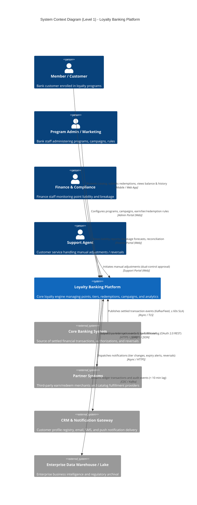
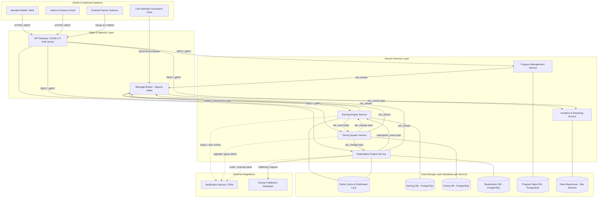
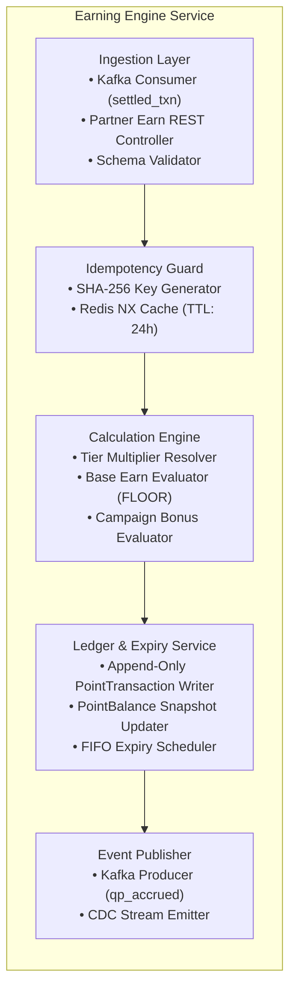
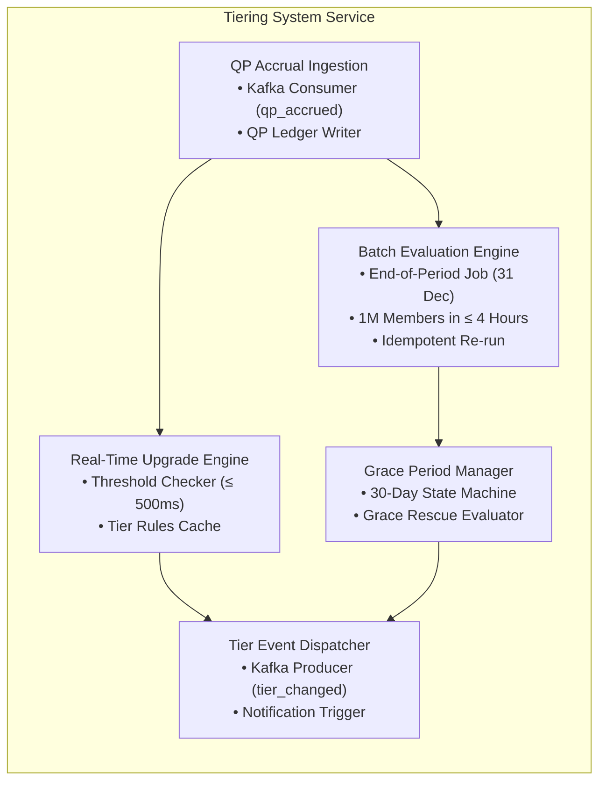
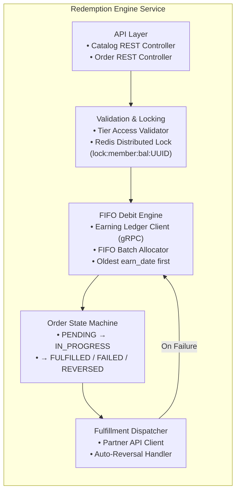
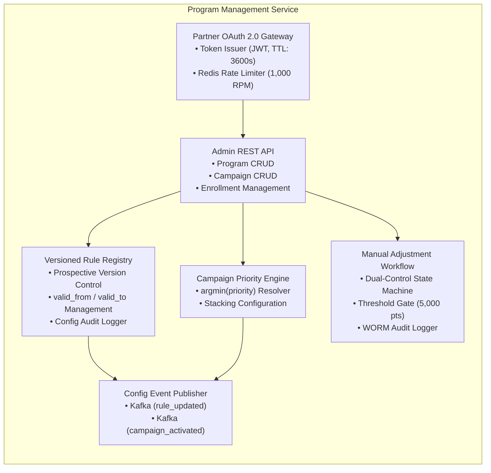
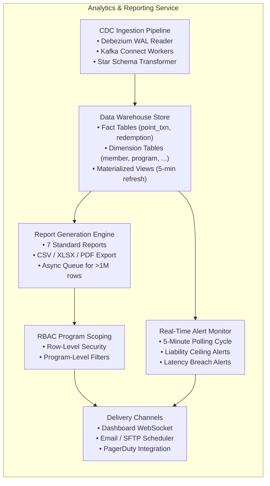
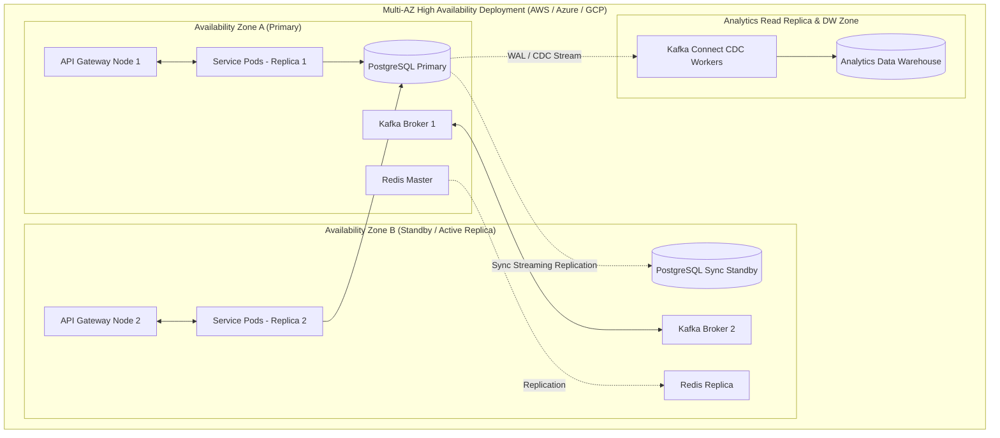

# Loyalty Banking — Architecture Overview

**Domain**: Loyalty Banking  
**Version**: 1.0  
**Date**: 2026-08-14  
**Source**: [loyalty_domain.md](file:///d:/learn/loyalty/loyalty_domain.md) | [FR-01..05](file:///d:/learn/loyalty/requirements/) | [AS-01..05](file:///d:/learn/loyalty/analytics/) | [Quality-Gates-Architecture.md](file:///d:/learn/loyalty/quality-gates/Quality-Gates-Architecture.md)

---

## 1. Executive Summary

**Loyalty Banking** is an enterprise-grade financial loyalty platform providing end-to-end management of customer rewards points, tier progression, catalog redemptions, campaign promotions, and financial liability reporting. The architecture is designed as a **modular, event-driven microservices architecture** with polyglot data persistence, strict module data isolation, real-time stream ingestion, and high-throughput transactional guarantees.

### Key Architectural Characteristics
- **Throughput & Latency**: Sustained ingestion of ≥ 500 earn events/second with end-to-end processing latency ≤ 2,000 ms (p95).
- **Settlement SLA**: Real-time event consumption from core banking within ≤ 60 seconds of transaction settlement.
- **Data Integrity**: Append-only immutable Sổ cái (Earning Ledger) (`point_transaction`), mutable Point Balance snapshot (`point_balance`) for fast read access, strict FIFO point consumption, and zero duplicate credits via distributed idempotency locks.
- **Reporting Isolation**: Complete separation of transactional OLTP datastores from analytical workloads via near-real-time (< 10 min lag) Change Data Capture (CDC) into an analytical Data Warehouse.
- **Resilience & DR**: Target RTO ≤ 5 minutes, RPO ≤ 10 minutes with multi-AZ failover and automated point batch recovery.

---

## 2. System Context (C4 Level 1)

The Loyalty Banking system integrates upstream with financial settlement pipelines, downstream with fulfillment partners, and provides administrative and member interfaces.



---

## 3. Container Architecture (C4 Level 2)

The system is decomposed into 5 domain service containers, an edge API gateway, a high-throughput message broker, distributed caching layer, and dedicated operational and analytical datastores.



---

## 4. Module Boundaries & Data Isolation

Following **ADR-001 (Module Boundaries & Polyglot Persistence)**, each module operates as an independent service boundary with full encapsulation of its domain entities and dedicated private datastore. **Direct cross-module database access is strictly prohibited.**

| Module | Core Responsibility | Domain Entities Owned | Data Store Type |
|---|---|---|---|
| **Earning Engine** | Ingests settled events, calculates base & bonus points, manages immutable Sổ cái (Earning Ledger) and mutable Point Balance snapshot, enforces FIFO & idempotency, schedules expiry. | `PointTransaction`, `PointBalance`, `EarnRule`, `EarnEventLog`, `ExpirySchedule` | PostgreSQL (Append-Only Ledger + Balance Table) + Redis (Idempotency Cache) |
| **Tiering System** | Accrues Qualifying Points (QP), performs instant tier upgrades, executes end-of-year batch evaluations, manages 30-day grace periods. | `MemberTier`, `QpLedger`, `TierRule`, `TierEvaluationLog`, `TierEvent` | PostgreSQL (Partitioned Ledger & Snapshot) |
| **Redemption Engine** | Manages reward catalog, validates point balances, executes atomic FIFO point debits, coordinates partner fulfillment, handles reversals. | `RewardItem`, `RedemptionOrder`, `FulfillmentRecord` | PostgreSQL (ACID Transactions) + Redis (Debit Locks) |
| **Program Management** | Program lifecycle, campaign configuration & priority, rule versioning, member enrollments, partner registry & OAuth gateway, manual adjustments. | `LoyaltyProgram`, `Campaign`, `Enrollment`, `Partner`, `ConfigVersionLog`, `ManualAdjustmentLog` | PostgreSQL (Temporal Tables & WORM Audit) |
| **Analytics & Reporting** | Aggregates program metrics, calculates financial liability & breakage, generates 7 standard reports, serves real-time dashboard & alerts. | `fact_point_transaction`, `fact_redemption_order`, `fact_enrollment`, `dim_*`, `MaterializedViews` | Dedicated Analytics Data Warehouse (Columnar / Star Schema) |

---

## 5. Component Diagrams (C4 Level 3)

The following diagrams decompose each domain service container (from §3) into its internal components. Detailed specifications per component are in the respective Detailed Design documents ([DD-01](file:///Users/dusainbolt/Documents/vcb/loyalty_system_docs/design/DD-01-earning-engine.md)–[DD-05](file:///Users/dusainbolt/Documents/vcb/loyalty_system_docs/design/DD-05-analytics-reporting.md)).

### 5.1 Earning Engine — Internal Components



### 5.2 Tiering System — Internal Components



### 5.3 Redemption Engine — Internal Components



### 5.4 Program Management — Internal Components



### 5.5 Analytics & Reporting — Internal Components



---

## 6. Communication Patterns & API Standards

### 6.1 Synchronous REST / gRPC Interfaces
- **API Standard**: REST over HTTPS with OpenAPI 3.0 specification; inter-service synchronous reads use gRPC over HTTP/2 for sub-50ms latency (NFR-02-003).
- **URI Versioning**: Standardized URI path prefix `/api/v1/...` with forward-compatible semantic schemas.
- **Security**: OAuth 2.0 Bearer JWT tokens for internal/external users; OAuth 2.0 Client Credentials flow for third-party partners.
- **Error Standard**: Standardized RFC 7807 Problem Details payload:
```json
{
  "type": "https://api.loyaltybanking.com/errors/insufficient-balance",
  "title": "Insufficient Points Balance",
  "status": 422,
  "detail": "Requested 300 points exceeds available confirmed balance of 200 points.",
  "instance": "/api/v1/redemptions/orders",
  "code": "ERR_RED_INSUFFICIENT_BALANCE",
  "correlation_id": "req-9b81f26a-4d7a-42c2-8361-ec853c074df3",
  "timestamp": "2026-08-14T14:30:00Z"
}
```

### 6.2 Asynchronous Event Streams (Kafka Topics)
- **Message Protocol**: Apache Kafka with JSON / Apache Avro schema registry.
- **Standard Envelope**: All events contain metadata headers (`event_id`, `event_type`, `timestamp`, `correlation_id`, `source_module`, `partition_key`).

| Topic Name | Producer | Consumer(s) | Key Schema / Payload |
|---|---|---|---|
| `corebanking.transactions.settled` | Core Banking | Earning Engine | `source_txn_id`, `member_id`, `amount`, `channel`, `settled_ts` |
| `loyalty.earning.qp_accrued` | Earning Engine | Tiering System | `event_id`, `member_id`, `program_id`, `qp_amount`, `source_txn_id` |
| `loyalty.tiering.tier_changed` | Tiering System | Earning Engine, Redemption Engine, CRM | `member_id`, `old_tier`, `new_tier`, `multiplier`, `effective_ts` |
| `loyalty.redemption.debit_requested` | Redemption Engine | Earning Engine | `order_id`, `member_id`, `points_required`, `fifo_batches` |
| `loyalty.redemption.fulfilled` | Redemption Engine | Earning Engine, Analytics, CRM | `order_id`, `member_id`, `status` (`FULFILLED` / `FAILED`), `points` |
| `loyalty.cdc.platform_events` | All Services | Analytics (DW Ingest) | Debezium CDC change streams from all operational databases |

---

## 7. Technology Stack & Infrastructure

| Component Layer | Technology Choice | Architectural Justification |
|---|---|---|
| **Service Runtimes** | Go / Java Spring Boot / Node.js LTS | High-concurrency I/O, low-latency transaction processing, strong typing. |
| **Edge API Gateway** | Kong / Envoy Gateway | High-performance routing, OAuth 2.0 token introspection, rate limiting (1,000 req/min). |
| **Event Broker** | Apache Kafka | Ordered partitioned event delivery, high throughput (≥ 500 events/sec), replayability. |
| **Operational DBs** | PostgreSQL 16+ | Strong ACID compliance, table partitioning, JSONB for flexible rule schemas, row-level locking. |
| **In-Memory Cache / Lock** | Redis Cluster 7.x | Distributed locking (`Redlock`), sub-millisecond idempotency deduplication cache. |
| **Data Warehouse** | ClickHouse / PostgreSQL DW Replica | Fast columnar scans for large aggregation reports (> 1M rows), star schema support. |
| **Change Data Capture** | Debezium / Kafka Connect | Low-overhead streaming from PostgreSQL WAL into Kafka for analytics pipeline (< 10 min lag). |
| **Observability** | OpenTelemetry, Prometheus, Grafana, Jaeger | Distributed tracing with correlation IDs, p95 latency monitoring, operational alerting. |

---

## 8. Deployment Topology & Resilience (Multi-AZ)



### High Availability & DR Guarantees
- **Failover**: Automated primary database promotion via Patroni / cloud managed RDS within **< 60 seconds**.
- **Recovery Time Objective (RTO)**: **≤ 5 minutes** for full transactional recovery.
- **Recovery Point Objective (RPO)**: **≤ 10 minutes** for data warehouse analytics; **0 data loss (RPO = 0)** for confirmed Sổ cái (Earning Ledger) entries.
- **Backup & Archival**: Continuous WAL archiving + automated snapshot every 6 hours, tested quarterly.
