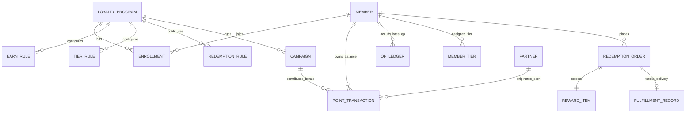
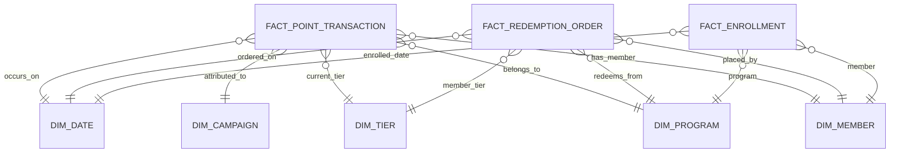

# Loyalty Banking — Data Architecture & Database Schema

**Domain**: Loyalty Banking  
**Version**: 1.0  
**Date**: 2026-08-14  
**Source**: [loyalty_domain.md](../lab2-requirements.md) | [FR-01..05](../lab2-requirements.md) | [AS-01..05](../lab2-requirements.md) | [ADR-001](adrs/ADR-001-module-boundaries-and-data-isolation.md)

---

## 1. Overview & Data Design Principles

The Loyalty Banking data architecture is designed for **financial auditability, zero data loss, high write throughput, and strict FIFO lifecycle management**.

### Core Data Principles
1. **Append-Only Immutable Sổ cái (Earning Ledger)**: The `point_transaction` table allows `INSERT` operations only. Modifications or reversals are recorded as offsetting debit/credit entries.
2. **FIFO Expiry & Consumption Indexing**: Indexed on `(member_id, status, earn_date ASC)` to allow sub-millisecond retrieval of oldest confirmed point batches during redemption and expiry.
3. **Strict Separation of QP & Redeemable Points**: `qp_ledger` and `point_transaction` are distinct physical tables in separate module schemas.
4. **Temporal Configuration Versioning**: Program rules (`earn_rule`, `tier_rule`, `redemption_rule`) use `valid_from` and `valid_to` timestamps with version numbers to preserve prospective-only execution.
5. **WORM Compliance for Audit Logs**: `config_version_log`, `manual_adjustment_log`, and `tier_evaluation_log` enforce write-once-read-many access policies with no `UPDATE` or `DELETE` permissions.

---

## 2. Entity-Relationship Diagram (OLTP Core)



---

## 3. Physical Database Schemas (DDL)

### 3.1 Earning Engine Schema (`earning_db`)

```sql
-- Bảng Số dư cuối cùng (Point Balance Snapshot)
CREATE TABLE point_balance (
    balance_id              UUID PRIMARY KEY DEFAULT gen_random_uuid(),
    member_id               UUID NOT NULL,
    program_id              UUID NOT NULL,
    confirmed_balance       BIGINT NOT NULL DEFAULT 0,
    pending_balance         BIGINT NOT NULL DEFAULT 0,
    updated_at              TIMESTAMPTZ NOT NULL DEFAULT NOW(),
    CONSTRAINT uq_member_program UNIQUE (member_id, program_id)
);

-- Sổ cái (Earning Ledger) (Append-Only)
CREATE TABLE point_transaction (
    transaction_id          UUID PRIMARY KEY DEFAULT gen_random_uuid(),
    member_id               UUID NOT NULL,
    program_id              UUID NOT NULL,
    source_event_id         VARCHAR(128) NOT NULL,
    source_type             VARCHAR(32) NOT NULL DEFAULT 'CORE_BANKING', -- 'CORE_BANKING', 'PARTNER', 'MANUAL_ADJUST', 'EXPIRY', 'REVERSAL'
    partner_id              UUID NULL,
    campaign_id             UUID NULL,
    type                    VARCHAR(32) NOT NULL, -- 'EARN', 'BONUS', 'REDEEM', 'EXPIRED', 'ADJUST_CREDIT', 'ADJUST_DEBIT', 'REVERSAL'
    status                  VARCHAR(32) NOT NULL, -- 'PENDING', 'CONFIRMED', 'CANCELLED', 'PENDING_DEBIT', 'CONFIRMED_DEBIT'
    amount                  BIGINT NOT NULL CHECK (amount > 0),
    remaining_balance       BIGINT NOT NULL CHECK (remaining_balance >= 0),
    earn_date               TIMESTAMPTZ NOT NULL,
    expiry_date             TIMESTAMPTZ NOT NULL,
    idempotency_key         VARCHAR(256) NOT NULL UNIQUE,
    metadata                JSONB NULL,
    created_at              TIMESTAMPTZ NOT NULL DEFAULT NOW()
);

-- Indices for High-Performance Queries & FIFO Consumption
CREATE INDEX idx_pt_fifo_consumption ON point_transaction (member_id, program_id, status, earn_date ASC) 
    WHERE status = 'CONFIRMED' AND remaining_balance > 0;
CREATE INDEX idx_pt_expiry_sweep ON point_transaction (expiry_date ASC, status) 
    WHERE status = 'CONFIRMED' AND remaining_balance > 0;
CREATE INDEX idx_pt_member_history ON point_transaction (member_id, program_id, created_at DESC);
CREATE INDEX idx_pt_source_dedup ON point_transaction (source_event_id, program_id);

-- Earn Rule Configuration Table
CREATE TABLE earn_rule (
    rule_id                 UUID PRIMARY KEY DEFAULT gen_random_uuid(),
    program_id              UUID NOT NULL,
    name                    VARCHAR(128) NOT NULL,
    earn_rate               NUMERIC(10, 4) NOT NULL DEFAULT 1.0000, -- e.g. 1 point per $1 spent
    transaction_type        VARCHAR(64) NOT NULL, -- 'PURCHASE', 'TRANSFER', 'BILL_PAY', 'ANY'
    channel                 VARCHAR(64) NOT NULL DEFAULT 'ALL', -- 'POS', 'ONLINE', 'MOBILE', 'ALL'
    currency                VARCHAR(3) NOT NULL DEFAULT 'USD',
    version                 INTEGER NOT NULL DEFAULT 1,
    status                  VARCHAR(32) NOT NULL DEFAULT 'ACTIVE', -- 'DRAFT', 'ACTIVE', 'INACTIVE'
    valid_from              TIMESTAMPTZ NOT NULL,
    valid_to                TIMESTAMPTZ NULL,
    created_at              TIMESTAMPTZ NOT NULL DEFAULT NOW(),
    updated_at              TIMESTAMPTZ NOT NULL DEFAULT NOW()
);
CREATE INDEX idx_earn_rule_lookup ON earn_rule (program_id, transaction_type, channel, status, valid_from, valid_to);
```

---

### 3.2 Tiering System Schema (`tiering_db`)

```sql
-- Qualifying Points Ledger (Separate from redeemable points)
CREATE TABLE qp_ledger (
    qp_id                   UUID PRIMARY KEY DEFAULT gen_random_uuid(),
    member_id               UUID NOT NULL,
    program_id              UUID NOT NULL,
    source_event_id         VARCHAR(128) NOT NULL,
    qp_amount               BIGINT NOT NULL CHECK (qp_amount > 0),
    tier_period_start       DATE NOT NULL,
    tier_period_end         DATE NOT NULL,
    accrual_date            TIMESTAMPTZ NOT NULL DEFAULT NOW()
);
CREATE INDEX idx_qp_member_period ON qp_ledger (member_id, program_id, tier_period_start, tier_period_end);

-- Member Current & Historical Tier State
CREATE TABLE member_tier (
    member_tier_id          UUID PRIMARY KEY DEFAULT gen_random_uuid(),
    member_id               UUID NOT NULL,
    program_id              UUID NOT NULL,
    current_tier            VARCHAR(32) NOT NULL DEFAULT 'SILVER', -- 'SILVER', 'GOLD', 'PLATINUM'
    previous_tier           VARCHAR(32) NULL,
    effective_from          TIMESTAMPTZ NOT NULL DEFAULT NOW(),
    tier_period_end         DATE NOT NULL,
    grace_period_end        TIMESTAMPTZ NULL,
    status                  VARCHAR(32) NOT NULL DEFAULT 'ACTIVE', -- 'ACTIVE', 'IN_GRACE_PERIOD', 'DOWNGRADED'
    cumulative_qp           BIGINT NOT NULL DEFAULT 0,
    updated_at              TIMESTAMPTZ NOT NULL DEFAULT NOW(),
    CONSTRAINT uq_member_program_tier UNIQUE (member_id, program_id)
);
CREATE INDEX idx_member_tier_status ON member_tier (program_id, status, grace_period_end);

-- Tier Definitions & Rules
CREATE TABLE tier_rule (
    tier_rule_id            UUID PRIMARY KEY DEFAULT gen_random_uuid(),
    program_id              UUID NOT NULL,
    tier_name               VARCHAR(32) NOT NULL, -- 'SILVER', 'GOLD', 'PLATINUM'
    qp_threshold            BIGINT NOT NULL, -- SILVER=0, GOLD=1000, PLATINUM=3000
    earn_multiplier         NUMERIC(5, 2) NOT NULL DEFAULT 1.00, -- SILVER=1.0, GOLD=1.5, PLATINUM=2.0
    grace_period_days       INTEGER NOT NULL DEFAULT 30,
    tier_period_type        VARCHAR(32) NOT NULL DEFAULT 'CALENDAR_YEAR', -- 'CALENDAR_YEAR', 'ROLLING_12M'
    version                 INTEGER NOT NULL DEFAULT 1,
    valid_from              TIMESTAMPTZ NOT NULL DEFAULT NOW(),
    valid_to                TIMESTAMPTZ NULL
);

-- Tier Evaluation Batch Audit Log
CREATE TABLE tier_evaluation_log (
    run_id                  UUID PRIMARY KEY DEFAULT gen_random_uuid(),
    program_id              UUID NOT NULL,
    evaluation_date         TIMESTAMPTZ NOT NULL DEFAULT NOW(),
    members_evaluated       INTEGER NOT NULL,
    upgrades_count          INTEGER NOT NULL,
    downgrades_count        INTEGER NOT NULL,
    no_change_count         INTEGER NOT NULL,
    run_duration_sec        INTEGER NOT NULL,
    status                  VARCHAR(32) NOT NULL -- 'SUCCESS', 'FAILED'
);
```

---

### 3.3 Redemption Engine Schema (`redemption_db`)

```sql
-- Reward Catalog
CREATE TABLE reward_item (
    item_id                 UUID PRIMARY KEY DEFAULT gen_random_uuid(),
    program_id              UUID NOT NULL,
    name                    VARCHAR(256) NOT NULL,
    category                VARCHAR(64) NOT NULL, -- 'VOUCHER', 'MERCHANDISE', 'CASH_BACK', 'TRAVEL'
    points_cost             BIGINT NOT NULL CHECK (points_cost >= 100), -- min 100 points
    currency_value          NUMERIC(12, 2) NOT NULL, -- e.g. 100 points = $1.00
    fulfillment_type        VARCHAR(32) NOT NULL, -- 'DIGITAL', 'PHYSICAL', 'ACCOUNT_CREDIT'
    min_tier_required       VARCHAR(32) NOT NULL DEFAULT 'SILVER', -- 'SILVER', 'GOLD', 'PLATINUM'
    stock_quantity          INTEGER NULL, -- NULL = unlimited
    status                  VARCHAR(32) NOT NULL DEFAULT 'ACTIVE', -- 'DRAFT', 'ACTIVE', 'OUT_OF_STOCK', 'DISCONTINUED'
    created_at              TIMESTAMPTZ NOT NULL DEFAULT NOW()
);

-- Redemption Order
CREATE TABLE redemption_order (
    order_id                UUID PRIMARY KEY DEFAULT gen_random_uuid(),
    member_id               UUID NOT NULL,
    program_id              UUID NOT NULL,
    reward_item_id          UUID NOT NULL REFERENCES reward_item(item_id),
    quantity                INTEGER NOT NULL DEFAULT 1 CHECK (quantity > 0),
    total_points_debited    BIGINT NOT NULL CHECK (total_points_debited >= 100),
    member_tier_at_order    VARCHAR(32) NOT NULL,
    status                  VARCHAR(32) NOT NULL DEFAULT 'PENDING', -- 'PENDING', 'IN_PROGRESS', 'FULFILLED', 'FAILED', 'CANCELLED', 'REVERSED'
    delivery_address        JSONB NULL,
    failure_reason          VARCHAR(256) NULL,
    created_at              TIMESTAMPTZ NOT NULL DEFAULT NOW(),
    updated_at              TIMESTAMPTZ NOT NULL DEFAULT NOW()
);
CREATE INDEX idx_order_member ON redemption_order (member_id, program_id, created_at DESC);
CREATE INDEX idx_order_status ON redemption_order (status, created_at ASC);

-- Fulfillment Record
CREATE TABLE fulfillment_record (
    fulfillment_id          UUID PRIMARY KEY DEFAULT gen_random_uuid(),
    order_id                UUID NOT NULL REFERENCES redemption_order(order_id),
    partner_id              UUID NULL,
    tracking_number         VARCHAR(128) NULL,
    voucher_code_hash       VARCHAR(256) NULL,
    bank_account_ref        VARCHAR(128) NULL,
    status                  VARCHAR(32) NOT NULL DEFAULT 'PENDING', -- 'PENDING', 'IN_PROGRESS', 'FULFILLED', 'FAILED'
    dispatched_at           TIMESTAMPTZ NULL,
    fulfilled_at            TIMESTAMPTZ NULL,
    sla_due_date            TIMESTAMPTZ NOT NULL
);
CREATE INDEX idx_fulfill_order ON fulfillment_record (order_id);
```

---

### 3.4 Program Management Schema (`program_mgmt_db`)

```sql
-- Top-level Loyalty Program
CREATE TABLE loyalty_program (
    program_id              UUID PRIMARY KEY DEFAULT gen_random_uuid(),
    name                    VARCHAR(128) NOT NULL, -- e.g. 'BankRewards 2025'
    currency_name           VARCHAR(64) NOT NULL DEFAULT 'Points',
    cost_per_point          NUMERIC(10, 6) NOT NULL DEFAULT 0.010000, -- $0.010000 per point
    status                  VARCHAR(32) NOT NULL DEFAULT 'DRAFT', -- 'DRAFT', 'ACTIVE', 'SUSPENDED', 'DEACTIVATED'
    start_date              DATE NOT NULL,
    end_date                DATE NULL,
    terms_and_conditions    TEXT NULL,
    created_at              TIMESTAMPTZ NOT NULL DEFAULT NOW(),
    updated_at              TIMESTAMPTZ NOT NULL DEFAULT NOW()
);

-- Promotional Campaign Table
CREATE TABLE campaign (
    campaign_id             UUID PRIMARY KEY DEFAULT gen_random_uuid(),
    program_id              UUID NOT NULL REFERENCES loyalty_program(program_id),
    name                    VARCHAR(128) NOT NULL, -- e.g. 'Double Points August'
    multiplier              NUMERIC(5, 2) NOT NULL DEFAULT 2.00,
    flat_bonus              BIGINT NOT NULL DEFAULT 0,
    priority                INTEGER NOT NULL DEFAULT 1, -- lower value = higher priority
    start_date              TIMESTAMPTZ NOT NULL,
    end_date                TIMESTAMPTZ NOT NULL,
    points_budget           BIGINT NULL,
    points_issued_total     BIGINT NOT NULL DEFAULT 0,
    status                  VARCHAR(32) NOT NULL DEFAULT 'ACTIVE',
    created_at              TIMESTAMPTZ NOT NULL DEFAULT NOW()
);
CREATE INDEX idx_campaign_active ON campaign (program_id, status, start_date, end_date, priority ASC);

-- Partner Registry & OAuth Config
CREATE TABLE partner (
    partner_id              UUID PRIMARY KEY DEFAULT gen_random_uuid(),
    name                    VARCHAR(128) NOT NULL,
    client_id               VARCHAR(128) NOT NULL UNIQUE,
    client_secret_hash      VARCHAR(256) NOT NULL,
    partner_type            VARCHAR(32) NOT NULL, -- 'EARN_ONLY', 'REDEEM_ONLY', 'BOTH'
    rate_limit_rpm          INTEGER NOT NULL DEFAULT 1000, -- default 1,000 req/min
    status                  VARCHAR(32) NOT NULL DEFAULT 'ACTIVE',
    created_at              TIMESTAMPTZ NOT NULL DEFAULT NOW()
);

-- Member Program Enrollment
CREATE TABLE enrollment (
    enrollment_id           UUID PRIMARY KEY DEFAULT gen_random_uuid(),
    member_id               UUID NOT NULL,
    program_id              UUID NOT NULL REFERENCES loyalty_program(program_id),
    status                  VARCHAR(32) NOT NULL DEFAULT 'ACTIVE', -- 'PENDING', 'ACTIVE', 'SUSPENDED', 'CANCELLED'
    enrollment_date         TIMESTAMPTZ NOT NULL DEFAULT NOW(),
    CONSTRAINT uq_member_enrollment UNIQUE (member_id, program_id)
);

-- WORM Audit Logs
CREATE TABLE config_version_log (
    change_id               UUID PRIMARY KEY DEFAULT gen_random_uuid(),
    entity_name             VARCHAR(64) NOT NULL,
    entity_id               UUID NOT NULL,
    operator_id             UUID NOT NULL,
    previous_value          JSONB NULL,
    new_value               JSONB NOT NULL,
    changed_at              TIMESTAMPTZ NOT NULL DEFAULT NOW()
);

CREATE TABLE manual_adjustment_log (
    adjustment_id           UUID PRIMARY KEY DEFAULT gen_random_uuid(),
    member_id               UUID NOT NULL,
    program_id              UUID NOT NULL,
    operator_id             UUID NOT NULL,
    approver_id             UUID NULL,
    point_amount            BIGINT NOT NULL,
    adjustment_type         VARCHAR(16) NOT NULL, -- 'CREDIT', 'DEBIT'
    before_balance          BIGINT NOT NULL,
    after_balance           BIGINT NOT NULL,
    reason_code             VARCHAR(64) NOT NULL,
    reason_notes            TEXT NOT NULL,
    status                  VARCHAR(32) NOT NULL DEFAULT 'PENDING_APPROVAL', -- 'PENDING_APPROVAL', 'APPROVED', 'REJECTED'
    created_at              TIMESTAMPTZ NOT NULL DEFAULT NOW(),
    approved_at             TIMESTAMPTZ NULL
);
```

---

## 4. Data Warehouse Dimensional Model (Star Schema)

The analytics datastore isolates reporting queries from operational transaction processing via a dedicated dimensional warehouse.



### Fact & Dimension Table Definitions

```sql
-- Dimensions
CREATE TABLE dim_date (
    date_key                INTEGER PRIMARY KEY, -- YYYYMMDD
    full_date               DATE NOT NULL,
    day_of_week             INTEGER NOT NULL,
    day_name                VARCHAR(16) NOT NULL,
    month_number            INTEGER NOT NULL,
    month_name              VARCHAR(16) NOT NULL,
    quarter                 INTEGER NOT NULL,
    year                    INTEGER NOT NULL
);

CREATE TABLE dim_member (
    member_key              BIGSERIAL PRIMARY KEY,
    member_id               UUID NOT NULL UNIQUE,
    current_tier            VARCHAR(32) NOT NULL,
    account_status          VARCHAR(32) NOT NULL,
    is_active               BOOLEAN NOT NULL,
    days_since_last_activity INTEGER NOT NULL,
    is_dormant              BOOLEAN NOT NULL -- true if > 90 days
);

CREATE TABLE dim_program (
    program_key             BIGSERIAL PRIMARY KEY,
    program_id              UUID NOT NULL UNIQUE,
    name                    VARCHAR(128) NOT NULL,
    cost_per_point          NUMERIC(10, 6) NOT NULL,
    status                  VARCHAR(32) NOT NULL
);

CREATE TABLE dim_campaign (
    campaign_key            BIGSERIAL PRIMARY KEY,
    campaign_id             UUID NOT NULL UNIQUE,
    name                    VARCHAR(128) NOT NULL,
    multiplier              NUMERIC(5, 2) NOT NULL,
    priority                INTEGER NOT NULL
);

-- Fact: Point Movement Transactions
CREATE TABLE fact_point_transaction (
    point_fact_id           BIGSERIAL PRIMARY KEY,
    date_key                INTEGER REFERENCES dim_date(date_key),
    member_key              BIGINT REFERENCES dim_member(member_key),
    program_key             BIGINT REFERENCES dim_program(program_key),
    campaign_key            BIGINT REFERENCES dim_campaign(campaign_key),
    tier_name               VARCHAR(32) NOT NULL,
    channel                 VARCHAR(64) NOT NULL,
    transaction_type        VARCHAR(64) NOT NULL,
    event_type              VARCHAR(32) NOT NULL, -- 'EARN', 'BONUS', 'REDEEM', 'EXPIRED', 'ADJUST'
    status                  VARCHAR(32) NOT NULL, -- 'CONFIRMED', 'PENDING'
    points_amount           BIGINT NOT NULL,
    points_remaining        BIGINT NOT NULL,
    financial_liability_usd NUMERIC(14, 4) NOT NULL, -- points_amount * cost_per_point
    earn_date               TIMESTAMPTZ NOT NULL,
    expiry_date             TIMESTAMPTZ NOT NULL
);
CREATE INDEX idx_fact_pt_date_prog ON fact_point_transaction (date_key, program_key, event_type);

-- Fact: Redemption Orders
CREATE TABLE fact_redemption_order (
    redemption_fact_id      BIGSERIAL PRIMARY KEY,
    date_key                INTEGER REFERENCES dim_date(date_key),
    member_key              BIGINT REFERENCES dim_member(member_key),
    program_key             BIGINT REFERENCES dim_program(program_key),
    reward_category         VARCHAR(64) NOT NULL,
    fulfillment_type        VARCHAR(32) NOT NULL,
    order_status            VARCHAR(32) NOT NULL,
    points_debited          BIGINT NOT NULL,
    monetary_value_usd      NUMERIC(12, 2) NOT NULL,
    fulfillment_duration_hours NUMERIC(8, 2) NULL,
    sla_breached            BOOLEAN NOT NULL DEFAULT FALSE
);
```

---

## 5. Storage Partitioning & Retention Policy

| Tier | Retention Period | Target Storage | Partition Strategy | Cleanup / Migration Action |
|---|---|---|---|---|
| **Hot Storage** | **0 – 90 days** | High-speed SSD (PostgreSQL OLTP) | Partitioned by `RANGE (created_at)` monthly | High-speed index queries for member history & FIFO debits |
| **Warm Storage** | **90 days – 3 years** | Columnar DW (ClickHouse / PG DW) | Partitioned by `RANGE (date_key)` quarterly | Pre-aggregated summaries, monthly executive reporting |
| **Cold / WORM** | **3 years – 7 years** | Compressed Object Store (S3 Glacier / WORM) | Parquet format by `YYYY/MM` | Regulatory audit compliance, read-only audit retrieval |
