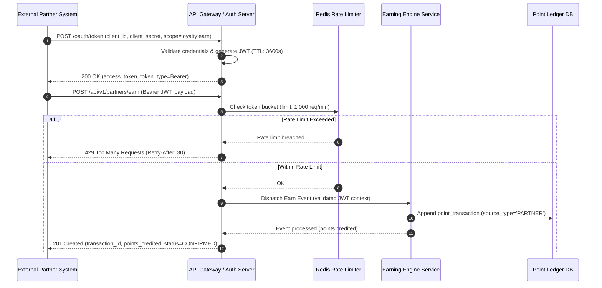
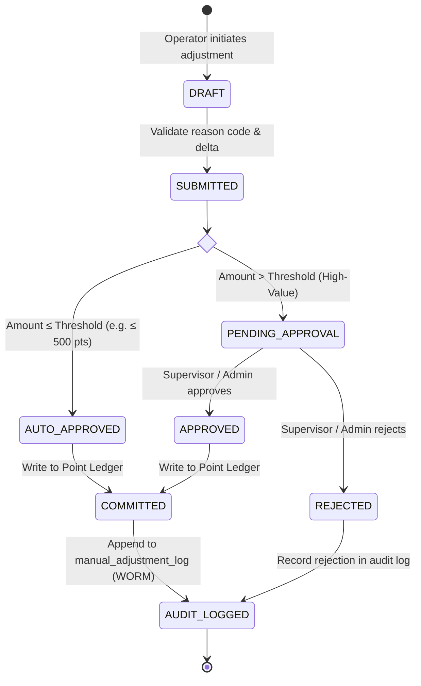

# Loyalty Banking — Security & Integration Architecture

**Domain**: Loyalty Banking  
**Version**: 1.0  
**Date**: 2026-08-14  
**Source**: [loyalty_domain.md](file:///d:/learn/loyalty/loyalty_domain.md) | [FR-04](file:///d:/learn/loyalty/requirements/FR-04-program-management.md) | [Quality-Gates-Architecture.md](file:///d:/learn/loyalty/quality-gates/Quality-Gates-Architecture.md)

---

## 1. Overview

The Security & Integration Architecture establishes the **authentication, authorization, encryption, partner onboarding, audit governance, and operational security controls** for the Loyalty Banking platform.

### Core Security Objectives
1. **Zero Trust Integration**: All external partner and core banking communication is authenticated via cryptographically verified tokens and mTLS/TLS 1.3.
2. **Dual-Control Governance**: High-value point ledger adjustments require segregation of duties (operator submission + independent supervisor approval).
3. **Comprehensive RBAC**: Fine-grained endpoint and data access authorization mapped to organizational roles.
4. **Data Protection & PII Isolation**: AES-256 data-at-rest encryption and masking of member personal data.
5. **Auditing & Non-Repudiation**: Immutable WORM audit logs for every configuration and ledger modification.

---

## 2. Partner Integration & OAuth 2.0 Gateway

External earn/redeem partners access the system via the **Partner API Gateway** using standard OAuth 2.0 Client Credentials grants.

### Partner Rate Limiting Configuration
- **Default Limit**: **1,000 requests per minute** per registered partner.
- **Algorithm**: Redis-backed Token Bucket algorithm with sliding window.
- **Header Contract**:
  - `X-RateLimit-Limit`: 1000
  - `X-RateLimit-Remaining`: 985
  - `X-RateLimit-Reset`: 1723647600

---

## 3. Role-Based Access Control (RBAC) Matrix

The system enforces strict role-based access across 6 functional actor roles.

| Resource / Endpoint | Program Admin | Partner Manager | Member (Self) | Finance Team | Auditor | Support Agent |
|---|---|---|---|---|---|---|
| **Program & Rule Config (`/api/v1/programs/*`)** | **CRUD** | Read-only | — | Read-only | Read-only | — |
| **Campaign Config (`/api/v1/campaigns/*`)** | **CRUD** | Read-only | — | Read-only | Read-only | — |
| **Partner Management (`/api/v1/partners/*`)** | Read-only | **CRUD** | — | — | Read-only | — |
| **Manual Adjustments (`/api/v1/adjustments/*`)** | **Create / Approve** | — | — | Read-only | Read-only | **Create (under limit)** |
| **Reward Catalog (`/api/v1/catalog/*`)** | **CRUD** | Read-only | **Read (Eligible)** | Read-only | Read-only | Read-only |
| **Redemption Orders (`/api/v1/redemptions/*`)** | Read-only | — | **Create / Cancel** | Read-only | Read-only | **Reversal Workflow** |
| **Member Point History (`/api/v1/members/points`)** | Read-only | — | **Read (Own)** | — | Read-only | **Read (Assigned)** |
| **Financial & Liability Reports (`/api/v1/reports/*`)** | Read-only | — | — | **Full Access** | Read-only | — |
| **Audit Logs (`/api/v1/audit/*`)** | Read-only | — | — | Read-only | **Full Read** | — |

---

## 4. Dual-Control Manual Balance Adjustment Workflow

To prevent fraud and insider abuse, manual balance adjustments are governed by a multi-level approval state machine (FR-04-051).

### Dual-Control Rules
1. **Separation of Duties**: The `operator_id` who submits the adjustment cannot be the `approver_id`.
2. **Mandatory Audit Fields**: Every adjustment must record `operator_id`, `approver_id`, `before_balance`, `after_balance`, `reason_code`, and `reason_notes`.
3. **Threshold Gates**: Adjustments exceeding **5,000 points (or $50 liability equivalent)** require dual approval; adjustments exceeding **50,000 points** require Finance Director co-signature.

---

## 5. Data Protection & Cryptography

### 5.1 Encryption Standards
- **Data at Rest**: All PostgreSQL databases, message queues, and S3 archival buckets are encrypted using **AES-256** with customer-managed keys (AWS KMS / Azure Key Vault / HashiCorp Vault) with annual key rotation.
- **Data in Transit**: All network traffic (internal inter-service and external public APIs) is enforced with **TLS 1.3** (minimum TLS 1.2 with strong cipher suites: `TLS_AES_256_GCM_SHA384`).
- **Partner Secret Hashing**: Partner `client_secret` values are hashed using **Argon2id** (memory cost 64MB, time cost 3 iterations).

### 5.2 PII Protection & Data Masking
- Member Personally Identifiable Information (PII) such as bank account numbers, physical delivery addresses, and phone numbers are encrypted at the application column level or tokenized.
- Audit logs and analytics ETL pipelines mask PII fields (e.g., account `****1234`, email `j***@bank.com`).

---

## 6. Threat Modeling & Mitigation (STRIDE)

| Threat Category | Potential Attack Vector | Architectural Mitigation Control |
|---|---|---|
| **Spoofing** | Impersonating core banking or partner earn API | Mutual TLS (mTLS) for core banking; OAuth 2.0 JWT with RS256 signature verification for partners. |
| **Tampering** | Modifying point balances directly in database | Append-only ledger; row-level cryptographic hash chain; DB user permissions restricted to `INSERT` only. |
| **Repudiation** | Operator denies executing high-value manual adjustment | Immutable WORM `manual_adjustment_log` with dual operator/approver signatures and UTC timestamps. |
| **Information Disclosure** | Unauthorized user viewing other members' point balances | RBAC gateway enforcement; row-level security (RLS) scoping member queries to authenticated `sub` claim. |
| **Denial of Service** | Flooding partner earn API with excessive requests | Token-bucket rate limiting (1,000 req/min); AWS Shield / Cloudflare DDoS mitigation at edge. |
| **Elevation of Privilege** | Support agent attempting to self-approve manual adjustments | Segregation of duties enforced at domain service layer: `operator_id != approver_id`. |
