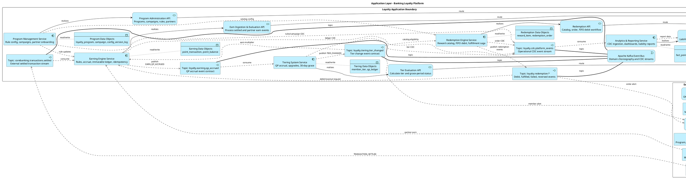

# Application Layer - Banking Loyalty Platform

```plantuml
@startuml
!pragma layout smetana
!include <archimate/Archimate>

title Application Layer - Banking Loyalty Platform
left to right direction

rectangle "External Application Interfaces" as ExternalBoundary {
    Application_Interface(MemberChannelApi, "Member Channel API\nMobile and online banking calls")
    Application_Interface(AdminPortalApi, "Admin Portal API\nProgram, campaign, rule, report administration")
    Application_Interface(CoreBankingFeed, "Core Banking Event Feed\nSettled transaction events")
    Application_Interface(PartnerApi, "Partner API\nMerchant earn/redeem requests")
    Application_Service(IdentityProviderService, "Identity Provider Service\nOAuth 2.0 and JWT authentication")
    Application_Service(NotificationService, "Notification Service\nSMS, push, email, CRM alerts")
}

rectangle "Loyalty Application Boundary" as LoyaltyApplicationBoundary {
    Application_Interface(ApiGateway, "API Gateway & OAuth 2.0 Server\nAuthentication, rate limiting, routing")

    Application_Service(EarnIngestionApi, "Earn Ingestion & Evaluation API\nProcess settled and partner earn events")
    Application_Service(TierEvaluationApi, "Tier Evaluation API\nCalculate tier and grace-period status")
    Application_Service(RedemptionApi, "Redemption API\nCatalog, order, FIFO debit workflow")
    Application_Service(ProgramAdminApi, "Program Administration API\nPrograms, campaigns, rules, partners")
    Application_Service(ReportingApi, "Reporting API\nLiability, breakage, reconciliation reports")

    Application_Component(EarningEngine, "Earning Engine Service\nRules, accrual, immutable ledger, idempotency")
    Application_Component(TieringSystem, "Tiering System Service\nQP accrual, upgrades, 30-day grace")
    Application_Component(RedemptionEngine, "Redemption Engine Service\nReward catalog, FIFO debit, fulfillment saga")
    Application_Component(ProgramManagement, "Program Management Service\nRule config, campaigns, partner onboarding")
    Application_Component(AnalyticsReporting, "Analytics & Reporting Service\nCDC ingestion, dashboards, liability reports")

    Application_Event(KafkaEventBus, "Apache Kafka Event Bus\nDomain choreography and CDC streams")
    Application_Interface(SettledTransactionsTopic, "Topic: corebanking.transactions.settled\nExternal settled transaction stream")
    Application_Interface(QpAccruedTopic, "Topic: loyalty.earning.qp_accrued\nQP accrual event contract")
    Application_Interface(TierChangedTopic, "Topic: loyalty.tiering.tier_changed\nTier change event contract")
    Application_Interface(RedemptionEventsTopic, "Topic: loyalty.redemption.*\nDebit, fulfilled, failed, reversed events")
    Application_Interface(CdcPlatformEventsTopic, "Topic: loyalty.cdc.platform_events\nOperational CDC event stream")

    Application_DataObject(EarningData, "Earning Data Objects\npoint_transaction, point_balance")
    Application_DataObject(TieringData, "Tiering Data Objects\nmember_tier, qp_ledger")
    Application_DataObject(RedemptionData, "Redemption Data Objects\nreward_item, redemption_order")
    Application_DataObject(ProgramData, "Program Data Objects\nloyalty_program, campaign, config_version_log")
    Application_DataObject(AnalyticsData, "Analytics Data Objects\nfact_point_transaction, fact_redemption_order, dim_program")
}

Rel_Serving(ApiGateway, MemberChannelApi, "HTTPS REST")
Rel_Serving(ApiGateway, AdminPortalApi, "HTTPS REST")
Rel_Serving(IdentityProviderService, ApiGateway, "token validation")
Rel_Serving(ApiGateway, PartnerApi, "OAuth 2.0 REST")

Rel_Serving(EarningEngine, EarnIngestionApi, "realizes")
Rel_Serving(TieringSystem, TierEvaluationApi, "realizes")
Rel_Serving(RedemptionEngine, RedemptionApi, "realizes")
Rel_Serving(ProgramManagement, ProgramAdminApi, "realizes")
Rel_Serving(AnalyticsReporting, ReportingApi, "realizes")

Rel_Serving(EarnIngestionApi, ApiGateway, "route")
Rel_Serving(TierEvaluationApi, ApiGateway, "route")
Rel_Serving(RedemptionApi, ApiGateway, "route")
Rel_Serving(ProgramAdminApi, ApiGateway, "route")
Rel_Serving(ReportingApi, ApiGateway, "route")

Rel_Flow(CoreBankingFeed, SettledTransactionsTopic, "TRANSACTION_SETTLED")
Rel_Association(SettledTransactionsTopic, KafkaEventBus, "topic")
Rel_Association(QpAccruedTopic, KafkaEventBus, "topic")
Rel_Association(TierChangedTopic, KafkaEventBus, "topic")
Rel_Association(RedemptionEventsTopic, KafkaEventBus, "topic")
Rel_Association(CdcPlatformEventsTopic, KafkaEventBus, "topic")

Rel_Flow(SettledTransactionsTopic, EarningEngine, "consume")
Rel_Flow(PartnerApi, EarningEngine, "partner earn")
Rel_Flow(EarningEngine, QpAccruedTopic, "publish EARN_QP_ACCRUED")
Rel_Flow(QpAccruedTopic, TieringSystem, "consume")
Rel_Flow(TieringSystem, TierChangedTopic, "publish TIER_CHANGED")
Rel_Flow(TierChangedTopic, EarningEngine, "earn multiplier")
Rel_Flow(TierChangedTopic, RedemptionEngine, "catalog eligibility")
Rel_Flow(TierChangedTopic, NotificationService, "member alert")
Rel_Flow(RedemptionEngine, RedemptionEventsTopic, "publish redemption events")
Rel_Flow(RedemptionEventsTopic, EarningEngine, "debit/reversal request")
Rel_Flow(RedemptionEventsTopic, NotificationService, "order alert")
Rel_Flow(ProgramManagement, CdcPlatformEventsTopic, "rules/campaign CDC")
Rel_Flow(EarningEngine, CdcPlatformEventsTopic, "ledger CDC")
Rel_Flow(TieringSystem, CdcPlatformEventsTopic, "tier CDC")
Rel_Flow(RedemptionEngine, CdcPlatformEventsTopic, "order CDC")
Rel_Flow(CdcPlatformEventsTopic, AnalyticsReporting, "consume")

Rel_Access(EarningEngine, EarningData, "read/write")
Rel_Access(TieringSystem, TieringData, "read/write")
Rel_Access(RedemptionEngine, RedemptionData, "read/write")
Rel_Access(ProgramManagement, ProgramData, "read/write")
Rel_Access(AnalyticsReporting, AnalyticsData, "read/write")

Rel_Flow(ProgramManagement, EarningEngine, "rule updates")
Rel_Flow(ProgramManagement, RedemptionEngine, "catalog config")
Rel_Flow(AnalyticsReporting, ReportingApi, "report data")

@enduml
```
