# Business Layer - Banking Loyalty Platform

> **Not a Lab 8 view — outside the modeling pack.**
> The four Lab 8 ArchiMate views are in [`../../lab8-archimate-views.md`](../../lab8-archimate-views.md).
> This file was drawn before the Guide was adopted. It has no header and no RACI, it uses the old container names, and it is kept only as before-pack material. It is not submitted and not reviewed.

<!--
Title:      Business Process View — Loyalty Banking Platform
Viewpoint:  ArchiMate — Business Layer
Layer(s):   Business
As-Is | To-Be | Transition:  To-Be
Owner:      Role BA/PO  Name Loyalty Banking Modeling Team
RACI:       R BA/PO  A Owner  C EA SA Sec Test  I DA Dev Ops
Version:    v1.0  Date 2026-08-21  Status Review
Legend:     Triggering (→), Realization (..>), Serving (-->>), Assignment (==>), Access (~~>)
RACI legend: R = draws · A = approves · C = consulted · I = informed
Scope:      in-scope: BP-01..BP-05 happy path + CON.1–CON.3 constraint branches; out-of-scope: container internals, protocol labels
-->

```plantuml
@startuml
!pragma layout smetana
!include <archimate/Archimate>

title Business Layer - Banking Loyalty Platform
left to right direction

rectangle "Active Structure - Business Actors" as ActorBoundary {
    Business_Actor(Member, "Bank Customer / Member\nUses mobile and online channels")
    Business_Actor(CoreBanking, "Core Banking System\nSource of settled transactions")
    Business_Actor(ProgramAdmin, "Program Administrator\nManages programs and campaigns")
    Business_Actor(FinanceTeam, "Finance & Accounting\nMonitors liability and reconciliation")
    Business_Actor(AlliancePartner, "Alliance Merchant Partner\nExternal earn/redeem partner")
    Business_Actor(SupportAgent, "Support Agent\nInitiates manual adjustments")
}

rectangle "Behavior - Business Services" as ServiceBoundary {
    Business_Service(PointEarningService, "Point Earning Service\nAccrue confirmed loyalty points")
    Business_Service(TierManagementService, "Tier Management Service\nEvaluate member tier lifecycle")
    Business_Service(RewardRedemptionService, "Reward Redemption Service\nRedeem catalog rewards")
    Business_Service(DualControlAdjustmentService, "Dual-Control Adjustment Service\nGovern high-value manual changes")
    Business_Service(LiabilityReportingService, "Liability Reporting Service\nReport liability and breakage")
}

rectangle "Behavior - Business Processes" as ProcessBoundary {
    Business_Process(BP01, "BP-01 Settlement Ingestion & Ledger Accrual\nValidate event, calculate points, append ledger\n[CON.1: reject duplicate transaction_ref_id before ledger write]")
    Business_Process(BP02, "BP-02 Tier Progression & 30-Day Grace\nAccrue QP, upgrade, evaluate grace\n[CON.2: consume Kafka event — no direct cross-service DB read]")
    Business_Process(BP03, "BP-03 FIFO Redemption & Saga Reversal\nDebit oldest points and handle failures\n[CON.3: auto-reversal restores earn_date + expiry on fulfillment failure]")
    Business_Process(BP04, "BP-04 Dual-Control Approval\nManual adjustment approval >500 pts\n[CON.2: adjustment must pass through owning service API]")
    Business_Process(BP05, "BP-05 Financial Liability & Breakage Audit\nReconcile ledger and forecast liability\n[CON.2: analytics queries DW only — not OLTP databases]")
}

rectangle "Passive Structure - Business Objects" as ObjectBoundary {
    Business_Object(PointTransactionLedger, "Point Transaction Ledger\nAppend-only financial history")
    Business_Object(PointBalanceSnapshot, "Available Balance Snapshot\nFast confirmed balance read")
    Business_Object(TierInfoQpBalance, "Tier Info & QP Balance\nMember tier status and QP")
    Business_Object(RedemptionOrder, "Redemption Order\nReward order and fulfillment state")
    Business_Object(LiabilityReport, "Liability Report\nBreakage and reconciliation output")
    Business_Object(ManualAdjustmentLog, "Manual Adjustment Log\nWORM approval audit trail")
}

Rel_Serving(PointEarningService, Member, "earn history")
Rel_Serving(PointEarningService, AlliancePartner, "partner earn")
Rel_Serving(TierManagementService, Member, "tier status")
Rel_Serving(RewardRedemptionService, Member, "redeem rewards")
Rel_Serving(RewardRedemptionService, AlliancePartner, "fulfillment")
Rel_Serving(DualControlAdjustmentService, ProgramAdmin, "approve")
Rel_Serving(DualControlAdjustmentService, SupportAgent, "submit")
Rel_Serving(LiabilityReportingService, FinanceTeam, "reports")

Rel_Triggering(CoreBanking, BP01, "settled transaction")
Rel_Triggering(AlliancePartner, BP01, "partner earn event")
Rel_Assignment(ProgramAdmin, BP04, "approver role")
Rel_Assignment(SupportAgent, BP04, "operator role")
Rel_Assignment(FinanceTeam, BP05, "owner")

Rel_Realization(BP01, PointEarningService, "realizes")
Rel_Realization(BP02, TierManagementService, "realizes")
Rel_Realization(BP03, RewardRedemptionService, "realizes")
Rel_Realization(BP04, DualControlAdjustmentService, "realizes")
Rel_Realization(BP05, LiabilityReportingService, "realizes")

Rel_Triggering(BP01, BP02, "QP accrued")
Rel_Triggering(BP02, BP03, "tier benefits")
Rel_Triggering(BP03, BP05, "redemption facts")
Rel_Triggering(BP04, BP01, "approved adjustment")

Rel_Access(BP01, PointTransactionLedger, "append")
Rel_Access(BP01, PointBalanceSnapshot, "update")
Rel_Access(BP02, TierInfoQpBalance, "read/write")
Rel_Access(BP03, PointTransactionLedger, "FIFO read/debit")
Rel_Access(BP03, PointBalanceSnapshot, "validate")
Rel_Access(BP03, RedemptionOrder, "create/update")
Rel_Access(BP04, PointTransactionLedger, "adjust")
Rel_Access(BP04, ManualAdjustmentLog, "audit")
Rel_Access(BP05, PointTransactionLedger, "reconcile")
Rel_Access(BP05, RedemptionOrder, "aggregate")
Rel_Access(BP05, LiabilityReport, "produce")

note right of BP01
  CON.1 — No duplicate point posting (G2)
  Idempotency guard on transaction_ref_id
  before any ledger write.
end note

note right of BP03
  CON.3 — Fulfillment failure must compensate (G2)
  Auto-reversal: PointTransaction PENDING_DEBIT
  → CONFIRMED with original earn_date & expiry.
end note

note right of BP02
  CON.2 — No direct cross-service DB access (G2)
  Tiering consumes Kafka event; never reads
  Earning DB directly.
end note

@enduml
```

