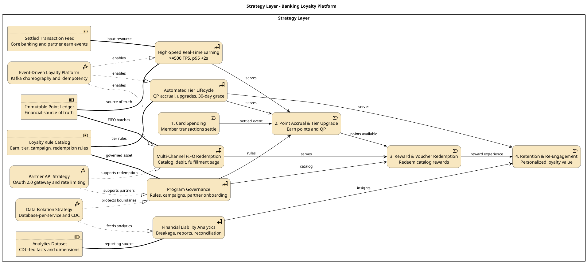

# Strategy Layer - Banking Loyalty Platform

```plantuml
@startuml
!include <archimate/Archimate>

title Strategy Layer - Banking Loyalty Platform
left to right direction

rectangle "Strategy Layer" as StrategyBoundary {
    Strategy_Resource(SettledTransactions, "Settled Transaction Feed\nCore banking and partner earn events")
    Strategy_Resource(PointLedger, "Immutable Point Ledger\nFinancial source of truth")
    Strategy_Resource(RuleCatalog, "Loyalty Rule Catalog\nEarn, tier, campaign, redemption rules")
    Strategy_Resource(AnalyticsDataset, "Analytics Dataset\nCDC-fed facts and dimensions")

    Strategy_Capability(RealTimeEarning, "High-Speed Real-Time Earning\n>=500 TPS, p95 <2s")
    Strategy_Capability(TierLifecycle, "Automated Tier Lifecycle\nQP accrual, upgrades, 30-day grace")
    Strategy_Capability(FifoRedemption, "Multi-Channel FIFO Redemption\nCatalog, debit, fulfillment saga")
    Strategy_Capability(ProgramGovernance, "Program Governance\nRules, campaigns, partner onboarding")
    Strategy_Capability(LiabilityAnalytics, "Financial Liability Analytics\nBreakage, reports, reconciliation")

    Strategy_CourseOfAction(EventDrivenPlatform, "Event-Driven Loyalty Platform\nKafka choreography and idempotency")
    Strategy_CourseOfAction(DataIsolation, "Data Isolation Strategy\nDatabase-per-service and CDC")
    Strategy_CourseOfAction(PartnerApiStrategy, "Partner API Strategy\nOAuth 2.0 gateway and rate limiting")

    Strategy_ValueStream(CardSpending, "1. Card Spending\nMember transactions settle")
    Strategy_ValueStream(PointAccrualTier, "2. Point Accrual & Tier Upgrade\nEarn points and QP")
    Strategy_ValueStream(RewardRedemption, "3. Reward & Voucher Redemption\nRedeem catalog rewards")
    Strategy_ValueStream(RetentionReengagement, "4. Retention & Re-Engagement\nPersonalized loyalty value")
}

Rel_Association(SettledTransactions, RealTimeEarning, "input resource")
Rel_Association(PointLedger, RealTimeEarning, "source of truth")
Rel_Association(PointLedger, FifoRedemption, "FIFO batches")
Rel_Association(RuleCatalog, ProgramGovernance, "governed asset")
Rel_Association(RuleCatalog, TierLifecycle, "tier rules")
Rel_Association(AnalyticsDataset, LiabilityAnalytics, "reporting source")

Rel_Realization(EventDrivenPlatform, RealTimeEarning, "enables")
Rel_Realization(EventDrivenPlatform, TierLifecycle, "enables")
Rel_Realization(EventDrivenPlatform, FifoRedemption, "enables")
Rel_Realization(DataIsolation, ProgramGovernance, "protects boundaries")
Rel_Realization(DataIsolation, LiabilityAnalytics, "feeds analytics")
Rel_Realization(PartnerApiStrategy, ProgramGovernance, "supports partners")
Rel_Realization(PartnerApiStrategy, FifoRedemption, "supports redemption")

Rel_Triggering(CardSpending, PointAccrualTier, "settled event")
Rel_Triggering(PointAccrualTier, RewardRedemption, "points available")
Rel_Triggering(RewardRedemption, RetentionReengagement, "reward experience")

Rel_Serving(RealTimeEarning, PointAccrualTier, "serves")
Rel_Serving(TierLifecycle, PointAccrualTier, "serves")
Rel_Serving(TierLifecycle, RetentionReengagement, "serves")
Rel_Serving(FifoRedemption, RewardRedemption, "serves")
Rel_Serving(ProgramGovernance, PointAccrualTier, "rules")
Rel_Serving(ProgramGovernance, RewardRedemption, "catalog")
Rel_Serving(LiabilityAnalytics, RetentionReengagement, "insights")

@enduml
```
