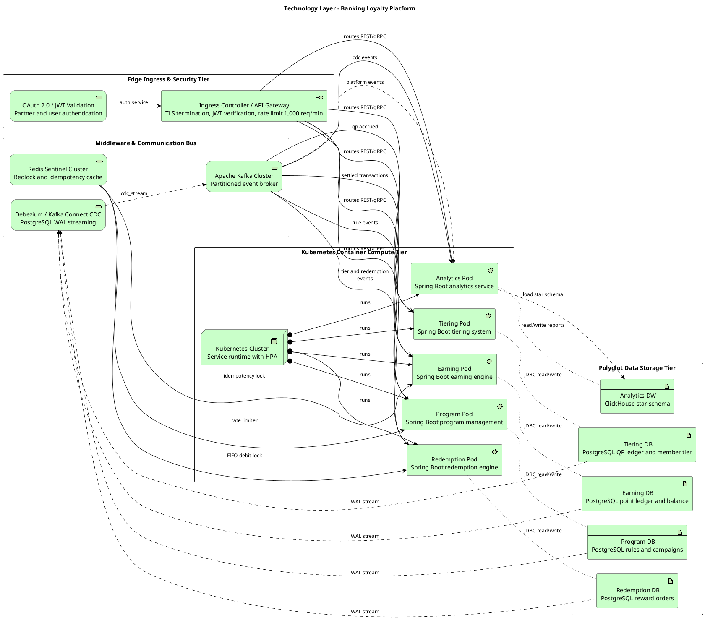

# Technology Layer - Banking Loyalty Platform

```plantuml
@startuml
!include <archimate/Archimate>

title Technology Layer - Banking Loyalty Platform
left to right direction

rectangle "Edge Ingress & Security Tier" as EdgeTier {
    Technology_Interface(IngressGateway, "Ingress Controller / API Gateway\nTLS termination, JWT verification, rate limit 1,000 req/min")
    Technology_Service(OAuthJwtValidation, "OAuth 2.0 / JWT Validation\nPartner and user authentication")
}

rectangle "Kubernetes Container Compute Tier" as ComputeTier {
    Technology_Node(KubernetesCluster, "Kubernetes Cluster\nService runtime with HPA")
    Technology_SystemSoftware(EarningPod, "Earning Pod\nSpring Boot earning engine")
    Technology_SystemSoftware(TieringPod, "Tiering Pod\nSpring Boot tiering system")
    Technology_SystemSoftware(RedemptionPod, "Redemption Pod\nSpring Boot redemption engine")
    Technology_SystemSoftware(ProgramPod, "Program Pod\nSpring Boot program management")
    Technology_SystemSoftware(AnalyticsPod, "Analytics Pod\nSpring Boot analytics service")
}

rectangle "Middleware & Communication Bus" as MiddlewareTier {
    Technology_Service(KafkaCluster, "Apache Kafka Cluster\nPartitioned event broker")
    Technology_Service(RedisCluster, "Redis Sentinel Cluster\nRedlock and idempotency cache")
    Technology_Service(DebeziumCdc, "Debezium / Kafka Connect CDC\nPostgreSQL WAL streaming")
}

rectangle "Polyglot Data Storage Tier" as StorageTier {
    Technology_Artifact(EarningDb, "Earning DB\nPostgreSQL point ledger and balance")
    Technology_Artifact(TieringDb, "Tiering DB\nPostgreSQL QP ledger and member tier")
    Technology_Artifact(RedemptionDb, "Redemption DB\nPostgreSQL reward orders")
    Technology_Artifact(ProgramDb, "Program DB\nPostgreSQL rules and campaigns")
    Technology_Artifact(AnalyticsDw, "Analytics DW\nClickHouse star schema")
}

Rel_Serving(OAuthJwtValidation, IngressGateway, "auth service")
Rel_Assignment(KubernetesCluster, EarningPod, "runs")
Rel_Assignment(KubernetesCluster, TieringPod, "runs")
Rel_Assignment(KubernetesCluster, RedemptionPod, "runs")
Rel_Assignment(KubernetesCluster, ProgramPod, "runs")
Rel_Assignment(KubernetesCluster, AnalyticsPod, "runs")

Rel_Serving(IngressGateway, EarningPod, "routes REST/gRPC")
Rel_Serving(IngressGateway, TieringPod, "routes REST/gRPC")
Rel_Serving(IngressGateway, RedemptionPod, "routes REST/gRPC")
Rel_Serving(IngressGateway, ProgramPod, "routes REST/gRPC")
Rel_Serving(IngressGateway, AnalyticsPod, "routes REST/gRPC")

Rel_Serving(KafkaCluster, EarningPod, "settled transactions")
Rel_Serving(KafkaCluster, TieringPod, "qp accrued")
Rel_Serving(KafkaCluster, RedemptionPod, "tier and redemption events")
Rel_Serving(KafkaCluster, ProgramPod, "rule events")
Rel_Serving(KafkaCluster, AnalyticsPod, "cdc events")

Rel_Serving(RedisCluster, EarningPod, "idempotency lock")
Rel_Serving(RedisCluster, RedemptionPod, "FIFO debit lock")
Rel_Serving(RedisCluster, ProgramPod, "rate limiter")

Rel_Access(EarningPod, EarningDb, "JDBC read/write")
Rel_Access(TieringPod, TieringDb, "JDBC read/write")
Rel_Access(RedemptionPod, RedemptionDb, "JDBC read/write")
Rel_Access(ProgramPod, ProgramDb, "JDBC read/write")
Rel_Access(AnalyticsPod, AnalyticsDw, "read/write reports")

Rel_Flow(EarningDb, DebeziumCdc, "WAL stream")
Rel_Flow(TieringDb, DebeziumCdc, "WAL stream")
Rel_Flow(RedemptionDb, DebeziumCdc, "WAL stream")
Rel_Flow(ProgramDb, DebeziumCdc, "WAL stream")
Rel_Flow(DebeziumCdc, KafkaCluster, "cdc_stream")
Rel_Flow(KafkaCluster, AnalyticsPod, "platform events")
Rel_Flow(AnalyticsPod, AnalyticsDw, "load star schema")

@enduml
```
