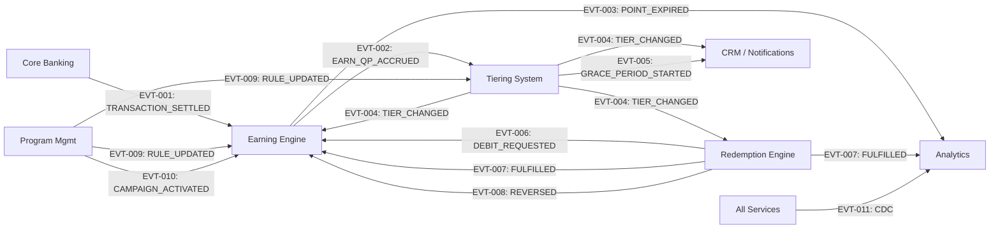

# Loyalty Banking — Domain Event Catalog

**Domain**: Loyalty Banking  
**Version**: 1.0  
**Date**: 2026-08-16  
**Source**: [Architecture-Overview.md](../architecture/Architecture-Overview.md) §5.2 | [ADR-002](../architecture/adrs/ADR-002-event-driven-earn-ingestion-and-idempotency.md) | [ADR-003](../architecture/adrs/ADR-003-data-warehouse-and-analytics-isolation.md)

---

## 1. Overview

This catalog is the **authoritative registry** of all domain events exchanged between bounded contexts in the Loyalty Banking platform. Every event documented here is the formal contract between producer and consumer services.

### Event Envelope Standard

All events published to Apache Kafka follow a standard metadata envelope:

```json
{
  "event_id": "evt-<UUID>",
  "event_type": "<event_type_constant>",
  "source_module": "<producer_module>",
  "correlation_id": "corr-<UUID>",
  "partition_key": "<member_id or entity_id>",
  "timestamp": "2026-08-16T08:00:00.000Z",
  "schema_version": "1.0",
  "payload": { ... }
}
```

| Header Field | Type | Description |
|---|---|---|
| `event_id` | UUID | Globally unique event identifier |
| `event_type` | String | Canonical event type (e.g., `EARN_QP_ACCRUED`) |
| `source_module` | String | Producer bounded context name |
| `correlation_id` | UUID | End-to-end trace ID for distributed tracing |
| `partition_key` | String | Kafka partition key ensuring per-member ordering |
| `timestamp` | ISO 8601 | Event creation time (UTC) |
| `schema_version` | String | Semantic version of the payload schema |

---

## 2. Event Catalog

### 2.1 Upstream Events (External → Loyalty Platform)

---

#### EVT-001: `TRANSACTION_SETTLED`

| Property | Value |
|---|---|
| **Topic** | `corebanking.transactions.settled` |
| **Producer** | Core Banking System (external) |
| **Consumer(s)** | Earning Engine |
| **Partition Key** | `member_id` |
| **Ordering** | Per-member ordered (same partition) |
| **Idempotency** | Consumer-side: SHA-256(`source_txn_id` + `program_id`) in Redis (TTL: 24h) |
| **SLA** | ≤ 60 seconds from settlement ([FR-01-001](../lab2-requirements.md)) |
| **Triggers** | PointTransaction lifecycle: `[*] → PENDING` or `[*] → CONFIRMED` |

**Payload Schema**:
```json
{
  "source_txn_id": "TXN-20260816-001",
  "member_id": "mbr-<UUID>",
  "transaction_type": "PURCHASE | TRANSFER | BILL_PAY",
  "channel": "POS | ONLINE | MOBILE | ATM",
  "amount": 5099,
  "currency": "USD",
  "settled_at": "2026-08-16T07:55:00Z",
  "authorization_id": "AUTH-<UUID>",
  "is_settled": true,
  "merchant_category_code": "5411"
}
```

---

### 2.2 Earning Engine Events

---

#### EVT-002: `EARN_QP_ACCRUED`

| Property | Value |
|---|---|
| **Topic** | `loyalty.earning.qp_accrued` |
| **Producer** | Earning Engine |
| **Consumer(s)** | Tiering System |
| **Partition Key** | `member_id` |
| **Ordering** | Per-member ordered |
| **Idempotency** | Consumer deduplicates by `event_id` |
| **Triggers** | QpLedger INSERT; MemberTier upgrade evaluation |

**Payload Schema**:
```json
{
  "event_id": "evt-<UUID>",
  "member_id": "mbr-<UUID>",
  "program_id": "prg-<UUID>",
  "qp_amount": 50,
  "source_txn_id": "TXN-20260816-001",
  "earn_transaction_id": "ptx-<UUID>",
  "tier_period_start": "2026-01-01",
  "tier_period_end": "2026-12-31",
  "accrual_timestamp": "2026-08-16T08:00:01Z"
}
```

---

#### EVT-003: `POINT_EXPIRED`

| Property | Value |
|---|---|
| **Topic** | `loyalty.earning.point_expired` |
| **Producer** | Earning Engine (Expiry Sweep Job) |
| **Consumer(s)** | Analytics (DW Ingest), Notification Service |
| **Partition Key** | `member_id` |
| **Ordering** | Per-member ordered |
| **Triggers** | PointTransaction lifecycle: `CONFIRMED → EXPIRED` |

**Payload Schema**:
```json
{
  "event_id": "evt-<UUID>",
  "member_id": "mbr-<UUID>",
  "program_id": "prg-<UUID>",
  "expired_transaction_id": "ptx-<UUID>",
  "points_expired": 500,
  "original_earn_date": "2025-08-16T10:00:00Z",
  "expiry_date": "2026-08-16T00:01:00Z",
  "expiry_policy": "ROLLING_12M | FIXED_YEAR_END"
}
```

---

### 2.3 Tiering System Events

---

#### EVT-004: `TIER_CHANGED`

| Property | Value |
|---|---|
| **Topic** | `loyalty.tiering.tier_changed` |
| **Producer** | Tiering System |
| **Consumer(s)** | Earning Engine (update earn multiplier), Redemption Engine (catalog eligibility), CRM / Notification Service |
| **Partition Key** | `member_id` |
| **Ordering** | Per-member ordered |
| **Triggers** | MemberTier lifecycle: `ACTIVE → ACTIVE` (upgrade) or `DOWNGRADED → ACTIVE` (step-down) |

**Payload Schema**:
```json
{
  "event_id": "evt-<UUID>",
  "member_id": "mbr-<UUID>",
  "program_id": "prg-<UUID>",
  "change_type": "UPGRADE | DOWNGRADE | GRACE_RESCUE",
  "old_tier": "SILVER",
  "new_tier": "GOLD",
  "old_multiplier": 1.0,
  "new_multiplier": 1.5,
  "effective_timestamp": "2026-08-16T08:00:02Z",
  "cumulative_qp": 1100,
  "trigger": "REAL_TIME | BATCH_EVALUATION | GRACE_RESCUE"
}
```

---

#### EVT-005: `GRACE_PERIOD_STARTED`

| Property | Value |
|---|---|
| **Topic** | `loyalty.tiering.grace_period` |
| **Producer** | Tiering System (Batch Evaluator) |
| **Consumer(s)** | Notification Service |
| **Partition Key** | `member_id` |
| **Ordering** | Per-member ordered |
| **Triggers** | MemberTier lifecycle: `ACTIVE → IN_GRACE_PERIOD` |

**Payload Schema**:
```json
{
  "event_id": "evt-<UUID>",
  "member_id": "mbr-<UUID>",
  "program_id": "prg-<UUID>",
  "current_tier": "PLATINUM",
  "target_downgrade_tier": "GOLD",
  "cumulative_qp": 1500,
  "required_qp": 3000,
  "qp_shortfall": 1500,
  "grace_period_start": "2027-01-01T00:00:00Z",
  "grace_period_end": "2027-01-31T00:00:00Z"
}
```

---

### 2.4 Redemption Engine Events

---

#### EVT-006: `REDEMPTION_DEBIT_REQUESTED`

| Property | Value |
|---|---|
| **Topic** | `loyalty.redemption.debit_requested` |
| **Producer** | Redemption Engine |
| **Consumer(s)** | Earning Engine (Ledger API — synchronous call, event for audit) |
| **Partition Key** | `member_id` |
| **Ordering** | Per-member ordered |
| **Triggers** | PointTransaction lifecycle: `CONFIRMED → PENDING_DEBIT`; RedemptionOrder: `PENDING → IN_PROGRESS` |

**Payload Schema**:
```json
{
  "event_id": "evt-<UUID>",
  "order_id": "ord-<UUID>",
  "member_id": "mbr-<UUID>",
  "program_id": "prg-<UUID>",
  "points_required": 300,
  "fifo_batches": [
    {"transaction_id": "ptx-001", "debit_amount": 200, "earn_date": "2026-01-10"},
    {"transaction_id": "ptx-002", "debit_amount": 100, "earn_date": "2026-03-15"}
  ],
  "reward_item_id": "itm-<UUID>",
  "member_tier_at_order": "GOLD"
}
```

---

#### EVT-007: `REDEMPTION_FULFILLED`

| Property | Value |
|---|---|
| **Topic** | `loyalty.redemption.fulfilled` |
| **Producer** | Redemption Engine |
| **Consumer(s)** | Earning Engine (confirm debit), Analytics (DW Ingest), CRM |
| **Partition Key** | `member_id` |
| **Ordering** | Per-member ordered |
| **Triggers** | PointTransaction lifecycle: `PENDING_DEBIT → CONFIRMED_DEBIT`; RedemptionOrder: `IN_PROGRESS → FULFILLED` |

**Payload Schema**:
```json
{
  "event_id": "evt-<UUID>",
  "order_id": "ord-<UUID>",
  "member_id": "mbr-<UUID>",
  "program_id": "prg-<UUID>",
  "status": "FULFILLED | FAILED",
  "points_debited": 300,
  "fulfillment_type": "DIGITAL | PHYSICAL | ACCOUNT_CREDIT",
  "fulfilled_at": "2026-08-16T09:30:00Z",
  "failure_reason": null
}
```

---

#### EVT-008: `REDEMPTION_REVERSED`

| Property | Value |
|---|---|
| **Topic** | `loyalty.redemption.fulfilled` |
| **Producer** | Redemption Engine |
| **Consumer(s)** | Earning Engine (restore FIFO batches), Analytics, CRM |
| **Partition Key** | `member_id` |
| **Ordering** | Per-member ordered; must be processed after `EVT-007` with `status=FAILED` |
| **Triggers** | PointTransaction lifecycle: `PENDING_DEBIT → CONFIRMED` (reversal); RedemptionOrder: `FAILED → REVERSED` |

**Payload Schema**:
```json
{
  "event_id": "evt-<UUID>",
  "order_id": "ord-<UUID>",
  "member_id": "mbr-<UUID>",
  "program_id": "prg-<UUID>",
  "status": "REVERSED",
  "points_restored": 300,
  "fifo_batches_restored": [
    {"transaction_id": "ptx-001", "restored_amount": 200, "original_earn_date": "2026-01-10", "original_expiry_date": "2027-01-10"},
    {"transaction_id": "ptx-002", "restored_amount": 100, "original_earn_date": "2026-03-15", "original_expiry_date": "2027-03-15"}
  ],
  "reversal_reason": "FULFILLMENT_FAILED",
  "reversed_at": "2026-08-16T10:00:00Z"
}
```

---

### 2.5 Program Management Events

---

#### EVT-009: `RULE_UPDATED`

| Property | Value |
|---|---|
| **Topic** | `loyalty.config.rule_updated` |
| **Producer** | Program Management |
| **Consumer(s)** | Earning Engine (reload earn rules), Tiering System (reload tier rules), Redemption Engine (reload redemption rules) |
| **Partition Key** | `program_id` |
| **Ordering** | Per-program ordered |
| **Triggers** | EarnRule / TierRule version increment |

**Payload Schema**:
```json
{
  "event_id": "evt-<UUID>",
  "program_id": "prg-<UUID>",
  "rule_type": "EARN_RULE | TIER_RULE | REDEMPTION_RULE",
  "rule_id": "rul-<UUID>",
  "old_version": 1,
  "new_version": 2,
  "changed_fields": {
    "earn_rate": {"old": 1.0, "new": 1.25}
  },
  "operator_id": "usr-<UUID>",
  "effective_from": "2026-08-16T08:00:00Z"
}
```

---

#### EVT-010: `CAMPAIGN_ACTIVATED`

| Property | Value |
|---|---|
| **Topic** | `loyalty.config.rule_updated` |
| **Producer** | Program Management |
| **Consumer(s)** | Earning Engine (apply bonus during earn evaluation) |
| **Partition Key** | `program_id` |
| **Ordering** | Per-program ordered |
| **Triggers** | Campaign lifecycle: `DRAFT → ACTIVE` |

**Payload Schema**:
```json
{
  "event_id": "evt-<UUID>",
  "program_id": "prg-<UUID>",
  "campaign_id": "cmp-<UUID>",
  "campaign_name": "Double Points August",
  "action": "ACTIVATED | PAUSED | COMPLETED | DEACTIVATED",
  "multiplier": 2.00,
  "flat_bonus": 0,
  "priority": 1,
  "start_date": "2026-08-01T00:00:00Z",
  "end_date": "2026-08-31T23:59:59Z"
}
```

---

### 2.6 Cross-Cutting Events (CDC)

---

#### EVT-011: `CDC_PLATFORM_EVENT`

| Property | Value |
|---|---|
| **Topic** | `loyalty.cdc.platform_events` |
| **Producer** | Debezium CDC Connector (all OLTP databases) |
| **Consumer(s)** | Analytics & Reporting Service (DW Stream Loader) |
| **Partition Key** | Source table primary key |
| **Ordering** | Per-table per-key ordered (WAL sequence) |
| **SLA** | End-to-end lag ≤ 10 minutes ([NFR-05-003](../lab2-requirements.md)) |

**Payload**: Standard Debezium change event (before/after row state, operation type, source metadata).

---

## 3. Event Flow Topology



---

## 4. Event Compatibility & Evolution Policy

| Policy | Rule |
|---|---|
| **Schema Evolution** | Backward-compatible additions only (new optional fields). Breaking changes require new `schema_version` and topic version suffix. |
| **Ordering Guarantee** | Per-partition ordering by `partition_key` (typically `member_id`). Cross-partition ordering is NOT guaranteed. |
| **At-Least-Once Delivery** | Kafka consumer groups with manual offset commit. All consumers MUST be idempotent. |
| **Retention** | Event topics retain data for 7 days (hot) + archived to cold storage for audit compliance. |
| **Schema Registry** | Apache Avro schemas registered in Confluent Schema Registry with compatibility mode `BACKWARD`. |

---

*Source: [Architecture-Overview.md](../architecture/Architecture-Overview.md) · [ADR-002](../architecture/adrs/ADR-002-event-driven-earn-ingestion-and-idempotency.md) · [ADR-003](../architecture/adrs/ADR-003-data-warehouse-and-analytics-isolation.md) · [entity-lifecycle-models.md](../design/entity-lifecycle-models.md)*
