# Loyalty Banking — Domain Summary

## Domain Overview

**Loyalty Banking** is a financial-services loyalty platform that manages the full lifecycle of customer loyalty points — from earning and tier progression to redemption and reporting. It sits at the intersection of **retail banking**, **rewards programs**, and **customer engagement**, enabling banks and financial institutions to incentivize customer behavior, deepen relationships, and drive product usage.

---

## Scope Summary

| # | Module | Purpose |
|---|--------|---------|
| 1 | Earning Engine | Calculates and awards points based on customer transactions and activities |
| 2 | Tiering System | Classifies customers into loyalty tiers based on accumulated value or activity |
| 3 | Redemption Engine | Processes point redemption requests against available reward catalogs |
| 4 | Program Management | Configures and administers loyalty programs, campaigns, and rules |
| 5 | Analytics & Reporting | Provides insights on program performance, customer behavior, and point liability |

---

## 1. Earning Engine

### Purpose
Automatically calculates and credits loyalty points to a customer's account based on qualifying transactions or activities.

### Key Concepts
- **Earn Rate**: Points awarded per unit of spend: **1 point per $1 spent** (base rate; tier multipliers apply on top).
- **Earn Event**: Any qualifying activity that triggers point accrual (purchase, transfer, bill payment, login milestone, etc.). Events must be received and processed within **60 seconds** of transaction settlement.
- **Bonus Campaign**: A time-limited multiplier or flat bonus applied on top of the base earn rate (e.g., the **"Double Points August"** campaign awards **2× points** on all eligible spend from 1 Aug – 31 Aug).
- **Expiry**: Points carry an expiry date set at credit time. Two policies supported: **rolling** (12 months from earn date) or **fixed** (31 December of the earn year). Members are notified **30 days** and **7 days** before their points expire.
- **Pending vs. Confirmed Points**: Points may be held in a pending state until a transaction is fully settled, then confirmed/credited.
- **Sổ cái (Earning Ledger)**: Hệ thống ghi sổ chuyên dụng của Earning Engine. Mọi giao dịch cộng điểm (base, bonus) hoặc trừ điểm (expire, reversed) đều được ghi nhận như một bút toán không thể sửa xóa (append-only, immutable). Đây là nguồn sự thật duy nhất (single source of truth) cho số dư điểm của thành viên.

### Key Entities
| Entity | Description |
|--------|-------------|
| `EarnRule` | Defines earn rate, eligible transaction types, channels, and validity period |
| `PointTransaction` | Ledger record of each point credit/debit event |
| `Member` | The loyalty account holder |
| `TransactionEvent` | Source event from core banking (e.g., purchase, payment) |

### Business Rules
- Points are only awarded for **settled** transactions.
- Bonus rules are evaluated **after** the base earn rule.
- If multiple bonus rules apply, the **highest multiplier** wins (or rules are stacked, depending on program config).
- Points are rounded **down** to the nearest integer.
- Earn events must be **idempotent** — the same source transaction must not credit points more than once.

### Flow
```
Transaction Event -> Earn Rule Evaluation -> Bonus Rule Evaluation
  -> Point Calculation -> Point Ledger Credit -> Expiry Scheduling
```

---

## 2. Tiering System

### Purpose
Segments customers into loyalty tiers — **Silver, Gold, Platinum** — based on their cumulative qualifying activity over a defined period. Tiers unlock benefits and influence earn rates.

### Key Concepts
- **Qualifying Points (QP)**: A separate metric used solely for tier calculation — not the same as redeemable points.
- **Tier Period**: The window over which QP are accumulated. Default: **calendar year (1 Jan – 31 Dec)**; configurable to rolling 12-month anniversary per program.
- **Tier Threshold**: The minimum QP required to reach or maintain a tier. Thresholds for the standard program: **Silver: 0 QP** (base tier, all enrolled members), **Gold: 1,000 QP**, **Platinum: 3,000 QP**.
- **Tier Upgrade**: When a member crosses the threshold for a higher tier. Upgrades take effect **immediately**.
- **Tier Downgrade**: When a member fails to maintain the QP required for their current tier at evaluation time. A member downgrades **one tier per evaluation cycle** (default; configurable).
- **Grace Period**: A buffer period after the tier period ends during which a member retains their current tier before downgrade takes effect. Default: **30 days**.

### Key Entities
| Entity | Description |
|--------|-------------|
| `Tier` | Definition of a tier (name, threshold, benefits) |
| `TierRule` | Configuration of evaluation frequency, QP source, grace periods |
| `MemberTier` | Current and previous tier for a member, with effective dates |
| `TierEvaluationLog` | Audit record of each tier recalculation |

### Business Rules
- Tier upgrades take effect **immediately** when the threshold is crossed.
- Tier downgrades take effect only **after** the evaluation cycle ends (+ grace period).
- QP do **not** expire mid-tier-period; they reset at the start of each new period.
- A member cannot skip tiers downward — they downgrade one level at a time per cycle (program-configurable).

### Tier Benefit Examples
| Tier | Example Benefits |
|------|-----------------|
| Silver | 1x base earn rate, standard support |
| Gold | 1.5x earn rate, priority support, lounge access |
| Platinum | 2x earn rate, concierge, exclusive offers |

### Flow
```
Qualifying Transaction -> QP Accrual -> Periodic Tier Evaluation
  -> Threshold Check -> Tier Upgrade / Maintain / Downgrade
  -> Benefit Activation -> Member Notification
```

---

## 3. Redemption Engine

### Purpose
Enables members to exchange their confirmed loyalty points for rewards — cash back, vouchers, merchandise, travel, charity donations, or statement credits.

### Key Concepts
- **Redemption Rate**: Points required per reward unit: **100 points = $1 redemption value** (program-level `cost_per_point` defines the reverse for liability calculations).
- **Redemption Catalog**: The collection of available reward options (items, partners, categories). Catalog items may carry a minimum tier requirement (e.g., Platinum-only items).
- **Redemption Request**: A member-initiated request to exchange points for a specific reward.
- **Fulfillment**: The actual delivery of the reward to the member (digital voucher, physical shipment, or account credit within 1 business day for cash-back).
- **Minimum Redemption**: The lowest number of points that can be redeemed in a single transaction: **100 points**.
- **Reversal**: Cancellation of a redemption and re-crediting of points to the member's account, restoring the original FIFO earn date and expiry date.

### Key Entities
| Entity | Description |
|--------|-------------|
| `RewardItem` | A redeemable reward in the catalog |
| `RedemptionOrder` | A member's redemption request, including status lifecycle |
| `PointLedger` | Master ledger of all point movements (earn + redeem + adjust + expire) |
| `FulfillmentRecord` | Tracks delivery status of the redeemed reward |

### Business Rules
- A member cannot redeem more points than their **confirmed available balance**.
- Points are **debited immediately** on redemption request approval.
- If fulfillment fails, points must be **reversed** back to the member's account.
- Expired points cannot be redeemed (FIFO expiry applied during debit).
- Some rewards may require a **minimum tier** (e.g., Platinum-only catalog items).

### Redemption Lifecycle
```
Redemption Request -> Balance Validation -> Point Debit (Pending)
  -> Catalog Fulfillment -> Delivery Confirmation -> Point Debit (Confirmed)
  [On Failure] -> Reversal -> Points Re-credited
```

---

## 4. Program Management

### Purpose
Provides the administrative layer for configuring, launching, and maintaining loyalty programs, including campaign setup, rule management, partner integration, and member enrollment.

### Key Concepts
- **Loyalty Program**: The top-level container defining the overall structure, currency, and rules (e.g., **"BankRewards 2025"**).
- **Campaign**: A time-bound promotional configuration that modifies earn/redeem behavior (e.g., **"Double Points August"** — 2× earn multiplier on all eligible spend, 1 Aug – 31 Aug). Campaigns carry a numeric priority to resolve conflicts.
- **Enrollment**: The process by which a customer opts into a loyalty program. A member may be enrolled in multiple programs simultaneously.
- **Partner Integration**: Third-party merchants or service providers that participate in the ecosystem (earn at partner, redeem with partner). Partner API calls are authenticated via **OAuth 2.0 client credentials**; default rate limit is **1,000 requests/minute per partner**.
- **Rule Engine**: The configurable logic layer that evaluates earn/tier/redeem rules without code changes. All rule changes are **versioned** and applied prospectively — existing balances and tier statuses are never retroactively affected.

### Key Entities
| Entity | Description |
|--------|-------------|
| `LoyaltyProgram` | Top-level program definition (name, currency, dates, terms) |
| `Campaign` | Time-limited promotional rule set |
| `EarnRule` / `TierRule` / `RedemptionRule` | Configurable rule records per program |
| `Partner` | External participant in the program ecosystem |
| `Enrollment` | Member-to-program join record with effective date and status |

### Business Rules
- A member can be enrolled in **multiple programs** simultaneously, subject to program eligibility rules.
- Campaigns must define a **priority** to resolve conflicts when multiple campaigns apply.
- Program configuration changes are **versioned** — existing member balances and tier status are unaffected by retroactive rule changes.
- Partner integrations use **standardized APIs** for earn/redeem event exchange.

### Admin Capabilities
- Create / update / deactivate programs and campaigns
- Define and publish reward catalog items
- Manage partner onboarding and API credentials
- Adjust member point balances (manual adjustment with audit trail)
- Configure notifications and member communications

---

## 5. Analytics and Reporting

### Purpose
Delivers data-driven insights into loyalty program performance, member behavior, point liability, and business impact. Supports both operational monitoring and strategic decision-making.

### Key Concepts
- **Point Liability**: The financial obligation represented by unspent points on the balance sheet. Formula: **`SUM(confirmed_unspent_points) × cost_per_point`** where `cost_per_point` is defined per program in the base currency.
- **Breakage Rate**: The percentage of earned points that expire without being redeemed (a source of program revenue). Formula: **`expired points / issued points × 100`**.
- **Redemption Rate**: The percentage of earned points that are redeemed by members. Formula: **`redeemed points / issued points × 100`**.
- **Active Members**: Members who have performed **at least 1 qualifying activity** in the reporting period. Members with no activity for >90 days are classified as dormant.
- **Tier Distribution**: Breakdown of the member base across each tier level (Silver / Gold / Platinum), reported as count and percentage of total enrolled.

### Key Reports
| Report | Description |
|--------|-------------|
| Point Issuance Report | Total points earned by members over a period, by program/campaign/channel |
| Redemption Report | Total points redeemed, reward categories, and fulfillment status |
| Point Liability Report | Current outstanding balance x redemption rate = liability in currency |
| Tier Movement Report | Upgrades, downgrades, and member distribution per tier |
| Expiry Report | Points expiring in upcoming periods; breakage forecast |
| Member Engagement Report | Activity rates, earn frequency, and dormancy indicators |
| Campaign Performance Report | Incremental activity and cost-per-point for each campaign |

### Key Metrics (KPIs)
| KPI | Formula / Definition |
|-----|---------------------|
| **Earn Rate** (actual) | Total points issued / Total qualifying spend |
| **Redemption Rate** | Points redeemed / Points issued |
| **Breakage Rate** | Points expired / Points issued |
| **Active Member Rate** | Active members / Total enrolled members |
| **Point Liability** | Outstanding points x cost-per-point |
| **Program ROI** | Incremental revenue attributable to loyalty / Program cost |

### Data Sources
- Core banking transaction feed (for earn events)
- CRM / member profile data
- Redemption fulfillment system
- Campaign management system

---

## Domain Glossary

| Term | Definition |
|------|-----------|
| **Points** | The loyalty currency issued to members for qualifying activity |
| **Qualifying Points (QP)** | Points used exclusively for tier calculation |
| **Earn Event** | A transaction or activity that triggers point accrual |
| **Tier** | A membership level that grants specific benefits |
| **Breakage** | Points that expire without being redeemed |
| **Point Liability** | Financial value of unspent points on the books |
| **Redemption** | Exchange of points for a reward |
| **Fulfillment** | Delivery of a reward after redemption |
| **Campaign** | A time-limited promotional rule overlay |
| **Enrollment** | A member's opt-in to a loyalty program |
| **Partner** | Third-party participant in the earn/redeem ecosystem |
| **FIFO Expiry** | First-in, first-out expiry — oldest points are consumed first |
| **Pending Points** | Points awaiting transaction settlement before confirmation |
| **Grace Period** | Buffer window before a tier downgrade takes effect |

---

## Domain Class Model (UML)

The following class diagram defines the formal domain model for the Loyalty Banking platform. Entities are organized by **Bounded Context** (aggregate boundaries) aligned with the module decomposition in [Architecture-Overview.md](file:///Users/dusainbolt/Documents/vcb/loyalty_system_docs/architecture/Architecture-Overview.md) §4 and [ADR-001](file:///Users/dusainbolt/Documents/vcb/loyalty_system_docs/architecture/adrs/ADR-001-module-boundaries-and-data-isolation.md).

> **MDD Anchor**: Every Functional Requirement (FR), Analytics Spec (AS), Detailed Design (DD), and Quality Gate criterion traces back to one or more entities and relationships in this model.

```mermaid
classDiagram
    direction TB

    %% ──────────────────────────────────────────────
    %% BOUNDED CONTEXT: Program Management
    %% ──────────────────────────────────────────────
    namespace ProgramManagement {
        class LoyaltyProgram {
            +UUID program_id
            +String name
            +String currency_name
            +Decimal cost_per_point
            +Enum status : DRAFT|ACTIVE|SUSPENDED|DEACTIVATED
            +Date start_date
            +Date end_date
        }

        class Campaign {
            +UUID campaign_id
            +String name
            +Decimal multiplier
            +BigInt flat_bonus
            +Int priority
            +Timestamp start_date
            +Timestamp end_date
            +Enum status : DRAFT|ACTIVE|PAUSED|COMPLETED|DEACTIVATED
        }

        class Partner {
            +UUID partner_id
            +String name
            +String client_id
            +Enum partner_type : EARN_ONLY|REDEEM_ONLY|BOTH
            +Int rate_limit_rpm
            +Enum status : ACTIVE|INACTIVE
        }

        class Enrollment {
            +UUID enrollment_id
            +Enum status : PENDING|ACTIVE|SUSPENDED|CANCELLED
            +Timestamp enrollment_date
        }

        class EarnRule {
            +UUID rule_id
            +Decimal earn_rate
            +String transaction_type
            +String channel
            +Int version
            +Enum status : DRAFT|ACTIVE|INACTIVE
            +Timestamp valid_from
            +Timestamp valid_to
        }
    }

    %% ──────────────────────────────────────────────
    %% BOUNDED CONTEXT: Earning Engine
    %% ──────────────────────────────────────────────
    namespace EarningEngine {
        class Member {
            +UUID member_id
            +String name
            +String email
        }

        class PointTransaction {
            +UUID transaction_id
            +String source_event_id
            +Enum source_type : CORE_BANKING|PARTNER|MANUAL_ADJUST|EXPIRY|REVERSAL
            +Enum type : EARN|BONUS|REDEEM|EXPIRED|ADJUST_CREDIT|ADJUST_DEBIT|REVERSAL
            +Enum status : PENDING|CONFIRMED|CANCELLED|PENDING_DEBIT|CONFIRMED_DEBIT
            +BigInt amount
            +BigInt remaining_balance
            +Timestamp earn_date
            +Timestamp expiry_date
            +String idempotency_key
        }

        class PointBalance {
            +UUID balance_id
            +BigInt confirmed_balance
            +BigInt pending_balance
        }
    }

    %% ──────────────────────────────────────────────
    %% BOUNDED CONTEXT: Tiering System
    %% ──────────────────────────────────────────────
    namespace TieringSystem {
        class MemberTier {
            +UUID member_tier_id
            +Enum current_tier : SILVER|GOLD|PLATINUM
            +Enum previous_tier : SILVER|GOLD|PLATINUM
            +Enum status : ACTIVE|IN_GRACE_PERIOD|DOWNGRADED
            +BigInt cumulative_qp
            +Timestamp effective_from
            +Timestamp grace_period_end
        }

        class QpLedger {
            +UUID qp_id
            +BigInt qp_amount
            +Date tier_period_start
            +Date tier_period_end
        }

        class TierRule {
            +UUID tier_rule_id
            +Enum tier_name : SILVER|GOLD|PLATINUM
            +BigInt qp_threshold
            +Decimal earn_multiplier
            +Int grace_period_days
            +Enum tier_period_type : CALENDAR_YEAR|ROLLING_12M
            +Int version
        }

        class TierEvaluationLog {
            +UUID run_id
            +Int members_evaluated
            +Int upgrades_count
            +Int downgrades_count
            +Enum status : SUCCESS|FAILED
        }
    }

    %% ──────────────────────────────────────────────
    %% BOUNDED CONTEXT: Redemption Engine
    %% ──────────────────────────────────────────────
    namespace RedemptionEngine {
        class RewardItem {
            +UUID item_id
            +String name
            +String category
            +BigInt points_cost
            +Enum fulfillment_type : DIGITAL|PHYSICAL|ACCOUNT_CREDIT
            +Enum min_tier_required : SILVER|GOLD|PLATINUM
            +Enum status : DRAFT|ACTIVE|OUT_OF_STOCK|DISCONTINUED
        }

        class RedemptionOrder {
            +UUID order_id
            +Int quantity
            +BigInt total_points_debited
            +String member_tier_at_order
            +Enum status : PENDING|IN_PROGRESS|FULFILLED|FAILED|CANCELLED|REVERSED
        }

        class FulfillmentRecord {
            +UUID fulfillment_id
            +String tracking_number
            +Enum status : PENDING|IN_PROGRESS|FULFILLED|FAILED
            +Timestamp dispatched_at
            +Timestamp fulfilled_at
            +Timestamp sla_due_date
        }
    }

    %% ──────────────────────────────────────────────
    %% RELATIONSHIPS (Cross-Aggregate via ID Reference)
    %% ──────────────────────────────────────────────

    LoyaltyProgram "1" --> "0..*" Enrollment : has
    LoyaltyProgram "1" --> "0..*" EarnRule : configures
    LoyaltyProgram "1" --> "0..*" TierRule : configures
    LoyaltyProgram "1" --> "0..*" Campaign : runs

    Member "1" --> "0..*" Enrollment : joins
    Member "1" --> "0..*" PointTransaction : owns
    Member "1" --> "1" PointBalance : has_balance
    Member "1" --> "0..*" QpLedger : accumulates_qp
    Member "1" --> "1" MemberTier : assigned_tier
    Member "1" --> "0..*" RedemptionOrder : places

    Campaign "1" --> "0..*" PointTransaction : contributes_bonus

    RedemptionOrder "1" --> "1" RewardItem : selects
    RedemptionOrder "1" --> "0..1" FulfillmentRecord : tracks_delivery

    Partner "1" --> "0..*" PointTransaction : originates_earn
```



### Aggregate Boundary Rules

| Bounded Context | Aggregate Root | Owned Entities | Database | Cross-Context Access |
|---|---|---|---|---|
| **Program Management** | `LoyaltyProgram` | `Campaign`, `EarnRule`, `TierRule`, `Partner`, `Enrollment` | `program_mgmt_db` | REST API / Kafka events only |
| **Earning Engine** | `PointTransaction` | `PointBalance` | `earning_db` + Redis | Kafka `qp_accrued` → Tiering; Ledger API → Redemption |
| **Tiering System** | `MemberTier` | `QpLedger`, `TierRule`, `TierEvaluationLog` | `tiering_db` | Kafka `tier_changed` → Earning, Redemption |
| **Redemption Engine** | `RedemptionOrder` | `RewardItem`, `FulfillmentRecord` | `redemption_db` + Redis | Calls Earning Ledger API; Calls Tier API |
| **Analytics & Reporting** | `fact_point_transaction` | All `dim_*` and `fact_*` tables | `analytics_dw` | CDC read-only from all OLTP databases |

> **Constraint**: No direct SQL queries, foreign keys, or cross-database transactions between bounded contexts ([ADR-001](file:///Users/dusainbolt/Documents/vcb/loyalty_system_docs/architecture/adrs/ADR-001-module-boundaries-and-data-isolation.md)). All cross-context communication is via APIs or events.

---

*Source: [loyalty.md](file:///Users/dusainbolt/Documents/vcb/loyalty_system_docs/loyalty.md) — Domain: Loyalty Banking, Scope: Earning Engine, Tiering System, Redemption Engine, Program Management, Analytics & Reporting*
