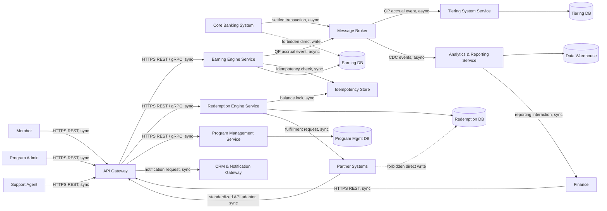

# Lab 6 — Ecosystem Sketch (Before)

**Status:** Done | **Phase:** Before pack, messy current style

This is a before-pack sitting. No Guide, no header template, no RACI, no installation or runtime.

The sketch uses only I-4 containers and I-3 external systems. Product names remain labels inside these containers, not separate systems.

## Edge Labels

Every edge on the sketch carries a protocol and a sync/async label.

| From | To | Protocol | Sync / Async | Event name (if async) |
|---|---|---|---|---|
| Core Banking System | Message Broker | Event stream | Async | `transaction.settled` |
| Message Broker | Earning Engine Service | Event stream | Async | `transaction.settled` consume |
| Earning Engine Service | Message Broker | Event stream | Async | `earning.qp_accrued` |
| Message Broker | Tiering System Service | Event stream | Async | `earning.qp_accrued` consume |
| Message Broker | Analytics & Reporting Service | Event stream | Async | `cdc.platform_events` consume |
| Member | API Gateway | HTTPS REST | Sync | — |
| Program Admin | API Gateway | HTTPS REST | Sync | — |
| Finance | API Gateway | HTTPS REST | Sync | — |
| Support Agent | API Gateway | HTTPS REST | Sync | — |
| Partner Systems | API Gateway | Standardized API adapter | Sync | — |
| API Gateway | Earning Engine Service | HTTPS REST / gRPC | Sync | — |
| API Gateway | Redemption Engine Service | HTTPS REST / gRPC | Sync | — |
| API Gateway | Program Management Service | HTTPS REST / gRPC | Sync | — |
| Earning Engine Service | Idempotency Store | Cache / lock protocol | Sync | — |
| Redemption Engine Service | Idempotency Store | Cache / lock protocol | Sync | — |
| Redemption Engine Service | Partner Systems | HTTPS REST | Sync | — |
| API Gateway | CRM & Notification Gateway | HTTPS REST | Sync | — |

## Label Note

Product labels are optional annotations only. No container was renamed or split to add a product.

| I-4 Container | Optional product label | Note |
|---|---|---|
| API Gateway | — | AuthN sits on this container. No separate IAM product is added as a system. |
| Message Broker | e.g. Apache Kafka | Label only. Not a separate system. Not installed. |
| Idempotency Store | e.g. Redis | Label only. Not a separate system. Not installed. |
| Earning DB | e.g. PostgreSQL | Label only. Not a separate system. |
| Tiering DB | e.g. PostgreSQL | Label only. Not a separate system. |
| Redemption DB | e.g. PostgreSQL | Label only. Not a separate system. |
| Program Mgmt DB | e.g. PostgreSQL | Label only. Not a separate system. |
| Data Warehouse | e.g. Star schema store | Label only. Not a separate system. |

## Negative Evidence

This is a simulation-only ecosystem model. No Docker, cluster, IAM realm, broker administration, runtime, deployment, or executable test was performed. `API Gateway` already owns authentication, so no separate IAM system is added. No new system is introduced for an adapter; it is represented by the I-8 legacy/adapter mechanism through `API Gateway`.
