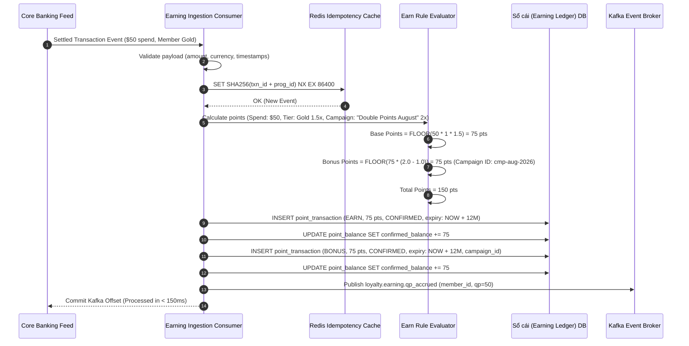
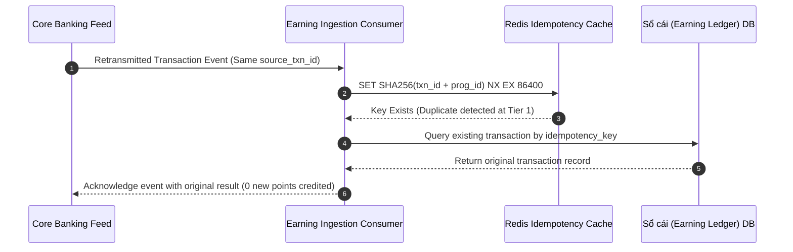
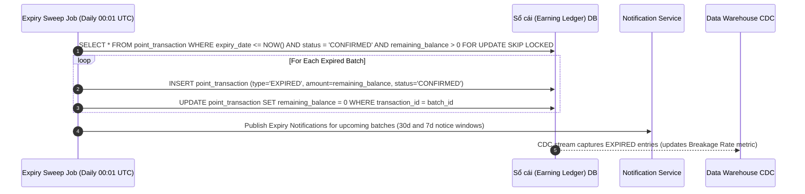

# Detailed Design: Earning Engine (DD-01)

**Module**: Earning Engine  
**Version**: 1.0  
**Date**: 2026-08-14  
**Source**: [loyalty_domain.md](../lab2-requirements.md) | [FR-01](../lab2-requirements.md) | [AS-01](../lab2-requirements.md) | [Quality-Gates-Design.md](../quality-gates/Quality-Gates-Design.md)

---

## 1. Module Overview & Responsibilities

The **Earning Engine** is responsible for consuming settled transaction events, evaluating base and bonus earn rules, calculating awarded points with mathematical precision (FLOOR rounding), appending immutable Sổ cái (Earning Ledger) records, scheduling expiry timelines, and emitting QP accrual events to the Tiering System.

---

## 2. Component Architecture

```mermaid
flowchart TB
    subgraph Ingestion["1. Ingestion Layer"]
        C_KAFKA[Kafka Consumer<br/>topic: corebanking.transactions.settled]
        P_API[Partner Earn REST Controller]
        VAL[Payload & Schema Validator]
    end

    subgraph Deduplication["2. Deduplication & Idempotency"]
        IDEM_GEN[SHA-256 Idempotency Key Generator]
        REDIS_FILTER[(Redis Cache Filter<br/>TTL: 24h)]
    end

    subgraph Calculation["3. Calculation & Rule Engine"]
        TIER_CACHE[Member Tier Resolver<br/>Silver 1x / Gold 1.5x / Plat 2x]
        BASE_EVAL[Base Earn Rule Evaluator<br/>FLOOR(amt × rate)]
        BONUS_EVAL[Campaign Bonus Evaluator<br/>Priority / Multiplier 2x / Stacking]
    end

    subgraph Persistence["4. Ledger & Expiry Persistence"]
        LEDGER_SVC[Earning Ledger Service]
        EXPIRY_SCHED[Expiry Scheduler Service]
        DB_LEDGER[(PostgreSQL<br/>point_transaction, point_balance)]
    end

    subgraph Egress["5. Event Publishing"]
        EVENT_PUB[Kafka Producer<br/>loyalty.earning.qp_accrued]
    end

    C_KAFKA --> VAL
    P_API --> VAL
    VAL --> IDEM_GEN
    IDEM_GEN --> REDIS_FILTER
    REDIS_FILTER -->|New Event| TIER_CACHE
    TIER_CACHE --> BASE_EVAL
    BASE_EVAL --> BONUS_EVAL
    BONUS_EVAL --> LEDGER_SVC
    LEDGER_SVC --> DB_LEDGER
    LEDGER_SVC --> EXPIRY_SCHED
    LEDGER_SVC --> EVENT_PUB
```

---

## 3. Mathematical & Algorithmic Specifications

### 3.1 Base Points Calculation
Points are strictly rounded **down** to the nearest integer:
$$\text{BasePoints} = \left\lfloor \text{TransactionAmount} \times \text{EarnRate} \times \text{TierMultiplier} \right\rfloor$$
- **Default EarnRate**: **1 point per $1 spent**
- **Tier Multipliers**: Silver = **1.0×**, Gold = **1.5×**, Platinum = **2.0×**

*Example*: Gold member spending $10.99 at base rate:
$$\text{BasePoints} = \lfloor 10.99 \times 1.0 \times 1.5 \rfloor = \lfloor 16.485 \rfloor = 16 \text{ points}$$

### 3.2 Bonus Campaign Evaluation
Bonus campaigns are evaluated **after** the base calculation.
1. **Highest Priority Wins (No Stacking)**:
   $$\text{ActiveCampaign} = \arg\min_{c \in \text{EligibleCampaigns}} (c.\text{priority})$$
   $$\text{BonusPoints} = \begin{cases} 
   \lfloor \text{BasePoints} \times (c.\text{multiplier} - 1.0) \rfloor & \text{if multiplier campaign} \\ 
   c.\text{flat\_bonus} & \text{if flat bonus campaign} 
   \end{cases}$$
2. **Stacking Configured**:
   $$\text{BonusPoints} = \sum_{c \in \text{EligibleCampaigns}} \text{CalculateCampaignBonus}(c)$$

---

## 4. Sequence Diagrams

### 4.1 Standard Earn Ingestion with Bonus Campaign (FLOW-01)



### 4.2 Deduplication of Duplicate Earn Event (UC-01-05)



### 4.3 Automated Point Expiry Sweep (FLOW-12 / UC-01-04)


