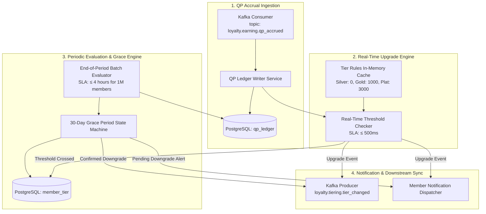
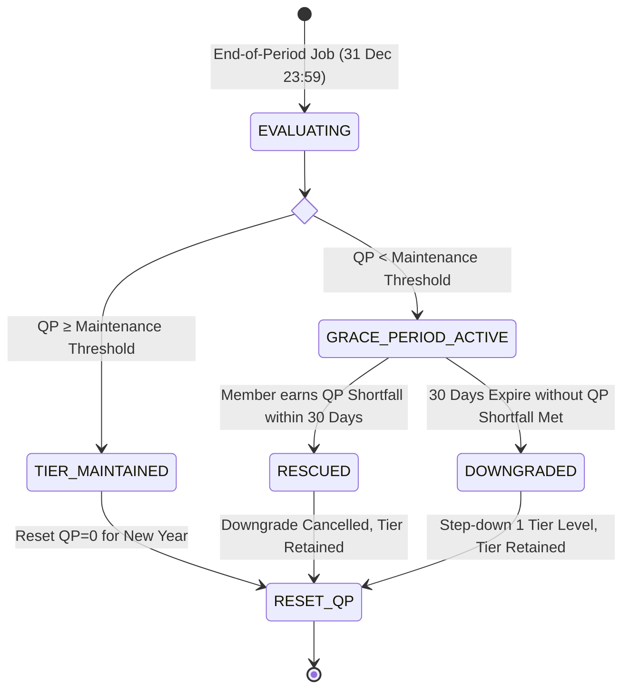
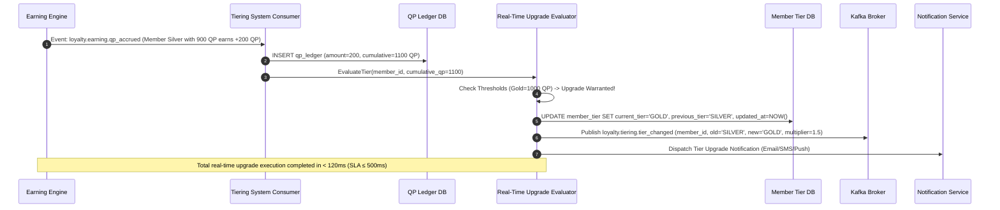
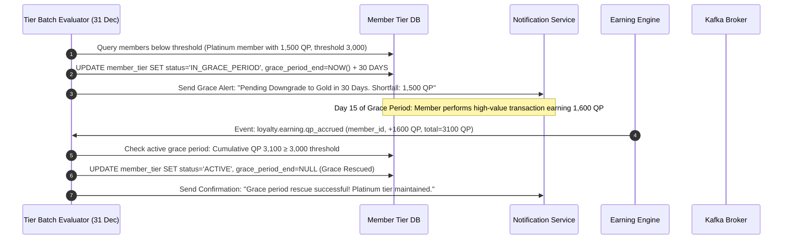

# Detailed Design: Tiering System (DD-02)

**Module**: Tiering System  
**Version**: 1.0  
**Date**: 2026-08-14  
**Source**: [loyalty_domain.md](../lab2-requirements.md) | [FR-02](../lab2-requirements.md) | [AS-02](../lab2-requirements.md) | [Quality-Gates-Design.md](../quality-gates/Quality-Gates-Design.md)

---

## 1. Module Overview & Responsibilities

The **Tiering System** segments members into loyalty tiers (**Silver, Gold, Platinum**) based on Qualifying Points (QP) accumulated over a tier period (default: calendar year 1 Jan – 31 Dec). It evaluates real-time upgrades on every transaction, executes end-of-period batch evaluation jobs, manages 30-day grace periods, and coordinates benefit activations across downstream modules.

---

## 2. Component Architecture

---

## 3. Tier Thresholds & Benefit Matrix

| Tier Name | QP Threshold | Earn Multiplier | Catalog Access Tier | Grace Period | Downgrade Policy |
|---|---|---|---|---|---|
| **Silver** | **0 QP** (Base tier) | **1.0×** | Standard Catalog | N/A | Base tier (cannot downgrade) |
| **Gold** | **1,000 QP** | **1.5×** | Gold + Standard Catalog | 30 Days | 1 level per cycle (Gold → Silver) |
| **Platinum** | **3,000 QP** | **2.0×** | Platinum Exclusive Catalog | 30 Days | 1 level per cycle (Platinum → Gold) |

---

## 4. Grace Period State Machine

---

## 5. Sequence Diagrams

### 5.1 Real-Time Tier Upgrade (FLOW-02 / UC-02-02)

### 5.2 End-of-Period Tier Downgrade & 30-Day Grace Rescue (FLOW-03 / UC-02-04)

