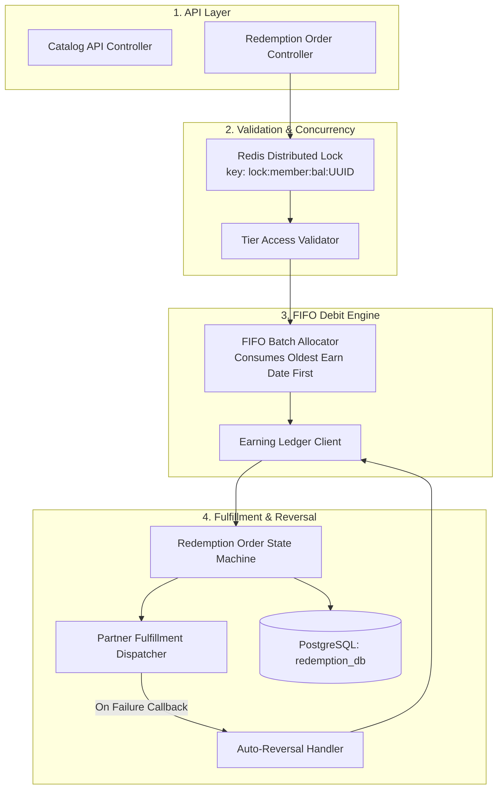
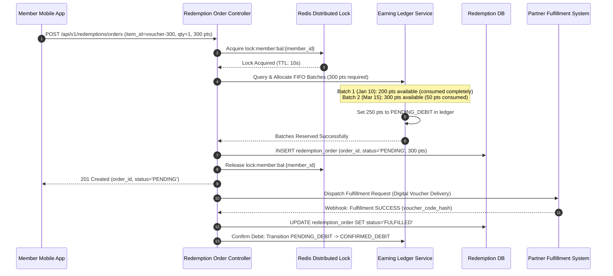
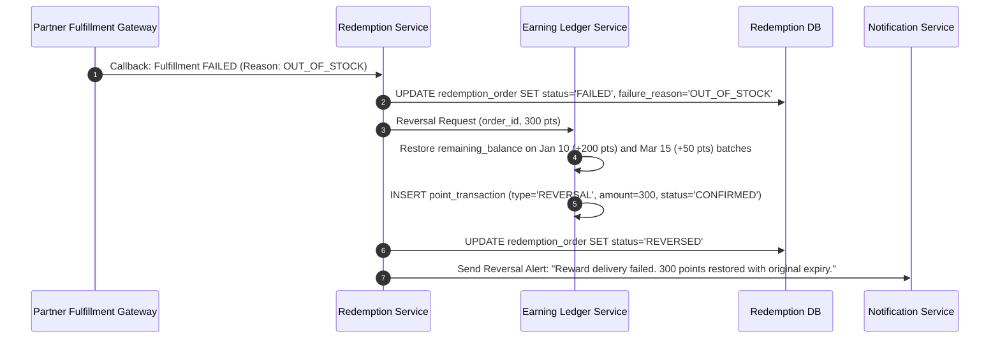
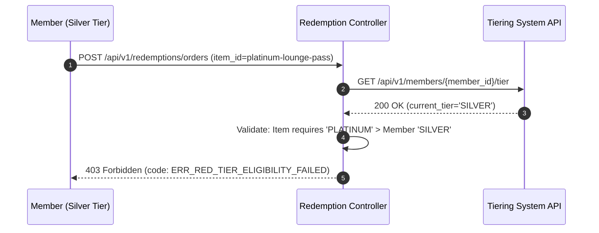

# Detailed Design: Redemption Engine (DD-03)

**Module**: Redemption Engine  
**Version**: 1.0  
**Date**: 2026-08-14  
**Source**: [loyalty_domain.md](file:///d:/learn/loyalty/loyalty_domain.md) | [FR-03](file:///d:/learn/loyalty/requirements/FR-03-redemption-engine.md) | [AS-03](file:///d:/learn/loyalty/analytics/AS-03-redemption-engine.md) | [Quality-Gates-Design.md](file:///d:/learn/loyalty/quality-gates/Quality-Gates-Design.md)

---

## 1. Module Overview & Responsibilities

The **Redemption Engine** manages the reward catalog, validates member balance and tier eligibility, executes atomic FIFO point debits, dispatches orders to fulfillment partners, and manages automated reversals that restore original point earn dates and expiry positions.

### Key Operational Constants
- **Redemption Rate**: **100 points = $1 redemption value**
- **Minimum Redemption**: **100 points per transaction**
- **Cash-Back SLA**: Account credit initiated **≤ 1 business day** of order fulfillment

---

## 2. Component Architecture



---

## 3. FIFO Batch Consumption & Restoration Algorithm

### 3.1 FIFO Debit Allocation
When debiting $P$ points for a member:
1. Lock member balance: `SET lock:member:bal:{member_id} {order_id} NX EX 10`.
2. Query confirmed unexpired batches:
   ```sql
   SELECT transaction_id, remaining_balance, earn_date, expiry_date 
   FROM point_transaction 
   WHERE member_id = :member_id AND status = 'CONFIRMED' AND remaining_balance > 0 
   ORDER BY earn_date ASC 
   FOR UPDATE;
   ```
3. Loop through batches in ascending `earn_date` order until $\sum \text{debit} = P$.
4. Mark batch amounts as `PENDING_DEBIT`.
5. Release distributed lock.

### 3.2 Reversal & FIFO Restoration (FR-03-041)
If fulfillment returns `FAILED`:
- Do **not** create a new earn date.
- Update the original batch entries: `remaining_balance = remaining_balance + debit_amount`.
- Append an audit reversal transaction to the ledger with `type='REVERSAL'` linked to `order_id`.
- The member's original FIFO queue position and expiry schedule are preserved exactly.

---

## 4. Sequence Diagrams

### 4.1 Successful Redemption with FIFO Point Consumption (FLOW-04 / UC-03-02)



### 4.2 Fulfillment Failure & Automatic Reversal (FLOW-05 / UC-03-06)



### 4.3 Tier-Restricted Catalog Check (FLOW-09 / UC-03-02)


