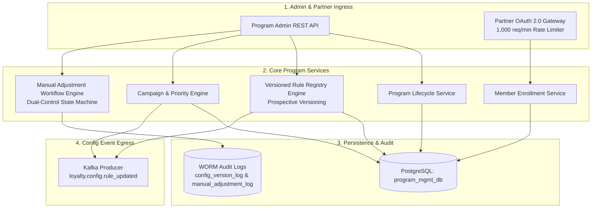
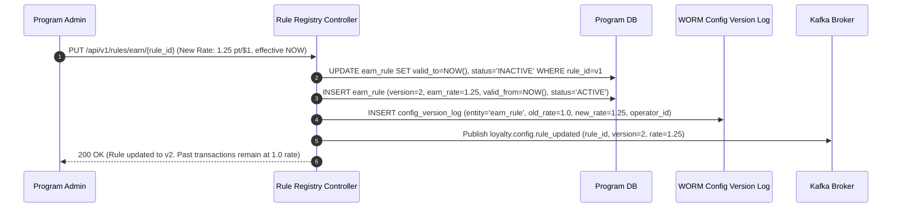
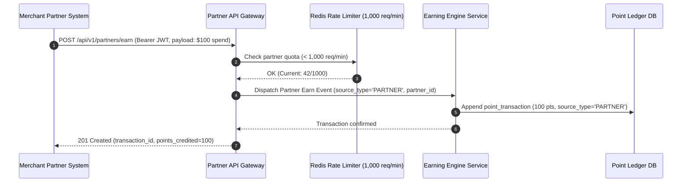
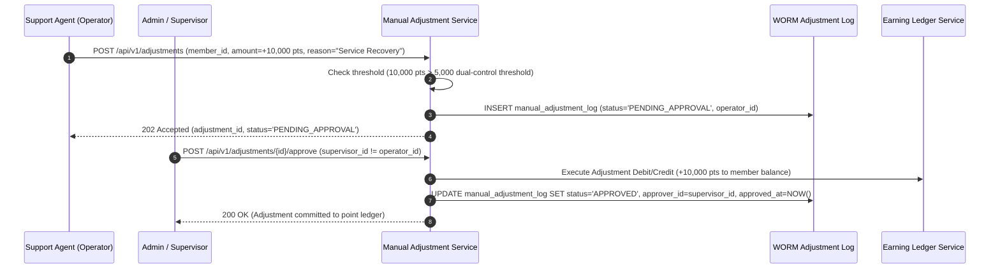

# Detailed Design: Program Management (DD-04)

**Module**: Program Management  
**Version**: 1.0  
**Date**: 2026-08-14  
**Source**: [loyalty_domain.md](file:///d:/learn/loyalty/loyalty_domain.md) | [FR-04](file:///d:/learn/loyalty/requirements/FR-04-program-management.md) | [AS-04](file:///d:/learn/loyalty/analytics/AS-04-program-management.md) | [Quality-Gates-Design.md](file:///d:/learn/loyalty/quality-gates/Quality-Gates-Design.md)

---

## 1. Module Overview & Responsibilities

The **Program Management** module is the central configuration and governance foundation for the Loyalty Banking platform. It administers program lifecycle (**"BankRewards 2025"**), promotional campaigns (**"Double Points August"** — 2× multiplier), rule versioning, partner onboarding & OAuth 2.0 API gateway (1,000 req/min rate limit), member enrollments, and dual-control manual balance adjustments.

---

## 2. Component Architecture

---

## 3. Rule Versioning & Conflict Resolution

### 3.1 Prospective Rule Versioning (FR-04-004, FR-04-005)
When an admin updates an active `EarnRule` or `TierRule`:
1. The existing active rule version has its `valid_to` set to `NOW()`.
2. A new rule row is inserted with `version = previous_version + 1`, `valid_from = NOW()`, and `valid_to = NULL`.
3. A record is appended to `config_version_log` capturing `operator_id`, `previous_value`, `new_value`, and `changed_at`.
4. Historical transactions evaluated under prior timestamps remain 100% unaffected.

### 3.2 Campaign Priority Conflict Resolution (FR-04-012)
When multiple active campaigns match an earn event:
$$\text{WinningCampaign} = \arg\min_{c \in \text{MatchedCampaigns}} (c.\text{priority})$$
- Priority 1 overrides Priority 2, 3, etc.
- If stacking is enabled in program configuration: $\text{TotalBonus} = \sum \text{Bonus}(c_i)$.

---

## 4. Sequence Diagrams

### 4.1 Prospective Rule Change without Retroactive Impact (FLOW-07 / UC-04-04)

### 4.2 Partner Earn Event via OAuth 2.0 Gateway (FLOW-08 / UC-04-06)

### 4.3 High-Value Manual Adjustment with Dual Approval (FLOW-11 / UC-04-07)

