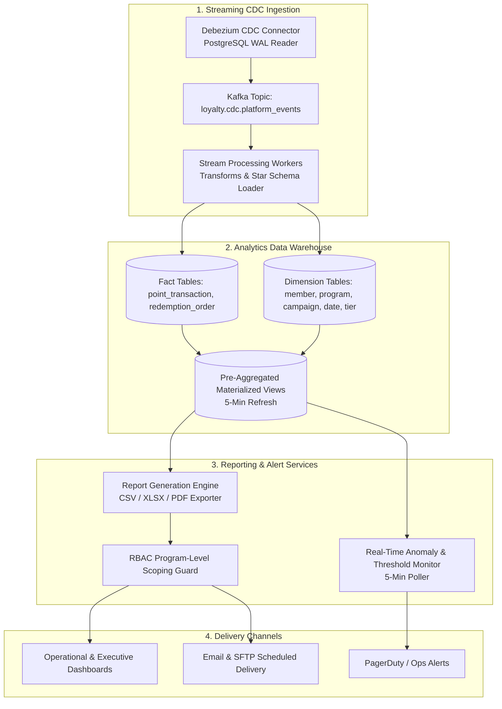
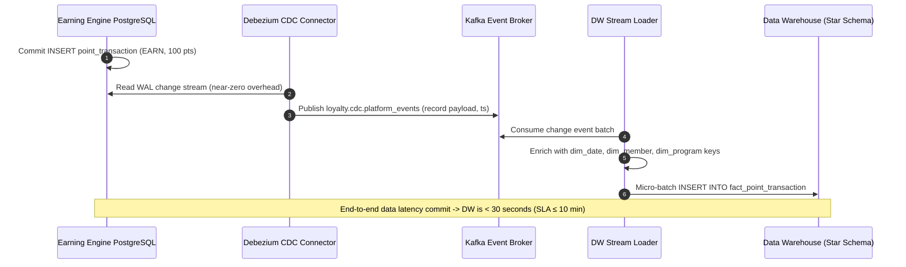
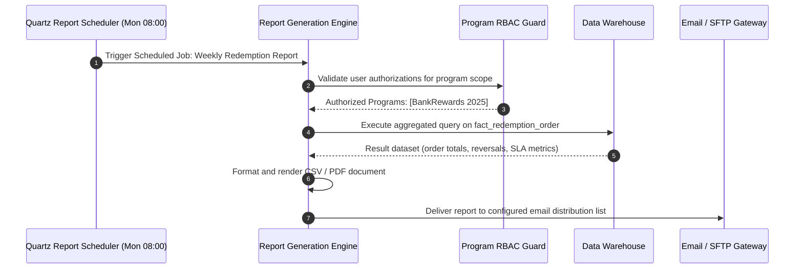
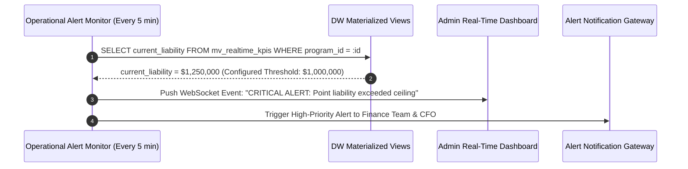

# Detailed Design: Analytics & Reporting (DD-05)

**Module**: Analytics & Reporting  
**Version**: 1.0  
**Date**: 2026-08-14  
**Source**: [loyalty_domain.md](file:///d:/learn/loyalty/loyalty_domain.md) | [FR-05](file:///d:/learn/loyalty/requirements/FR-05-analytics-reporting.md) | [AS-05](file:///d:/learn/loyalty/analytics/AS-05-analytics-reporting.md) | [Quality-Gates-Design.md](file:///d:/learn/loyalty/quality-gates/Quality-Gates-Design.md)

---

## 1. Module Overview & Responsibilities

The **Analytics & Reporting** module delivers cross-platform business intelligence, operational alerting, and regulatory reporting for the Loyalty Banking platform. It computes financial point liability, breakage forecasts, campaign ROI lift, and member engagement metrics while maintaining strict physical workload isolation from the transactional databases.

---

## 2. Component Architecture

---

## 3. Core KPI Mathematical Formulations

### 3.1 Financial Point Liability & Aging Buckets
$$\text{PointLiability} = \sum (\text{confirmed\_unspent\_points}) \times \text{cost\_per\_point}$$
Where default $\text{cost\_per\_point} = \$0.010000$ for BankRewards 2025.

#### Aging Breakdown
- **0–3 Months**: $\sum \text{balance}(\text{earn\_date} \ge \text{TODAY} - 90)$
- **3–6 Months**: $\sum \text{balance}(\text{earn\_date} \in [\text{TODAY}-180, \text{TODAY}-91])$
- **6–12 Months**: $\sum \text{balance}(\text{earn\_date} \in [\text{TODAY}-365, \text{TODAY}-181])$
- **> 12 Months**: $\sum \text{balance}(\text{earn\_date} < \text{TODAY}-365)$

### 3.2 Program Health KPIs
- **Redemption Rate**: $\frac{\text{Total Points Redeemed}}{\text{Total Points Issued}} \times 100$
- **Breakage Rate**: $\frac{\text{Total Points Expired}}{\text{Total Points Issued}} \times 100$
- **Active Member Rate**: $\frac{\text{Count}(\text{Members with } \ge 1 \text{ activity})}{\text{Total Enrolled Members}} \times 100$ (Dormant = $> 90$ days no activity)
- **Campaign Earn Lift**: $\left( \frac{\text{Points Earned During Campaign}}{\text{30-Day Pre-Campaign Baseline}} - 1 \right) \times 100$

---

## 4. Sequence Diagrams

### 4.1 Change Data Capture (CDC) to Data Warehouse (FLOW-10)

### 4.2 Scheduled Report Generation & Delivery (UC-05-09)

### 4.3 Real-Time Operational Dashboard Liability Alert (UC-05-08)

