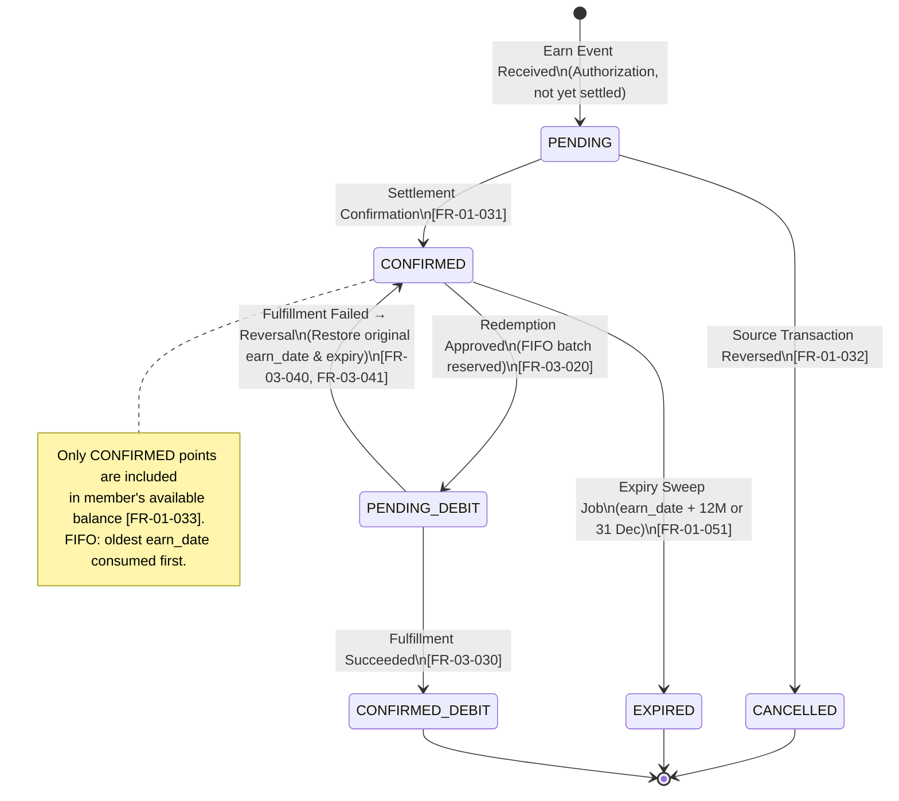
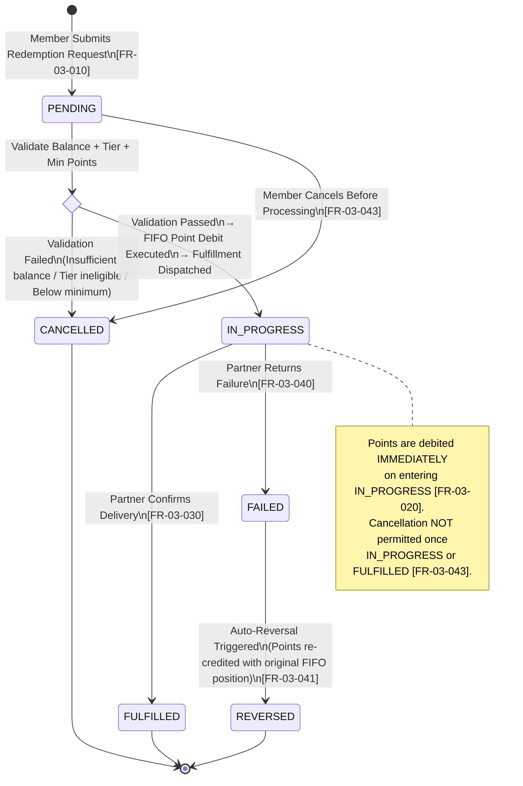
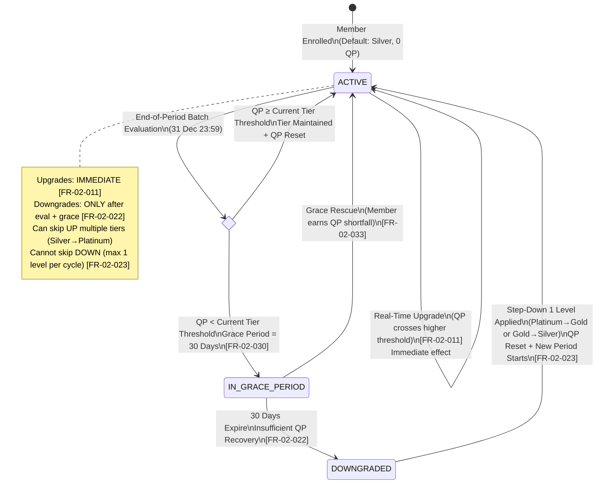
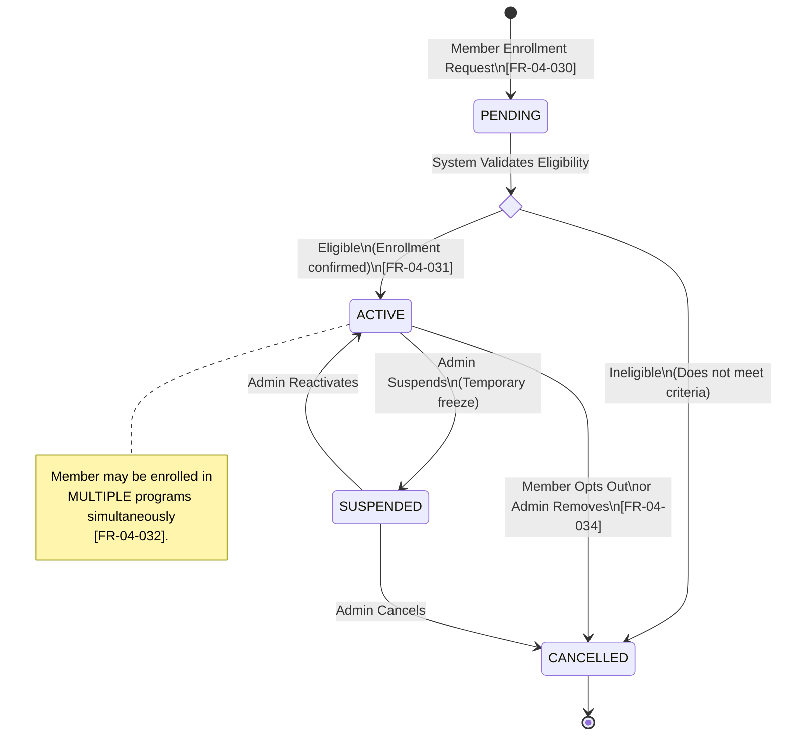
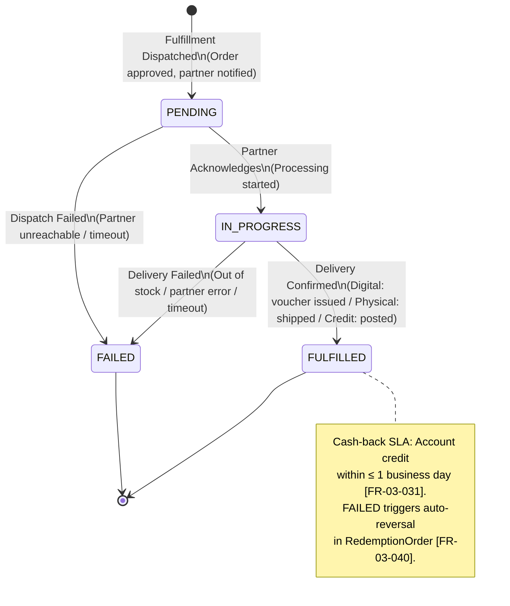
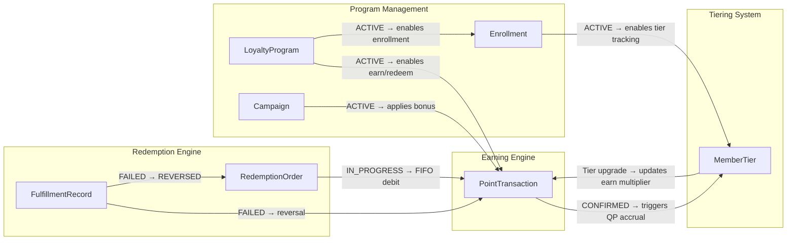

# Loyalty Banking — Entity Lifecycle Models

**Domain**: Loyalty Banking  
**Version**: 1.0  
**Date**: 2026-08-16  
**Source**: [loyalty_domain.md](../loyalty_domain.md) | [Data-Architecture-and-Schema.md](../architecture/Data-Architecture-and-Schema.md) | [FR-01..05](../requirements/) | [Quality-Gates-Design.md](../quality-gates/Quality-Gates-Design.md)

---

## 1. Overview

This document consolidates all **entity lifecycle state machine models** for the Loyalty Banking platform. Each state machine is the authoritative behavioral specification for its entity's `status` column as defined in the physical database schema ([Data-Architecture-and-Schema.md](../architecture/Data-Architecture-and-Schema.md)).

### Model-Driven Traceability

Every state transition maps to:
1. A **Functional Requirement** (FR) that specifies the business rule
2. A **Quality Gate criterion** (G01/G04) that asserts the transition is tested
3. A **DDL status enum** in the physical schema that constrains valid values

---

## 2. PointTransaction Lifecycle

**Bounded Context**: Earning Engine  
**Schema**: `earning_db.point_transaction`  
**Status Values**: `PENDING`, `CONFIRMED`, `CANCELLED`, `PENDING_DEBIT`, `CONFIRMED_DEBIT`  
**Source**: FR-01-030..033, FR-01-051, FR-03-020..024, FR-03-040..044



### Transition Rules

| From | To | Trigger | Business Rule | FR Source | QG Gate |
|---|---|---|---|---|---|
| `[*]` | `PENDING` | Earn event from Core Banking (auth-only) | Points held until settlement | FR-01-030 | G01-01-007 |
| `PENDING` | `CONFIRMED` | Settlement confirmation received | Auto-transition on settlement event | FR-01-031 | G01-01-007, AC-01-005 |
| `PENDING` | `CANCELLED` | Source transaction reversed/declined | Cancel before settlement | FR-01-032 | AC-01-005 |
| `CONFIRMED` | `PENDING_DEBIT` | Redemption order approved | Immediate FIFO debit reservation | FR-03-020 | G01-03-003 |
| `CONFIRMED` | `EXPIRED` | Expiry sweep job fires on `expiry_date` | Auto-debit; balance reduced | FR-01-051 | G01-01-009 |
| `PENDING_DEBIT` | `CONFIRMED_DEBIT` | Fulfillment partner returns SUCCESS | Final debit confirmation | FR-03-030 | FLOW-04 |
| `PENDING_DEBIT` | `CONFIRMED` | Fulfillment partner returns FAILED | Reversal: restore `remaining_balance`, `earn_date`, `expiry_date` | FR-03-040..041 | G01-03-007, FLOW-05 |

---

## 3. RedemptionOrder Lifecycle

**Bounded Context**: Redemption Engine  
**Schema**: `redemption_db.redemption_order`  
**Status Values**: `PENDING`, `IN_PROGRESS`, `FULFILLED`, `FAILED`, `CANCELLED`, `REVERSED`  
**Source**: FR-03-010..044



### Transition Rules

| From | To | Trigger | Business Rule | FR Source | QG Gate |
|---|---|---|---|---|---|
| `[*]` | `PENDING` | Member submits redemption request | Order created; validation begins | FR-03-010 | — |
| `PENDING` | `IN_PROGRESS` | Balance ≥ required; Tier eligible; ≥ 100 pts | FIFO debit + fulfillment dispatch | FR-03-012, FR-03-020 | G01-03-001, G01-03-003 |
| `PENDING` | `CANCELLED` | Validation fails OR member cancels | No points debited | FR-03-013, FR-03-043 | G01-03-005, G01-03-008 |
| `IN_PROGRESS` | `FULFILLED` | Partner callback: delivery confirmed | `FulfillmentRecord.status` = FULFILLED | FR-03-030 | FLOW-04 |
| `IN_PROGRESS` | `FAILED` | Partner callback: delivery failed | Trigger auto-reversal | FR-03-040 | FLOW-05 |
| `FAILED` | `REVERSED` | System auto-reversal completed | Points restored with original earn_date | FR-03-041 | G01-03-007, AC-03-005 |

---

## 4. MemberTier Lifecycle

**Bounded Context**: Tiering System  
**Schema**: `tiering_db.member_tier`  
**Status Values**: `ACTIVE`, `IN_GRACE_PERIOD`, `DOWNGRADED`  
**Source**: FR-02-010..043



### Transition Rules

| From | To | Trigger | Business Rule | FR Source | QG Gate |
|---|---|---|---|---|---|
| `[*]` | `ACTIVE` | Member enrollment | Silver tier assigned; QP=0 | FR-02-001 | G01-02-001 |
| `ACTIVE` | `ACTIVE` | QP crosses upgrade threshold | Immediate upgrade; benefits activated | FR-02-011 | G01-02-002, G01-02-003 |
| `ACTIVE` | `ACTIVE` | End-of-period: QP ≥ threshold | Tier maintained; QP resets | FR-02-020 | G01-02-004 |
| `ACTIVE` | `IN_GRACE_PERIOD` | End-of-period: QP < threshold | 30-day grace starts; benefits retained | FR-02-030 | G01-02-004, AC-02-003 |
| `IN_GRACE_PERIOD` | `ACTIVE` | Member earns required QP during grace | Downgrade cancelled | FR-02-033 | G01-02-007, AC-02-005 |
| `IN_GRACE_PERIOD` | `DOWNGRADED` | 30-day grace expires without rescue | Downgrade 1 level | FR-02-022 | G01-02-005, AC-02-004 |
| `DOWNGRADED` | `ACTIVE` | System applies step-down; new period starts | QP resets; lower tier activated | FR-02-023 | G01-02-005 |

---

## 5. LoyaltyProgram Lifecycle

**Bounded Context**: Program Management  
**Schema**: `program_mgmt_db.loyalty_program`  
**Status Values**: `DRAFT`, `ACTIVE`, `SUSPENDED`, `DEACTIVATED`  
**Source**: FR-04-001..006

```mermaid
stateDiagram-v2
    [*] --> DRAFT: Admin Creates Program\n[FR-04-001]

    state ActivationGate <<choice>>
    DRAFT --> ActivationGate: Admin Activates

    ActivationGate --> ACTIVE: Pre-conditions Met\n(≥ 1 EarnRule + TierRule + Start Date)\n[FR-04-002]
    ActivationGate --> DRAFT: Pre-conditions Failed\n(Missing required rules)

    ACTIVE --> SUSPENDED: Admin Suspends\n(All earn/redeem halted; balances frozen)\n[FR-04-003]
    SUSPENDED --> ACTIVE: Admin Reactivates\n(Operations resume)\n[FR-04-003]
    SUSPENDED --> DEACTIVATED: Admin Deactivates\n(Terminal state; no reactivation)\n[FR-04-006]
    ACTIVE --> DEACTIVATED: Admin Deactivates\n(Graceful wind-down initiated)

    DEACTIVATED --> [*]

    note right of ACTIVE
        All rule changes during ACTIVE are
        VERSIONED prospectively [FR-04-004].
        Existing balances unaffected [FR-04-005].
    end note
```

### Transition Rules

| From | To | Trigger | Business Rule | FR Source | QG Gate |
|---|---|---|---|---|---|
| `[*]` | `DRAFT` | Admin creates program | Initial state; no earn/redeem active | FR-04-001 | AC-04-001 |
| `DRAFT` | `ACTIVE` | Admin activates with valid config | Must have ≥1 EarnRule | FR-04-002 | G01-04-001, AC-04-002 |
| `ACTIVE` | `SUSPENDED` | Admin suspends operations | Earn/redeem halted; balances frozen | FR-04-003 | — |
| `SUSPENDED` | `ACTIVE` | Admin reactivates | Operations resume | FR-04-003 | — |
| `ACTIVE/SUSPENDED` | `DEACTIVATED` | Admin deactivates (terminal) | No further operations; archive begins | FR-04-006 | — |

---

## 6. Campaign Lifecycle

**Bounded Context**: Program Management  
**Schema**: `program_mgmt_db.campaign`  
**Status Values**: `DRAFT`, `ACTIVE`, `PAUSED`, `COMPLETED`, `DEACTIVATED`  
**Source**: FR-04-010..015

```mermaid
stateDiagram-v2
    [*] --> DRAFT: Admin Creates Campaign\n[FR-04-010]

    DRAFT --> ACTIVE: Admin Activates\n(Within program active period)\n[FR-04-013]

    ACTIVE --> PAUSED: Admin Pauses\n(Temporarily stops bonus application)
    PAUSED --> ACTIVE: Admin Resumes

    ACTIVE --> COMPLETED: end_date Reached\n(Auto-transition; budget may also trigger)\n[FR-04-014]
    ACTIVE --> DEACTIVATED: Admin Force-Stops

    PAUSED --> DEACTIVATED: Admin Deactivates

    COMPLETED --> [*]
    DEACTIVATED --> [*]

    note right of ACTIVE
        Priority conflict resolution [FR-04-012]:
        Lowest priority number wins.
        "Double Points August" = priority 1.
    end note
```

---

## 7. Enrollment Lifecycle

**Bounded Context**: Program Management  
**Schema**: `program_mgmt_db.enrollment`  
**Status Values**: `PENDING`, `ACTIVE`, `SUSPENDED`, `CANCELLED`  
**Source**: FR-04-030..034



---

## 8. FulfillmentRecord Lifecycle

**Bounded Context**: Redemption Engine  
**Schema**: `redemption_db.fulfillment_record`  
**Status Values**: `PENDING`, `IN_PROGRESS`, `FULFILLED`, `FAILED`  
**Source**: FR-03-030..034



---

## 9. Cross-Entity Lifecycle Interaction Map

The following diagram shows how lifecycle transitions in one entity trigger transitions in related entities across bounded contexts:



---

*Source: [loyalty_domain.md](../loyalty_domain.md) · [Data-Architecture-and-Schema.md](../architecture/Data-Architecture-and-Schema.md) · FR-01..05 · Quality-Gates-Design.md*
