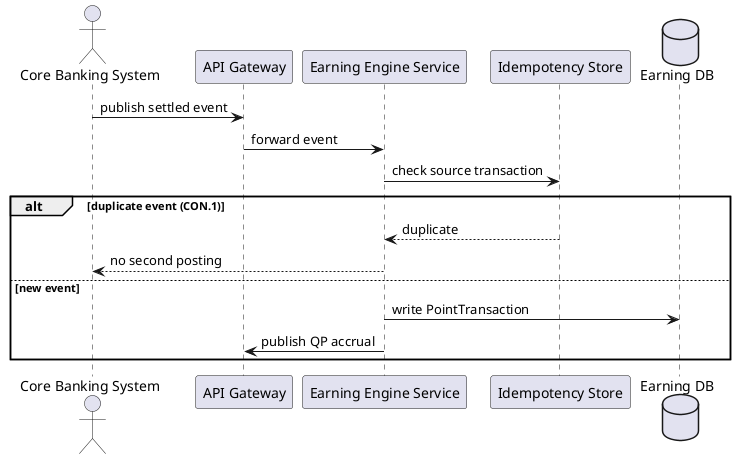
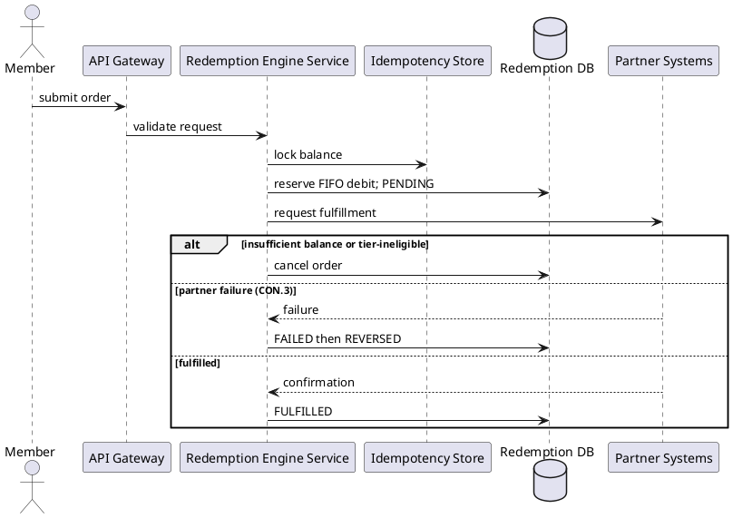
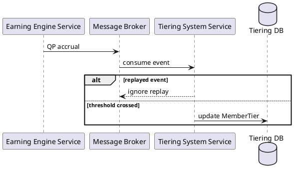
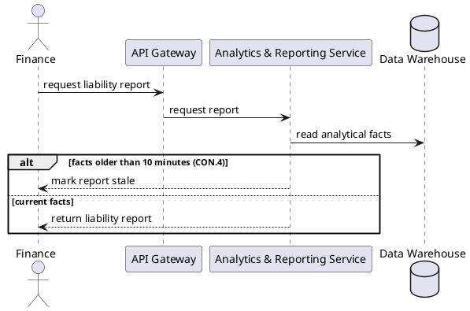
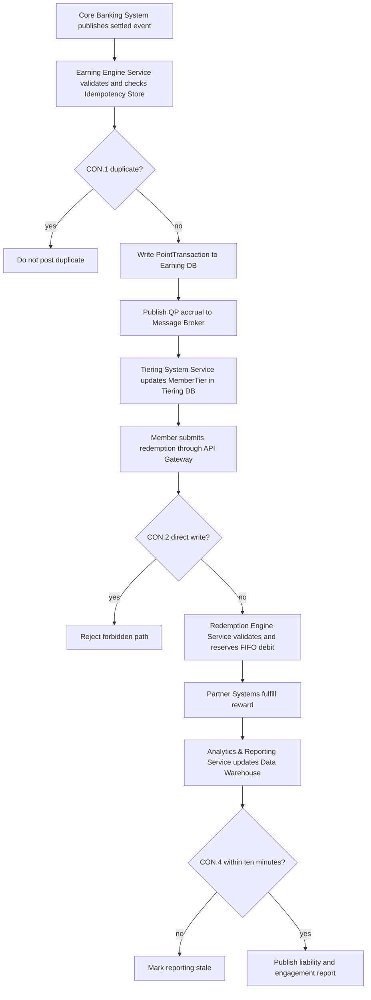
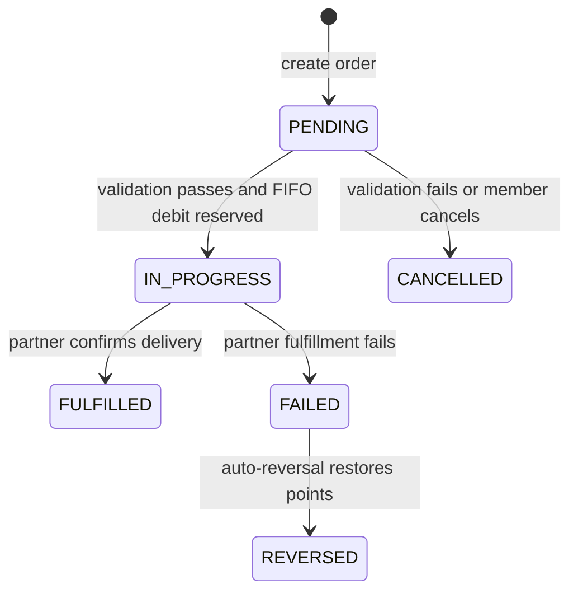

# Lab 5 — UML Before Pack

**Status:** Done | **Phase:** Messy current style | **R:** Dev / Test | **A:** SA / BA

No Guide header, RACI template, or implementation evidence is applied.

## UC-LB-01 Process settled earn event

## UC-LB-02 Redeem reward with FIFO

## UC-LB-03 Apply tier upgrade

## UC-LB-04 Generate point liability report

## Activity: I-5 Happy Path

## State Machine: `RedemptionOrder`

## G6 Planning Checklist

| Planned check | Coverage |
|---|---|
| T-01 | PENDING -> IN_PROGRESS |
| T-02 | PENDING -> CANCELLED |
| T-03 | IN_PROGRESS -> FULFILLED |
| T-04 | IN_PROGRESS -> FAILED |
| T-05 | FAILED -> REVERSED |
| ALT-01 | UC-LB-01 duplicate event |
| ALT-02 | UC-LB-02 insufficient balance or tier-ineligible |
| ALT-03 | UC-LB-02 partner failure and compensation |
| ALT-04 | UC-LB-03 replayed event |
| ALT-05 | UC-LB-04 stale warehouse data |

These are planned modeling checks only; no tests were executed.
