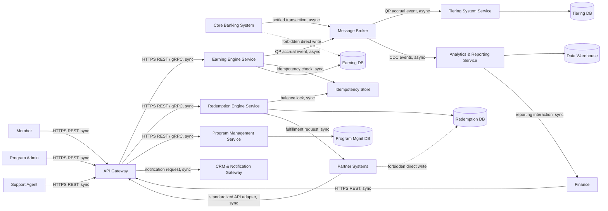

# Lab 6 — Ecosystem Sketch (Before)

**Status:** Done | **Phase:** Messy current style | **R:** SA | **A:** EA | **C:** Sec, Ops

The sketch uses only I-4 containers and I-3 external systems. Product names, if later added, remain labels inside these containers.

## Negative Evidence

This is a simulation-only ecosystem model. No Docker, cluster, IAM realm, broker administration, runtime, deployment, or executable test was performed. `API Gateway` already owns authentication, so no separate IAM system is added. No new system is introduced for an adapter; it is represented by the I-8 legacy/adapter mechanism through `API Gateway`.
