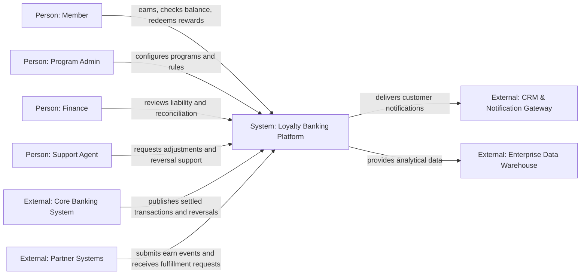
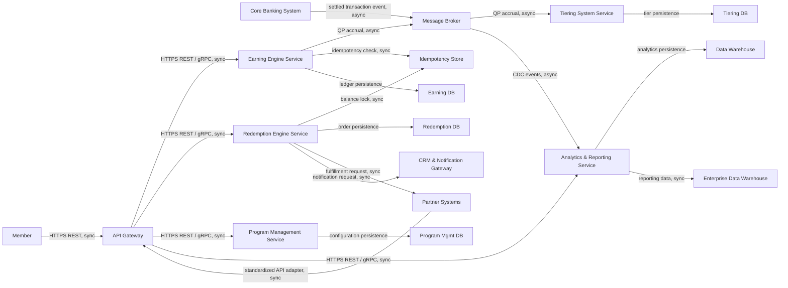
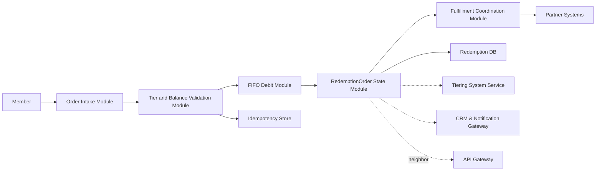

# Lab 9 — C4 After Views

**System-in-focus:** Loyalty Banking Platform | **Language:** C4 | **As-Is / To-Be / Transition:** To-Be | **Owner:** Casey Wong | **Version:** 1.0 | **Date:** 2026-08-21 | **Status:** Review

Legend: Person = actor, System = system-in-focus, System_Ext = I-3 external, Container = exact I-4 container, Component = module inside selected container. Relationship labels describe business interaction; protocol and sync/async labels appear only on Container/Component views.

## C4 Context (L1)

**R:** Sam Lee (SA) | **A:** Casey Wong (Owner) | **C:** Alex Morgan (EA), Priya Shah (BA) | **I:** Jordan Kim (Dev), Taylor Reed (Test)

No containers, databases, buses, protocols, pods, or components appear on Context.

## C4 Container (L2)

**R:** Sam Lee (SA) | **A:** Alex Morgan (EA) | **C:** Jordan Kim (Dev), Casey Wong (Owner) | **I:** Priya Shah (BA), Taylor Reed (Test)

Every container is an exact I-4 string. No unnamed external or direct channel/database path is shown.

## Optional C4 Component (L3) — `Redemption Engine Service`

**R:** Jordan Kim (Dev) | **A:** Sam Lee (SA) | **C:** Taylor Reed (Test), Priya Shah (BA) | **I:** Casey Wong (Owner)

Only `Redemption Engine Service` is exploded. Neighbor containers are black boxes; no second component view exists.
