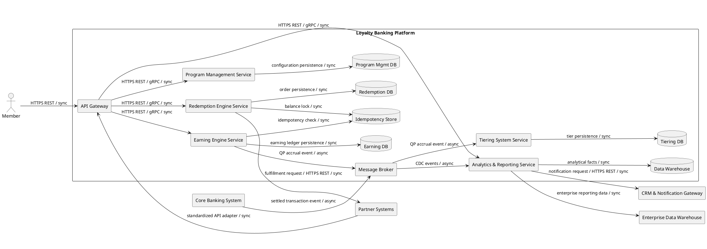
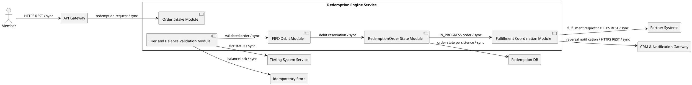

# Lab 9 — C4 Context, Container, and Component

Title:      Loyalty Banking Platform — C4 Context, Container, and Component
Viewpoint:  C4
Layer(s):   Context L1 / Container L2 / Component L3
As-Is | To-Be | Transition:  To-Be
Owner:      Role SA          Name Vũ Trường Quang
RACI:       Context R SA A Owner C EA BA/PO I DA Dev Test Ops; Container R SA A EA C DA Sec Dev Ops I BA/PO Test Owner; Component R Dev A SA C DA Sec Test I BA/PO Ops Owner
Version:    v1.0  Date 2026-08-21  Status Review
Legend:     Person, System, System_Ext, Container, Component; relationship labels describe business interaction at L1 and protocol plus sync/async at L2/L3
RACI legend: R = draws · A = approves · C = consulted · I = informed
Scope:      in-scope one Context, one Container, and one optional Component inside `Redemption Engine Service` / out-of-scope duplicate contexts, unnamed externals, protocol on Context, internals on Context, additional exploded containers

The RACI lines above are separate per artifact. They follow the adopted Lab 7 table: Context is drawn by SA Vũ Trường Quang and approved by Owner Facilitator; Container is drawn by SA Vũ Trường Quang and approved by EA Khuất Duy Bách; Component is drawn by Dev Lê Huy Du and approved by SA Vũ Trường Quang. R and A are different people for every artifact.

## C4 Context — Level 1

**Artifact RACI:** R SA — Vũ Trường Quang | A Owner — Facilitator | C EA — Khuất Duy Bách, BA/PO — Đặng Duy Hoàng | I DA/Sec — Khuất Duy Bách, Dev/Test — Lê Huy Du, Ops — Đặng Duy Hoàng

This view contains people, the system-in-focus, and only the four I-3 external systems. Relationship descriptions state business interactions; they do not show protocol, sync/async, containers, databases, buses, pods, or components.

```plantuml
@startuml
left to right direction
rectangle "People" {
  actor "Member" as Member
  actor "Program Admin" as Admin
  actor "Finance" as Finance
  actor "Support Agent" as Support
}
rectangle "Loyalty Banking Platform" as Platform
rectangle "External Systems" {
  rectangle "Core Banking System" as Core
  rectangle "Partner Systems" as Partners
  rectangle "CRM & Notification Gateway" as CRM
  rectangle "Enterprise Data Warehouse" as EDW
}
Member --> Platform : earns points, checks balance,
redeems rewards
Admin --> Platform : configures programs,
campaigns, and rules
Finance --> Platform : reviews liability, breakage,
and reconciliation
Support --> Platform : initiates adjustments and
reversal support
Core --> Platform : publishes settled transaction
events, authorizations, and reversals
Partners --> Platform : submits earn events and receives
fulfillment requests
Platform --> CRM : delivers customer notifications
Platform --> EDW : provides enterprise analytical data
@enduml
```

### Context checks

- Exactly one system-in-focus exists: `Loyalty Banking Platform`.
- All four I-2 actors appear: `Member`, `Program Admin`, `Finance`, `Support Agent`.
- All four I-3 externals appear: `Core Banking System`, `Partner Systems`, `CRM & Notification Gateway`, `Enterprise Data Warehouse`.
- No I-4 container, database, event bus, protocol, or component appears.

## C4 Container — Level 2

**Artifact RACI:** R SA — Vũ Trường Quang | A EA — Khuất Duy Bách | C DA/Sec — Khuất Duy Bách, Dev/Ops — Lê Huy Du / Đặng Duy Hoàng | I BA/PO — Đặng Duy Hoàng, Test — Lê Huy Du, Owner — Facilitator

This view contains all exact I-4 containers and the I-3 externals needed to explain their relationships. Every edge is labeled with the I-8 mechanism and sync/async classification. Product names are not added as systems.



### Container identity and G3 checks

| Required check | Result |
|---|---|
| 13 exact I-4 containers from Lab 1 / Lab 8 Application Cooperation | Pass |
| Four I-3 externals named | Pass |
| Every relationship has sync or async classification | Pass; persistence edges are synchronous service-owned writes |
| No direct external/channel write to service-owned database | Pass; all external access enters through API Gateway or Message Broker |
| No second system, unnamed external, or duplicate Context | Pass |

## Optional C4 Component — Level 3

**Selected container:** `Redemption Engine Service`, exactly as selected in Lab 1 I-11 and carried from Lab 8 Application Cooperation.

**Artifact RACI:** R Dev — Lê Huy Du | A SA — Vũ Trường Quang | C DA/Sec — Khuất Duy Bách, Test — Lê Huy Du | I BA/PO/Ops — Đặng Duy Hoàng, Owner — Facilitator

Only this one container is exploded. Neighboring I-4 containers are black boxes. Module names are internal design names, not new systems or containers.



### Component boundary checks

- Only `Redemption Engine Service` is decomposed.
- `API Gateway`, `Tiering System Service`, `Partner Systems`, `CRM & Notification Gateway`, `Idempotency Store`, and `Redemption DB` are black-box neighbors.
- No component appears on the Context view, and no second Component view exists.
