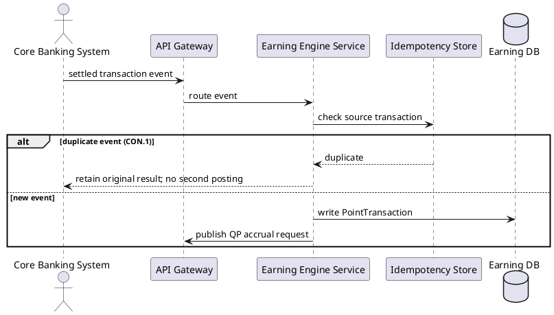
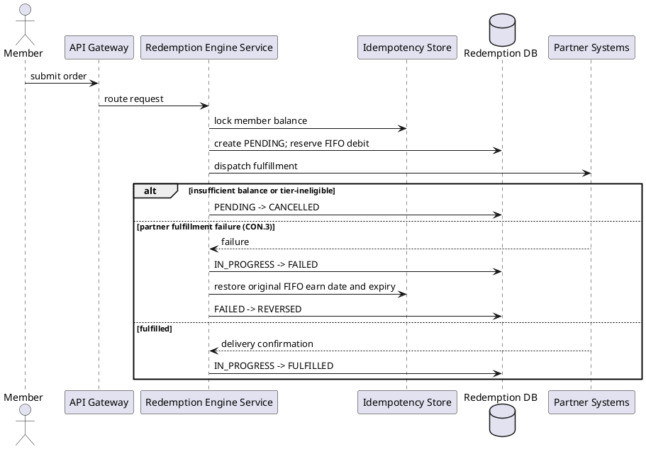
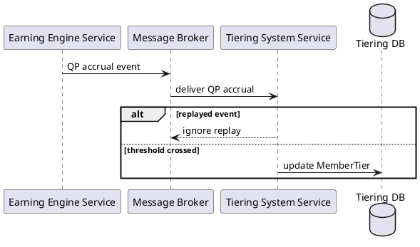
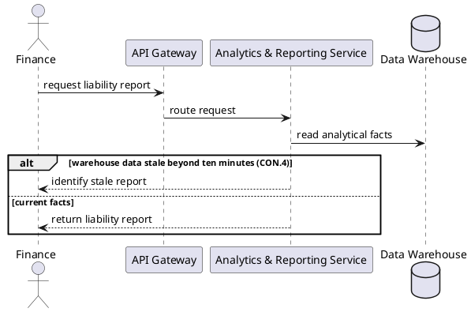
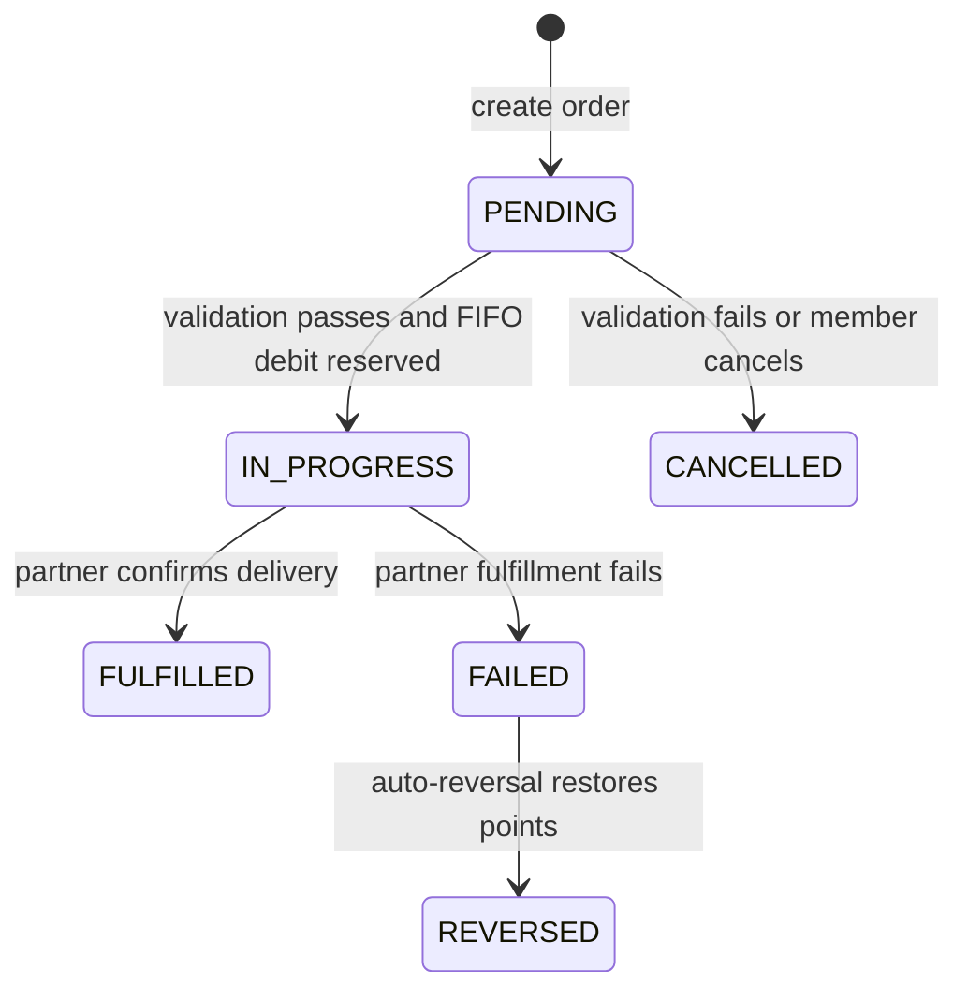

# Lab 10 — Audited UML After Pack

**Language:** UML | **As-Is / To-Be / Transition:** To-Be | **Owner:** Casey Wong | **Version:** 1.0 | **Date:** 2026-08-21 | **Status:** Review

Legend: actor lifelines are I-2 names; container lifelines are exact I-4/Lab 9 names; modules are allowed only inside `Redemption Engine Service`. `alt` marks exception behavior. **R:** Jordan Kim (Dev) | **A:** Sam Lee (SA) | **C:** Taylor Reed (Test), Priya Shah (BA) | **I:** Casey Wong (Owner)

## Participant-to-SUT Map

| Lifeline | Exact SUT / participant mapping |
|---|---|
| Member | Actor `Member`; SUT `API Gateway` for request entry |
| Core Banking System | External participant `Core Banking System`; SUT `Earning Engine Service` |
| Program Admin | Actor `Program Admin`; SUT `Program Management Service` |
| Finance | Actor `Finance`; SUT `Analytics & Reporting Service` |
| API Gateway | `API Gateway` |
| Message Broker | `Message Broker` |
| Earning Engine Service | `Earning Engine Service` |
| Tiering System Service | `Tiering System Service` |
| Redemption Engine Service | `Redemption Engine Service` |
| Idempotency Store | `Idempotency Store` |
| Earning DB | `Earning DB` |
| Tiering DB | `Tiering DB` |
| Redemption DB | `Redemption DB` |
| Data Warehouse | `Data Warehouse` |
| Partner Systems | External participant `Partner Systems` |
| CRM & Notification Gateway | External participant `CRM & Notification Gateway` |

## UC-LB-01 Process settled earn event

## UC-LB-02 Redeem reward with FIFO

## UC-LB-03 Apply tier upgrade

## UC-LB-04 Generate point liability report

## State Machine: `RedemptionOrder`

## G6 Coverage Note

| Coverage ID | Planned test mapping |
|---|---|
| G6-T01 | PENDING -> IN_PROGRESS |
| G6-T02 | PENDING -> CANCELLED |
| G6-T03 | IN_PROGRESS -> FULFILLED |
| G6-T04 | IN_PROGRESS -> FAILED |
| G6-T05 | FAILED -> REVERSED |
| G6-A01 | UC-LB-01 duplicate event under CON.1 |
| G6-A02 | UC-LB-02 insufficient balance or tier-ineligible |
| G6-A03 | UC-LB-02 partner fulfillment failure under CON.3 |
| G6-A04 | UC-LB-03 replayed event |
| G6-A05 | UC-LB-04 stale warehouse beyond ten minutes under CON.4 |

## Comparison with Lab 5

The audited pack retains the same four I-11 use cases and behavior. It replaces any ambiguous lifeline with exact I-2/I-3/I-4 names, keeps modules only within the selected `Redemption Engine Service`, uses one English UML vocabulary, and adds the after header, legend, and artifact-level RACI. The immutable Lab 5 source remains under `archive-before/`.
