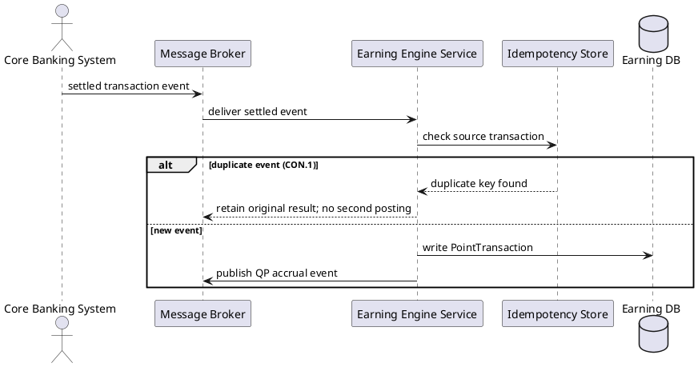
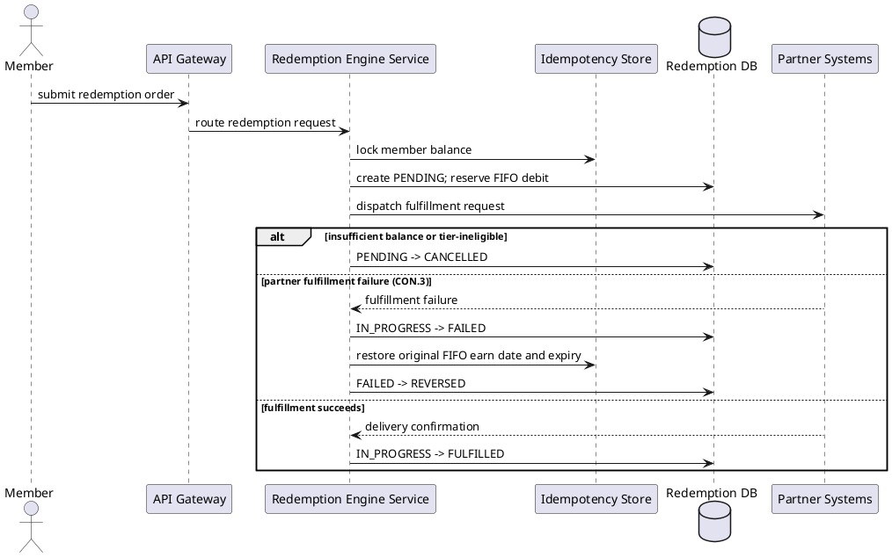
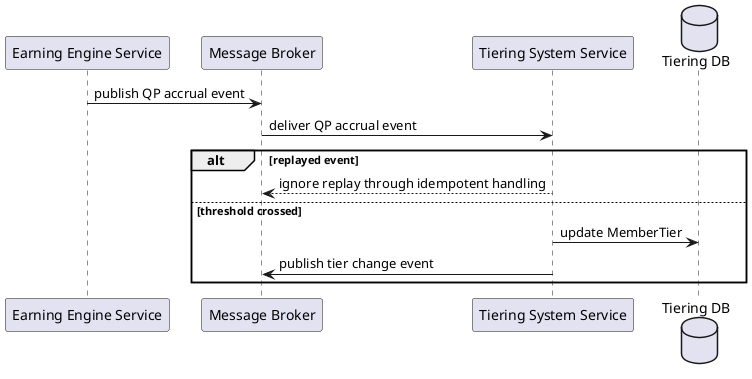
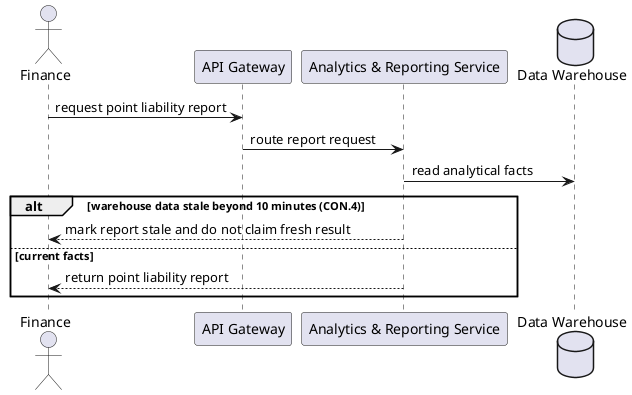
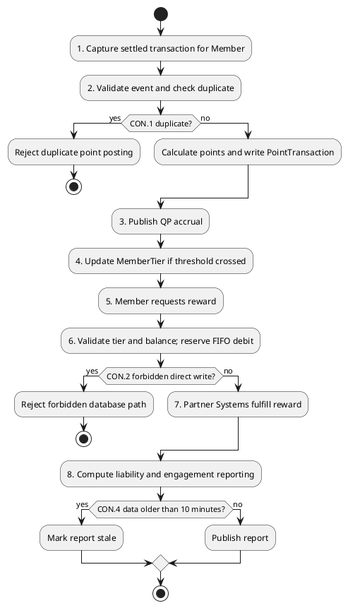
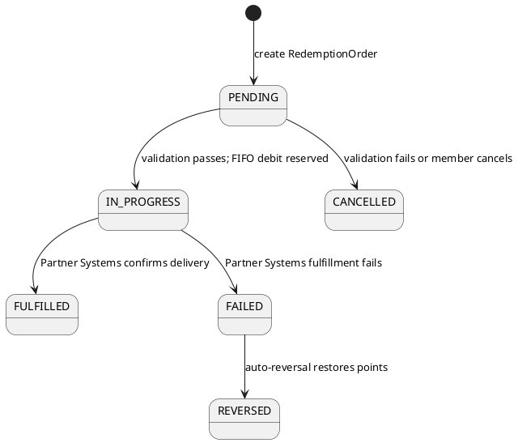

# Lab 10 — UML Low-Level Design for Named Use Cases

Title:      Loyalty Banking Platform — UML Named Use Cases and State Audit
Viewpoint:  UML Sequence / Activity / State
Layer(s):   Base — delivery behavior
As-Is | To-Be | Transition:  To-Be
Owner:      Role Dev         Name Lê Huy Du
RACI:       R Dev   A SA   C BA/PO Test   I EA DA Sec Ops Owner
Version:    v1.0  Date 2026-08-21  Status Review
Legend:     actor lifeline, exact Lab 9 Container participant, module inside `Redemption Engine Service`, `alt` exception branch, state transition
RACI legend: R = draws · A = approves · C = consulted · I = informed
Scope:      in-scope the four exact I-11 named use cases, one `RedemptionOrder` state machine, participant-to-SUT mapping, and planned G6 coverage / out-of-scope source code, runtime tests, unnamed lifelines, extra use cases, and components outside the selected container

The RACI follows the Lab 7 adopted table. UML Sequence is drawn by Dev Lê Huy Du and approved by SA Vũ Trường Quang. UML Activity / State is drawn by Test Lê Huy Du and approved by BA/PO Đặng Duy Hoàng. R and A are different people on each artifact even though Dev and Test are the same roster member.

## Participant-to-SUT Map

| Lifeline or actor | Exact mapping and SUT |
|---|---|
| Member | I-2 actor; request enters `API Gateway` |
| Program Admin | I-2 actor; configuration request enters `API Gateway` |
| Finance | I-2 actor; reporting request enters `API Gateway` |
| Core Banking System | I-3 external; event is handled by `Earning Engine Service` through `Message Broker` |
| Partner Systems | I-3 external; fulfillment neighbor of `Redemption Engine Service` |
| CRM & Notification Gateway | I-3 external; notification neighbor |
| API Gateway | Exact I-4 participant and request entry SUT |
| Message Broker | Exact I-4 participant and event transport SUT |
| Earning Engine Service | Exact I-4 SUT for UC-LB-01 |
| Tiering System Service | Exact I-4 SUT for UC-LB-03 |
| Redemption Engine Service | Exact I-4 SUT for UC-LB-02 and selected Component container |
| Analytics & Reporting Service | Exact I-4 SUT for UC-LB-04 |
| Idempotency Store | Exact I-4 neighbor used for duplicate check and balance lock |
| Earning DB | Exact I-4 persistence participant |
| Tiering DB | Exact I-4 persistence participant |
| Redemption DB | Exact I-4 persistence participant |
| Data Warehouse | Exact I-4 persistence participant |

## UML Sequence — UC-LB-01 Process settled earn event

**Artifact RACI:** R Dev — Lê Huy Du | A SA — Vũ Trường Quang | C BA/PO — Đặng Duy Hoàng, Test — Lê Huy Du | I EA/DA/Sec — Khuất Duy Bách, Ops — Đặng Duy Hoàng, Owner — Facilitator

## UML Sequence — UC-LB-02 Redeem reward with FIFO

**Artifact RACI:** same UML Sequence row: R Dev — Lê Huy Du | A SA — Vũ Trường Quang | C BA/PO — Đặng Duy Hoàng, Test — Lê Huy Du | I EA/DA/Sec — Khuất Duy Bách, Ops — Đặng Duy Hoàng, Owner — Facilitator

## UML Sequence — UC-LB-03 Apply tier upgrade

**Artifact RACI:** same UML Sequence row: R Dev — Lê Huy Du | A SA — Vũ Trường Quang | C BA/PO — Đặng Duy Hoàng, Test — Lê Huy Du | I EA/DA/Sec — Khuất Duy Bách, Ops — Đặng Duy Hoàng, Owner — Facilitator

## UML Sequence — UC-LB-04 Generate point liability report

**Artifact RACI:** same UML Sequence row: R Dev — Lê Huy Du | A SA — Vũ Trường Quang | C BA/PO — Đặng Duy Hoàng, Test — Lê Huy Du | I EA/DA/Sec — Khuất Duy Bách, Ops — Đặng Duy Hoàng, Owner — Facilitator

## UML Activity — I-5 Happy Path

**Artifact RACI:** R Test — Lê Huy Du | A BA/PO — Đặng Duy Hoàng | C SA — Vũ Trường Quang, Sec — Khuất Duy Bách | I EA/DA/Dev/Ops — Khuất Duy Bách / Lê Huy Du / Đặng Duy Hoàng, Owner — Facilitator

The activity follows I-5 exactly and uses business activities rather than C4 containers as activity boxes.

## UML State Machine — `RedemptionOrder`

**Artifact RACI:** same UML Activity / State row: R Test — Lê Huy Du | A BA/PO — Đặng Duy Hoàng | C SA — Vũ Trường Quang, Sec — Khuất Duy Bách | I EA/DA/Dev/Ops — Khuất Duy Bách / Lê Huy Du / Đặng Duy Hoàng, Owner — Facilitator

Exactly one object is modeled. The states are exactly the six I-6 values; terminal states are `CANCELLED`, `FULFILLED`, and `REVERSED`.

## G6 Coverage Note

| Coverage ID | Planned test mapping | Evidence source |
|---|---|---|
| G6-T01 | `PENDING -> IN_PROGRESS` | I-6 / State Machine |
| G6-T02 | `PENDING -> CANCELLED` | I-6 / State Machine |
| G6-T03 | `IN_PROGRESS -> FULFILLED` | I-6 / State Machine |
| G6-T04 | `IN_PROGRESS -> FAILED` | I-6 / State Machine |
| G6-T05 | `FAILED -> REVERSED` | I-6 / State Machine |
| G6-A01 | UC-LB-01 duplicate event under CON.1 | Sequence UC-LB-01 |
| G6-A02 | UC-LB-02 insufficient balance or tier-ineligible | Sequence UC-LB-02 |
| G6-A03 | UC-LB-02 partner fulfillment failure and CON.3 compensation | Sequence UC-LB-02 |
| G6-A04 | UC-LB-03 replayed event | Sequence UC-LB-03 |
| G6-A05 | UC-LB-04 warehouse data stale beyond ten minutes under CON.4 | Sequence UC-LB-04 |

No tests were executed. G6 evidence is a planned modeling checklist only.

## Comparison with Lab 5 Before Pack

The same four exact I-11 use cases are retained. Lab 5 was the messy current-style source; this after pack standardizes it against Lab 8 Application Cooperation and Lab 9 C4 Container. Ambiguous or noncanonical lifelines are removed, all container participants now resolve to exact I-4 strings, modules appear only inside the selected `Redemption Engine Service`, and the Guide header, legend, and artifact-level RACI are added. The Lab 5 archive remains unchanged under `modeling-pack/archive-before/`.

## Lab 10 Done-when Check

| Requirement | Status |
|---|---|
| One audited sequence for every I-11 use case | Yes — UC-LB-01 through UC-LB-04 |
| Participants match Lab 9 Container names | Yes — participant-to-SUT map |
| One state machine for one I-6 object | Yes — `RedemptionOrder` only |
| All I-6 transitions covered | Yes — G6-T01 through G6-T05 |
| Every sequence `alt` covered | Yes — G6-A01 through G6-A05 |
| Header, legend, and RACI present | Yes — Guide template filled |
| Before archive unchanged | Yes — archive remains frozen |
