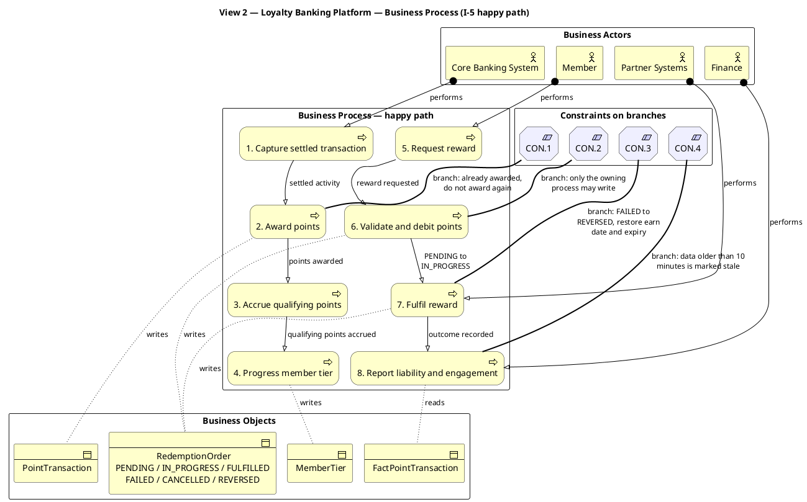
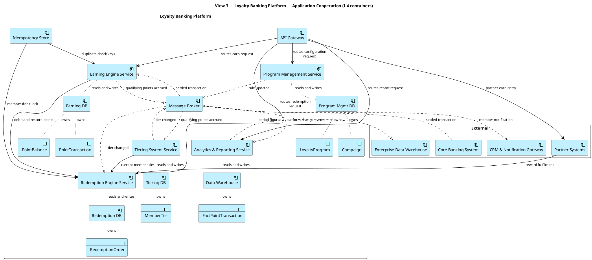

# Lab 8 — ArchiMate views (named set of four)

**System-in-focus:** Loyalty Banking Platform
**After pack.** Drawn to the Guide adopted in `lab7-adoption.md`.
**Language:** ArchiMate only. One viewpoint per canvas. No C4 notation, no UML messages.

This sitting produces **exactly four views**. It is not a full ArchiMate layer set: there is no Implementation & Migration view and no separate Strategy canvas, because the Guide asks for a named set of four and view 1 is "Motivation **or** Strategy".

Every box string comes from the Lab 1 index in `loyalty.md`. Nothing is renamed, shortened, or invented.

| # | View | Viewpoint | Carries |
|---:|---|---|---|
| 1 | Motivation | ArchiMate — Motivation | **G1** |
| 2 | Business Process | ArchiMate — Business | **G2** |
| 3 | Application Cooperation | ArchiMate — Application | Name identity for Lab 9 |
| 4 | Technology / Deployment | ArchiMate — Technology | I-9 locations, forbidden path |

---

## View 1 — Motivation

```
Title:      Loyalty Banking Platform — Motivation
Viewpoint:  ArchiMate
Layer(s):   Motivation
As-Is | To-Be | Transition:  To-Be
Owner:      Role EA          Name Khuất Duy Bách
RACI:       R EA   A Owner   C SA BA/PO Sec   I DA Dev Test Ops
Version:    v1.0  Date 2026-08-21  Status Draft
Legend:     Influence, Realization, Association
RACI legend: R = draws · A = approves · C = consulted · I = informed
Scope:      in-scope Lab 1 I-1 goal and outcome, I-10 constraints / out-of-scope protocols, nodes, container internals
```

**Legend — relationships used on this canvas**

| Relationship | Meaning here |
|---|---|
| Influence | A stakeholder shapes a driver; a driver motivates a goal |
| Realization | An outcome realizes the goal |
| Association | A constraint restricts the goal or an outcome |

```plantuml
@startuml
!pragma layout smetana
!include <archimate/Archimate>

title View 1 — Loyalty Banking Platform — Motivation

rectangle "Motivation" as MOT {
    Motivation_Stakeholder(Member, "Member")
    Motivation_Stakeholder(ProgramAdmin, "Program Admin")
    Motivation_Stakeholder(Finance, "Finance")
    Motivation_Stakeholder(SupportAgent, "Support Agent")

    Motivation_Driver(UnprovableBalances, "Unprovable member balances")
    Motivation_Driver(ManualReconciliation, "Manual reconciliation effort")
    Motivation_Driver(SlowRewardFeedback, "Slow reward feedback to members")

    Motivation_Goal(PlatformGoal, "Goal\nProvide a governed loyalty platform for earning points,\ntier progression, redemption, program configuration,\nand financial reporting")

    Motivation_Outcome(OutEarn60s, "Outcome\nSettled earn events processed within 60 seconds")
    Motivation_Outcome(OutNoDuplicate, "Outcome\nNo duplicate point postings")
    Motivation_Outcome(OutFifo, "Outcome\nFIFO redemption supported")
    Motivation_Outcome(OutFresh, "Outcome\nAnalytics data no more than 10 minutes stale")

    Motivation_Constraint(CON1, "CON.1\nNo duplicate point posting for the\nsame source transaction")
    Motivation_Constraint(CON2, "CON.2\nNo direct database writes from channels,\npartners, or other services into\nservice-owned databases")
    Motivation_Constraint(CON3, "CON.3\nFulfillment failure must compensate by\nrestoring points with original FIFO\nearn date and expiry")
    Motivation_Constraint(CON4, "CON.4\nAnalytics reporting data must not\nexceed 10 minutes staleness")
}

Rel_Influence(Member, SlowRewardFeedback, "experiences")
Rel_Influence(Member, UnprovableBalances, "experiences")
Rel_Influence(Finance, UnprovableBalances, "raises")
Rel_Influence(Finance, ManualReconciliation, "raises")
Rel_Influence(SupportAgent, ManualReconciliation, "raises")
Rel_Influence(ProgramAdmin, SlowRewardFeedback, "raises")

Rel_Influence(UnprovableBalances, PlatformGoal, "motivates")
Rel_Influence(ManualReconciliation, PlatformGoal, "motivates")
Rel_Influence(SlowRewardFeedback, PlatformGoal, "motivates")

Rel_Realization(OutEarn60s, PlatformGoal, "realizes")
Rel_Realization(OutNoDuplicate, PlatformGoal, "realizes")
Rel_Realization(OutFifo, PlatformGoal, "realizes")
Rel_Realization(OutFresh, PlatformGoal, "realizes")

Rel_Association(CON1, OutNoDuplicate, "restricts")
Rel_Association(CON2, PlatformGoal, "restricts")
Rel_Association(CON3, OutFifo, "restricts")
Rel_Association(CON4, OutFresh, "restricts")

@enduml
```



### G1 check

| G1 requires | On this view |
|---|---|
| I-1 Goal listed | `PlatformGoal`, worded exactly as I-1 |
| I-1 measurable Outcome listed | Four outcome elements: 60 seconds, no duplicates, FIFO, 10 minutes |
| CON.1 listed | `CON.1` restricting the no-duplicate outcome |
| CON.2 listed | `CON.2` restricting the goal |
| CON.3 listed | `CON.3` restricting the FIFO outcome |
| CON.4 listed | `CON.4` restricting the freshness outcome |

**Must not show — negative evidence:** no protocol appears; no node, pod, or cluster appears; no database or container appears; no internals of any container appear. The only element types on this canvas are Stakeholder, Driver, Goal, Outcome, and Constraint.

---

## View 2 — Business Process

```
Title:      Loyalty Banking Platform — Business Process
Viewpoint:  ArchiMate
Layer(s):   Business
As-Is | To-Be | Transition:  To-Be
Owner:      Role BA/PO       Name Đặng Duy Hoàng
RACI:       R BA/PO   A Owner   C EA SA Sec Test   I DA Dev Ops
Version:    v1.0  Date 2026-08-21  Status Draft
Legend:     Triggering, Assignment, Access, Association
RACI legend: R = draws · A = approves · C = consulted · I = informed
Scope:      in-scope Lab 1 I-5 happy path and I-6 states / out-of-scope containers, protocols, sync or async labels
```

**Legend — relationships used on this canvas**

| Relationship | Meaning here |
|---|---|
| Triggering | One business process leads to the next |
| Assignment | A business actor performs a business process |
| Access | A business process reads or writes a business object |
| Association | A constraint governs a decision branch |



### G2 check — named states match I-6

| I-6 state | Where it appears on this view |
|---|---|
| `PENDING` | Business object `RedemptionOrder`; process 6 entry |
| `IN_PROGRESS` | Triggering label on process 6 → process 7 |
| `FULFILLED` | Business object `RedemptionOrder`; process 7 outcome |
| `FAILED` | Business object `RedemptionOrder`; CON.3 branch on process 7 |
| `CANCELLED` | Business object `RedemptionOrder`; process 6 rejection branch |
| `REVERSED` | CON.3 branch label on process 7 |

Six states named, six states in I-6, no seventh state introduced.

| G2 also requires | On this view |
|---|---|
| I-5 happy path shown | Processes 1 to 8, in I-5 order |
| `CON.*` on decision branches | CON.1 on process 2, CON.2 on process 6, CON.3 on process 7, CON.4 on process 8 |

**Must not show — negative evidence:** no I-4 container appears as a process box — the eight boxes are business activities, not services. No sync or async label appears anywhere on this canvas. No protocol and no message arrow appears.

---

## View 3 — Application Cooperation

```
Title:      Loyalty Banking Platform — Application Cooperation
Viewpoint:  ArchiMate
Layer(s):   Application
As-Is | To-Be | Transition:  To-Be
Owner:      Role SA          Name Vũ Trường Quang
RACI:       R SA   A EA   C DA Sec Dev   I BA/PO Test Ops Owner
Version:    v1.0  Date 2026-08-21  Status Draft
Legend:     Serving, Flow, Access
RACI legend: R = draws · A = approves · C = consulted · I = informed
Scope:      in-scope Lab 1 I-4 containers and I-8 integration / out-of-scope container internals, message ordering
```

**Legend — relationships used on this canvas**

| Relationship | Meaning here |
|---|---|
| Serving | One component provides a capability to another on request |
| Flow | An event is carried from one component to another |
| Access | A component reads or writes a data object it owns |



### Name identity check — these strings carry into Lab 9 unchanged

| # | I-4 container | On this view |
|---:|---|---|
| 1 | API Gateway | Yes |
| 2 | Message Broker | Yes |
| 3 | Earning Engine Service | Yes |
| 4 | Tiering System Service | Yes |
| 5 | Redemption Engine Service | Yes |
| 6 | Program Management Service | Yes |
| 7 | Analytics & Reporting Service | Yes |
| 8 | Idempotency Store | Yes |
| 9 | Earning DB | Yes |
| 10 | Tiering DB | Yes |
| 11 | Redemption DB | Yes |
| 12 | Program Mgmt DB | Yes |
| 13 | Data Warehouse | Yes |

All four I-3 externals appear and no external outside I-3 appears.

**Must not show — negative evidence:** no numbered message and no lifeline appears, so nothing on this canvas is UML. No C4 person, system, or container shape and no C4 boundary notation appears. No protocol label appears.

---

## View 4 — Technology / Deployment

```
Title:      Loyalty Banking Platform — Technology and Deployment
Viewpoint:  ArchiMate
Layer(s):   Technology
As-Is | To-Be | Transition:  To-Be
Owner:      Role Ops         Name Đặng Duy Hoàng
RACI:       R Ops   A SA   C Sec Dev   I EA BA/PO DA Test Owner
Version:    v1.0  Date 2026-08-21  Status Draft
Legend:     Assignment, Serving, Association
RACI legend: R = draws · A = approves · C = consulted · I = informed
Scope:      in-scope Lab 1 I-9 locations and forbidden path / out-of-scope vendor products, credentials, host names
```

**Legend — relationships used on this canvas**

| Relationship | Meaning here |
|---|---|
| Assignment | A location hosts a container |
| Serving | A location or container is reachable from another |
| Association | The forbidden path annotation |

```plantuml
@startuml
!pragma layout smetana
!include <archimate/Archimate>

title View 4 — Loyalty Banking Platform — Technology and Deployment (I-9 locations)

rectangle "Outside the platform" as OUT {
    Technology_Node(Member, "Member")
    Technology_Node(PartnerSystems, "Partner Systems")
    Technology_Node(CoreBanking, "Core Banking System")
    Technology_Node(CrmGateway, "CRM & Notification Gateway")
}

rectangle "Edge & Ingestion Zone" as ZEDGE {
    Technology_Node(ApiGateway, "API Gateway")
    Technology_Node(MessageBroker, "Message Broker")
}

rectangle "Domain Services Zone" as ZDOM {
    Technology_Node(EarningEngine, "Earning Engine Service")
    Technology_Node(TieringSystem, "Tiering System Service")
    Technology_Node(RedemptionEngine, "Redemption Engine Service")
    Technology_Node(ProgramManagement, "Program Management Service")
}

rectangle "Analytics Zone" as ZANA {
    Technology_Node(AnalyticsReporting, "Analytics & Reporting Service")
    Technology_Node(DataWarehouse, "Data Warehouse")
}

rectangle "Data Services Zone" as ZDATA {
    Technology_Node(EarningDB, "Earning DB")
    Technology_Node(TieringDB, "Tiering DB")
    Technology_Node(RedemptionDB, "Redemption DB")
    Technology_Node(ProgramMgmtDB, "Program Mgmt DB")
    Technology_Node(IdempotencyStore, "Idempotency Store")
}

Rel_Serving(ApiGateway, Member, "only entry point")
Rel_Serving(ApiGateway, PartnerSystems, "only entry point")
Rel_Serving(MessageBroker, CoreBanking, "only entry point")
Rel_Serving(MessageBroker, CrmGateway, "only exit point")

Rel_Serving(ApiGateway, EarningEngine, "reaches")
Rel_Serving(ApiGateway, RedemptionEngine, "reaches")
Rel_Serving(ApiGateway, ProgramManagement, "reaches")
Rel_Serving(ApiGateway, AnalyticsReporting, "reaches")
Rel_Serving(MessageBroker, EarningEngine, "reaches")
Rel_Serving(MessageBroker, TieringSystem, "reaches")
Rel_Serving(MessageBroker, AnalyticsReporting, "reaches")

Rel_Assignment(EarningEngine, EarningDB, "sole writer")
Rel_Assignment(TieringSystem, TieringDB, "sole writer")
Rel_Assignment(RedemptionEngine, RedemptionDB, "sole writer")
Rel_Assignment(ProgramManagement, ProgramMgmtDB, "sole writer")
Rel_Assignment(AnalyticsReporting, DataWarehouse, "sole writer")
Rel_Assignment(EarningEngine, IdempotencyStore, "uses")
Rel_Assignment(RedemptionEngine, IdempotencyStore, "uses")

@enduml
```



### I-9 location check

| I-9 location | What runs there on this view |
|---|---|
| Edge & Ingestion Zone | API Gateway, Message Broker |
| Domain Services Zone | Earning Engine Service, Tiering System Service, Redemption Engine Service, Program Management Service |
| Analytics Zone | Analytics & Reporting Service, Data Warehouse |
| Data Services Zone | Earning DB, Tiering DB, Redemption DB, Program Mgmt DB, Idempotency Store |

### Forbidden path check

I-9 forbids Member, Partner Systems, CRM & Notification Gateway, and Core Banking System from writing directly to Earning DB or any other service-owned database.

| Party outside the platform | Reaches | Never reaches |
|---|---|---|
| Member | API Gateway only | Data Services Zone, Analytics Zone |
| Partner Systems | API Gateway only | Data Services Zone, Analytics Zone |
| Core Banking System | Message Broker only | Data Services Zone, Analytics Zone |
| CRM & Notification Gateway | Message Broker only | Data Services Zone, Analytics Zone |

**Must not show — negative evidence:** no line runs from anything in "Outside the platform" into the Data Services Zone or the Analytics Zone, so no channel writes the core ledger database. Each store has exactly one writer. No vendor product name, host name, or credential appears.

---

## Done-when check for this sitting

| Requirement | Status |
|---|---|
| Four views exist | Yes — Motivation, Business Process, Application Cooperation, Technology / Deployment |
| Not "all layers" | No Implementation & Migration view; no separate Strategy canvas |
| Header on every view | Yes — the Lab 7 template, filled |
| RACI letters on every view | Yes — one R and one A per view, taken from the adopted table |
| Legend on every view | Yes — relationships listed per canvas |
| Two A's on any view | None |
| Names = Lab 1 | Checked on view 3; all 13 containers and all 4 externals |
| G1 on view 1 | Goal, four outcomes, CON.1–CON.4 |
| G2 on view 2 | I-5 happy path, CON.* on branches, six I-6 states named |
| Mixed languages | None — ArchiMate elements and ArchiMate relationships only |
